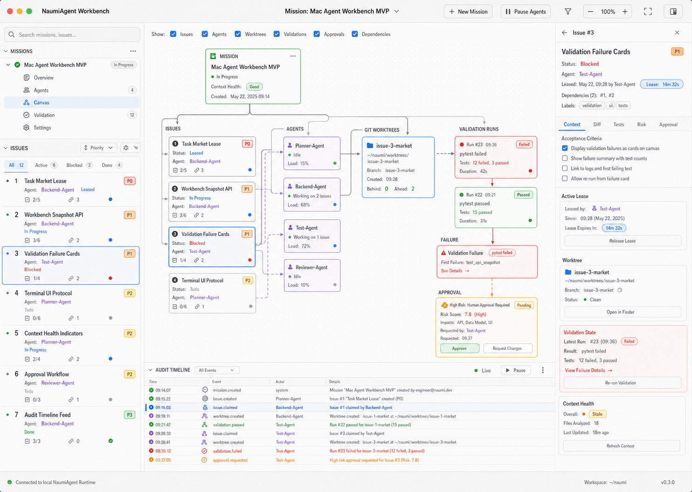
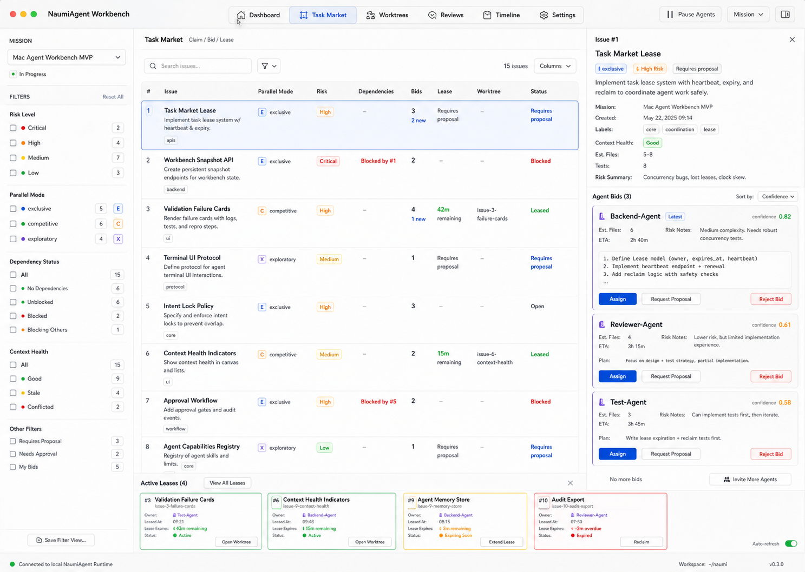
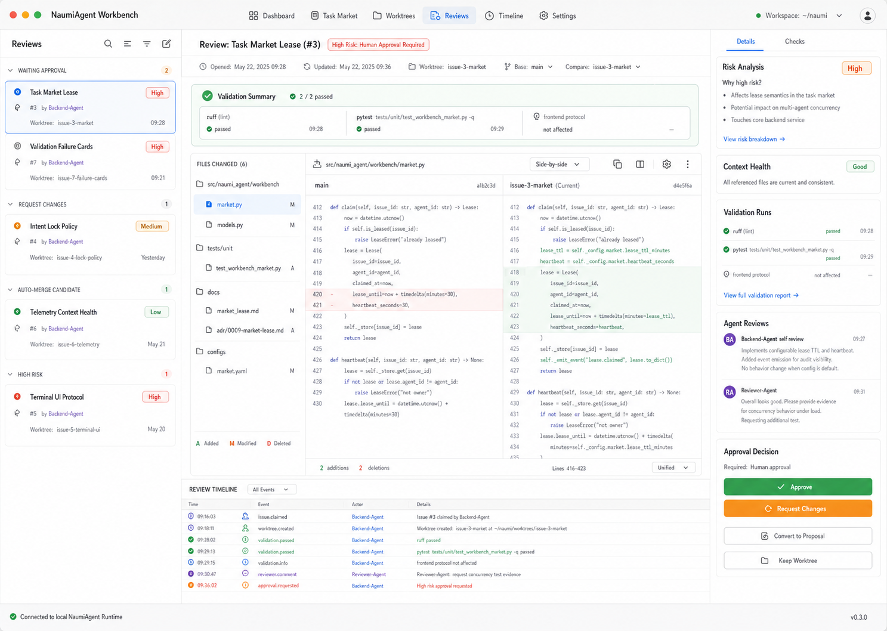
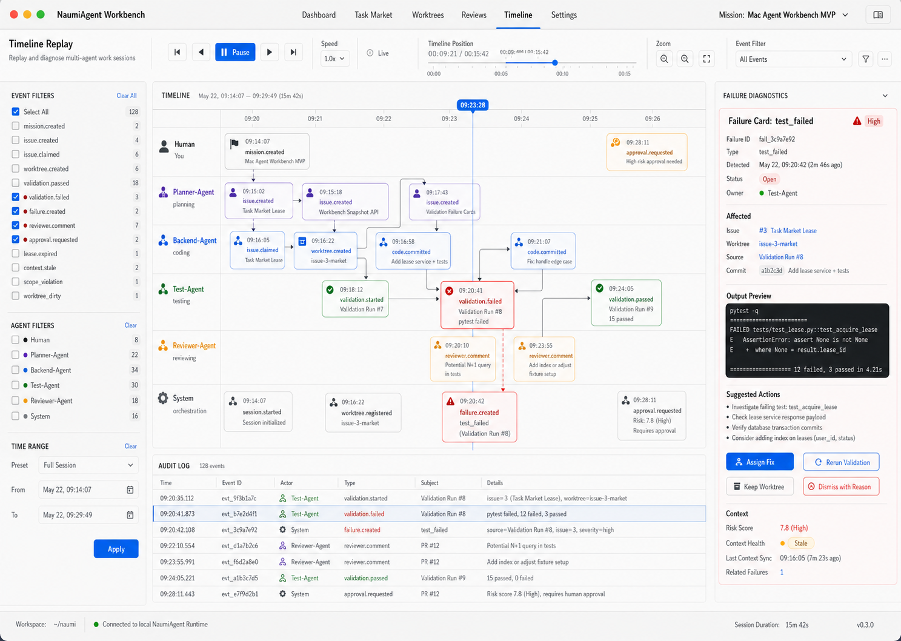

# NaumiAgent Mac Agent Workbench Interface Specification

> 视觉参考：`docs/assets/mac-agent-workbench/`  
> 产品文档：`docs/product/mac-agent-workbench-prd.md`  
> 架构文档：`docs/design/mac-agent-workbench-architecture.md`  
> 默认语言：中文。保底支持：中文、英文。

## 1. 设计目标

Mac Agent Workbench 的界面目标是让用户治理一个本地自治研发系统，而不是和 Agent 聊天。

第一版界面必须回答五个问题：

1. 当前 Mission 是什么？
2. 哪些 Agent 正在做什么？
3. 哪些 Issue 被认领、阻塞、失败或等待审批？
4. 每个任务对应哪个 worktree、验证结果和风险等级？
5. 用户现在需要介入什么？

## 2. 视觉参考图

### 2.1 Dashboard / Shared Canvas



用途：默认首页，总览 Mission、共享画板、Agent 状态、审批和审计事件。

### 2.2 Task Market / Agent Bidding



用途：任务市场页，展示 Issue 列表、Agent bid、claim/lease、依赖和 worktree 分配。

### 2.3 Reviews / Human Approval



用途：人工审查页，展示 diff、验证证据、风险、自评、Reviewer 评论和审批动作。

### 2.4 Timeline Replay / Failure Diagnostics



用途：时间线回放与失败诊断页，展示多 Agent 行为因果链、失败卡片和审计日志。

## 3. 应用壳

### 3.1 Window

目标尺寸：

```text
默认窗口：1440 x 1024
最小窗口：1180 x 760
推荐平台：macOS desktop
```

窗口形态：

- macOS 原生桌面应用感。
- 不显示浏览器 chrome。
- 顶部保留应用工具栏。
- 页面信息密度偏高，但必须有清晰层级。

### 3.2 Top Toolbar

固定在顶部。

左侧：

```text
NaumiAgent Workbench
当前 workspace 名称
当前 Git branch / main SHA
```

中间主导航：

```text
Dashboard
Task Market
Worktrees
Reviews
Timeline
Settings
```

中文默认：

```text
总览
任务市场
工作区
审查
时间线
设置
```

右侧工具：

```text
New Mission
Pause Agents
Sync Context
Search
Language Switch
```

中文默认：

```text
新建 Mission
暂停 Agent
同步上下文
搜索
语言
```

### 3.3 Global Status Strip

Toolbar 下方可选一条紧凑状态条：

```text
Mission: Mac Agent Workbench MVP
Active Agents: 4
Open Issues: 12
Blocked: 2
Pending Approval: 3
Failed Validations: 1
```

状态条用于快速暴露用户需要介入的事项。

## 4. 信息架构

MVP 主页面：

```text
Dashboard
Task Market
Worktrees
Reviews
Timeline
Settings
```

页面优先级：

1. Dashboard：必须第一版实现。
2. Task Market：必须第一版实现。
3. Reviews：必须第一版实现基础状态。
4. Timeline：必须第一版实现 snapshot/replay 基础。
5. Worktrees：可以第一版实现列表，后续增强。
6. Settings：第一版至少包含语言和治理策略入口。

## 5. Dashboard 页面规格

### 5.1 页面目标

Dashboard 是默认首页。它不是聊天页，而是 Mission Control。

用户进入页面后应立即看到：

- 当前 Mission。
- Agent 活跃状态。
- 中央共享画板。
- 待审批事项。
- 失败验证。
- 最近事件。

### 5.2 布局

```text
┌──────────────────────────────────────────────┐
│ Top Toolbar                                  │
├─────────────┬────────────────────┬───────────┤
│ Left Rail   │ Shared Canvas       │ Inspector │
│ Mission     │ Mission/Issue graph │ Details   │
│ Issue Tree  │ Agent/Worktree/Test │ Approval  │
├─────────────┴────────────────────┴───────────┤
│ Audit Timeline                               │
└──────────────────────────────────────────────┘
```

左栏宽度：

```text
260-320px
```

右栏宽度：

```text
340-420px
```

底部时间线高度：

```text
120-180px
```

### 5.3 Left Rail

模块：

```text
Mission Tree
Issue Queue
Filters
Search
```

Issue 行字段：

```text
id
title
status
risk_level
owner
blocked_by
context_health
```

状态展示：

| 状态 | 中文 | 颜色 |
|------|------|------|
| pending | 待处理 | gray |
| in_progress | 进行中 | blue |
| blocked | 阻塞 | amber |
| completed | 已完成 | green |
| failed | 失败 | red |

### 5.4 Shared Canvas

Canvas 节点类型：

```text
Mission Card
Issue Card
Agent Card
Lease Card
Worktree Card
Validation Run Card
Failure Card
Approval Card
Decision Card
```

连线类型：

```text
depends_on
claimed_by
bound_to_worktree
validated_by
failed_with
requires_approval
unlocks
```

节点交互：

- 点击节点：右侧 Inspector 显示详情。
- 拖动节点：只改变布局，不改变业务依赖。
- 双击 Issue：打开 Issue 详情。
- 右键节点：显示上下文菜单。
- Canvas toolbar：缩放、自动布局、筛选、只看失败、只看待审批。

### 5.5 Inspector

根据选中对象切换内容。

Issue Inspector：

```text
标题
状态
风险等级
Parallel Mode
Owner Agent
Active Lease
Worktree
Acceptance Criteria
Validation Runs
Failure Cards
Approval State
```

Tabs：

```text
上下文
变更
测试
风险
审批
```

英文：

```text
Context
Diff
Tests
Risk
Approval
```

### 5.6 Audit Timeline

显示最近事件：

```text
mission.created
issue.created
issue.claimed
worktree.created
validation.failed
failure.created
approval.requested
```

每行字段：

```text
timestamp
actor
event_type
subject
summary
```

## 6. Task Market 页面规格

### 6.1 页面目标

Task Market 负责受约束的自由分工。

用户应能看到：

- 哪些 Issue 可认领。
- 哪些 Agent 正在 bid。
- 哪些任务已被 lease。
- 哪些任务需要 proposal。
- 哪些任务被依赖阻塞。

### 6.2 布局

```text
┌─────────────┬─────────────────────────┬───────────────┐
│ Filters     │ Issue Market Table      │ Bid Inspector │
├─────────────┴─────────────────────────┴───────────────┤
│ Active Lease Strip                                     │
└────────────────────────────────────────────────────────┘
```

### 6.3 Issue Market Table

列：

```text
Issue
Parallel Mode
Risk
Dependencies
Bids
Lease
Worktree
Status
```

中文列名：

```text
任务
并行模式
风险
依赖
竞标
租约
工作区
状态
```

行操作：

```text
Claim
Bid
Request Proposal
View Dependencies
Open Worktree
```

中文：

```text
认领
竞标
请求提案
查看依赖
打开工作区
```

### 6.4 Bid Inspector

显示选中 Issue 的 Agent bid。

Bid 字段：

```text
agent_id
confidence
estimated_files
estimated_duration
risk_notes
plan_summary
requires_dependency
```

操作：

```text
Assign
Reject Bid
Request Proposal
Ask for Plan Revision
```

### 6.5 Lease Strip

底部显示 active lease。

字段：

```text
issue_id
agent
remaining_time
worktree
status
```

租约快过期时：

- 10 分钟以内 amber。
- 已过期 red。
- 点击可续租、释放、转派。

## 7. Reviews 页面规格

### 7.1 页面目标

Reviews 页面负责把 Agent 的工作从“完成”转为“可接受”。

它必须强调证据：

- diff。
- validation runs。
- risk analysis。
- self-review。
- reviewer comments。
- approval decision。

### 7.2 布局

```text
┌──────────────┬───────────────────────────┬───────────────┐
│ Review Inbox │ Diff / Evidence           │ Risk Approval │
├──────────────┴───────────────────────────┴───────────────┤
│ Review Timeline                                           │
└───────────────────────────────────────────────────────────┘
```

### 7.3 Review Inbox

分组：

```text
Waiting Approval
Request Changes
Auto-merge Candidate
High Risk
```

中文：

```text
等待审批
要求修改
可合并候选
高风险
```

### 7.4 Diff / Evidence

中心区域：

```text
File Tree
Diff Viewer
Validation Summary
```

Diff 规则：

- 新增行绿色弱背景。
- 删除行红色弱背景。
- 不使用高饱和色。
- 行号必须显示。
- 长文件默认折叠无关区块。

### 7.5 Risk Approval Panel

字段：

```text
Risk Level
Why Risky
Context Health
Validation Runs
Agent Self Review
Reviewer-Agent Comments
Known Risks
Approval State
```

操作：

```text
Approve
Request Changes
Convert to Proposal
Keep Worktree
Escalate Risk
```

中文：

```text
批准
要求修改
转为提案
保留工作区
提升风险
```

高风险默认主按钮不是 Approve，而是要求用户明确选择。

## 8. Timeline 页面规格

### 8.1 页面目标

Timeline 页面用于回放多 Agent 协作过程和诊断失败。

它必须回答：

- 失败从哪里开始？
- 哪个 Agent 做了什么？
- 哪个事件导致后续阻塞？
- 当前可采取什么恢复动作？

### 8.2 布局

```text
┌──────────────┬─────────────────────────┬─────────────────┐
│ Event Filter │ Timeline Lanes          │ Failure Detail  │
├──────────────┴─────────────────────────┴─────────────────┤
│ Raw Audit Log                                             │
└───────────────────────────────────────────────────────────┘
```

### 8.3 Timeline Lanes

泳道：

```text
Human
Planner-Agent
Backend-Agent
Reviewer-Agent
Test-Agent
System
```

事件形态：

- 成功：绿色小点。
- 失败：红色菱形或错误卡。
- 审批：amber badge。
- Agent 动作：purple/blue chip。

### 8.4 Replay Controls

控件：

```text
Play / Pause
Speed
Time Scrubber
Event Filter
Jump to Failure
```

中文：

```text
播放 / 暂停
速度
时间轴
事件筛选
跳到失败
```

### 8.5 Failure Detail

字段：

```text
Failure Kind
Affected Issue
Source Event
Source Validation Run
Output Preview
Severity
Owner
Related Worktree
Suggested Actions
```

操作：

```text
Assign Fix
Rerun Validation
Keep Worktree
Dismiss with Reason
Create Resolver Issue
```

中文：

```text
指派修复
重新验证
保留工作区
说明原因并忽略
创建解决任务
```

## 9. Worktrees 页面规格

> 当前没有生成图，但 MVP 需要这个页面的基础版本。

### 9.1 页面目标

管理 NaumiAgent 创建的本地 Git worktree。

### 9.2 布局

```text
Worktree Table
  -> Detail Inspector
  -> Action Bar
```

列：

```text
Name
Task
Agent
Branch
Status
Dirty Files
Commits Ahead
Removable
Last Updated
```

操作：

```text
Open in Finder
Open Terminal
Keep
Remove
Force Remove
Bind Task
Refresh
```

危险操作：

- `Force Remove` 必须二次确认。
- dirty worktree 默认不能删除。

## 10. Settings 页面规格

### 10.1 页面目标

配置语言、治理策略、验证命令 allowlist、Agent 权限。

### 10.2 分区

```text
General
Language
Governance
Validation
Agents
Storage
Advanced
```

### 10.3 Language

语言策略：

```text
默认：中文 zh-CN
保底：English en-US
用户可切换
切换后立即影响 UI 文案
底层事件 type 不翻译
```

设置项：

```text
Display Language: 中文 / English
Fallback Language: English
Use system language: on/off
```

默认：

```text
display_language = zh-CN
fallback_language = en-US
use_system_language = false
```

## 11. 国际化规格

### 11.1 支持语言

MVP 必须支持：

```text
zh-CN: 简体中文，默认
en-US: 英文，保底
```

规则：

- UI 可见文案必须走 i18n key。
- 事件类型不翻译。
- 数据库枚举值不翻译。
- Agent 名称不翻译。
- 用户输入内容不翻译。
- 错误提示默认中文，切换英文后显示英文。

### 11.2 文案分层

需要 i18n 的内容：

```text
Navigation labels
Button labels
Tab labels
Status labels
Empty states
Error messages
Tooltips
Confirmation dialogs
Column headers
Settings labels
```

不需要 i18n 的内容：

```text
event type: issue.claimed
enum value: in_progress
agent id: Backend-Agent
worktree name: issue-3-market
file path
shell command
git branch
```

### 11.3 Key 命名

推荐 key：

```text
nav.dashboard
nav.taskMarket
nav.worktrees
nav.reviews
nav.timeline
nav.settings

status.pending
status.inProgress
status.blocked
status.completed
status.failed

risk.low
risk.medium
risk.high
risk.critical

action.approve
action.requestChanges
action.claim
action.releaseLease
action.rerunValidation
action.keepWorktree
```

### 11.4 示例文案

```json
{
  "zh-CN": {
    "nav.dashboard": "总览",
    "nav.taskMarket": "任务市场",
    "action.approve": "批准",
    "action.requestChanges": "要求修改",
    "status.inProgress": "进行中",
    "failure.testFailed": "验证命令失败"
  },
  "en-US": {
    "nav.dashboard": "Dashboard",
    "nav.taskMarket": "Task Market",
    "action.approve": "Approve",
    "action.requestChanges": "Request Changes",
    "status.inProgress": "In Progress",
    "failure.testFailed": "Validation command failed"
  }
}
```

### 11.5 回退策略

回退顺序：

```text
current locale key
  -> en-US key
  -> key name
```

如果中文 key 缺失，不允许静默显示空白。

## 12. 组件规格

### 12.1 Status Badge

输入：

```text
status
label
tone
```

tone：

```text
neutral
blue
green
amber
red
purple
```

### 12.2 Risk Badge

显示：

```text
low
medium
high
critical
```

中文：

```text
低
中
高
严重
```

critical 必须使用更强视觉，但不使用刺眼全红大块。

### 12.3 Lease Chip

字段：

```text
agent
remaining_time
expires_at
state
```

状态：

```text
active
near_expiry
expired
released
```

### 12.4 Context Health Indicator

状态：

```text
good
stale
overloaded
missing
conflicted
```

中文：

```text
健康
过期
过载
缺失
冲突
```

### 12.5 Failure Card

字段：

```text
kind
title
affected_issue
source_id
detail
suggested_actions
status
```

操作：

```text
Assign Fix
Rerun Validation
Keep Worktree
Dismiss with Reason
```

### 12.6 Approval Card

字段：

```text
risk_level
reason
validation_summary
self_review
reviewer_comment
decision_state
```

操作：

```text
Approve
Request Changes
Convert to Proposal
Escalate Risk
```

### 12.7 Agent Card

字段：

```text
name
role
status
current_issue
confidence
context_health
active_lease
```

## 13. 颜色与视觉规则

语义色：

```text
green: passed / completed
red: failed / critical failure
amber: warning / approval required / blocked
blue: active / selected / lease
purple: agent identity
gray: neutral / inactive
```

规则：

- 不使用单一紫蓝渐变主视觉。
- 不使用装饰性光斑、渐变球、bokeh。
- 页面 section 不做大卡片堆叠。
- 卡片只用于独立对象：Issue、Agent、Failure、Approval。
- 列表优先使用行分隔，不把每一行做成浮动卡片。

## 14. 字体与密度

字体：

```text
macOS: SF Pro / system-ui
fallback: Inter, system-ui, sans-serif
```

字号：

```text
body: 14-16px
table: 13-14px
caption: 12px
page title: 20-24px
panel title: 15-17px
```

行高：

```text
body: 1.35-1.5
table: 1.25-1.35
```

## 15. 关键交互

### 15.1 Claim Issue

流程：

```text
选择 Issue
  -> 查看 Bid / Risk / Dependencies
  -> 点击 Claim 或 Assign
  -> 系统检查 active lease
  -> 系统检查 Intent Lock
  -> 创建 Lease
  -> 更新 Dashboard
```

错误：

- 已被认领：显示当前 owner 和 lease。
- 命中意图锁：提示转 Proposal。
- 依赖未完成：显示 blocked_by。

### 15.2 Approve Review

流程：

```text
打开 Reviews
  -> 选择 waiting approval
  -> 查看 diff / tests / risk
  -> 点击 Approve
  -> 二次确认 high risk
  -> 状态变为 approved 或 merge candidate
```

### 15.3 Diagnose Failure

流程：

```text
打开 Timeline
  -> 点击 Failure Card
  -> 查看 source validation
  -> 选择 Assign Fix / Rerun Validation
  -> 创建后续 Issue 或新 Validation Run
```

## 16. 空状态

Dashboard 无 Mission：

```text
中文：还没有 Mission。创建一个目标，让 Agent 围绕它开始协作。
英文：No mission yet. Create a mission to let agents coordinate around a shared goal.
```

Task Market 无可认领任务：

```text
中文：当前没有可认领任务。你可以创建 Issue，或查看被阻塞任务。
英文：No claimable issues. Create an issue or inspect blocked work.
```

Reviews 无待审查：

```text
中文：没有待审批内容。通过验证的低风险任务会出现在这里。
英文：Nothing waiting for review. Validated work will appear here.
```

Timeline 无事件：

```text
中文：暂无事件。创建 Mission 后，Agent 行为会记录在这里。
英文：No events yet. Agent activity will appear here after a mission starts.
```

## 17. 可访问性

要求：

- 所有按钮必须有可访问名称。
- 颜色不能作为唯一状态表达。
- 风险、失败、审批必须同时有图标/文字。
- 表格支持键盘导航。
- Canvas 节点支持列表替代视图。
- 语言切换不应改变数据含义。

## 18. MVP 切分

### 18.1 必须实现

```text
Dashboard snapshot
Task Market basic table
Review inbox basic state
Timeline event list
Language setting zh-CN/en-US
Status/Risk/Lease/Failure components
```

### 18.2 可以后续增强

```text
Canvas 拖拽布局持久化
复杂 timeline replay 动画
完整 diff viewer
多 workspace 切换
远程 GitHub PR 集成
自动合并策略
```

## 19. 与后端字段映射

Dashboard snapshot：

```text
missions -> Mission Summary
tasks -> Issue Queue / Task Market
issues -> Risk / Parallel Mode / Worktree
failures -> Failure Cards
events -> Audit Timeline / Timeline Replay
```

Issue card：

```text
Task.subject
Task.status
Task.owner
IssueMetadata.risk_level
IssueMetadata.parallel_mode
IssueMetadata.related_worktree
Lease.expires_at
ContextSnapshot.health
```

Review card：

```text
IssueMetadata.risk_level
ValidationRun.status
FailureCard.status
Approval.state
Decision.kind
```

## 20. 实现注意事项

1. 不要把聊天作为第一屏主区域。
2. 不要把所有对象都做成厚重卡片。
3. 不要硬编码中文或英文文案。
4. 不要在 UI 中翻译事件 type 和枚举存储值。
5. 不要让 UI 自己推断任务状态；以后端 snapshot 为准。
6. 不要隐藏 failure，只要 open failure 存在就必须可见。
7. 不要允许 high risk 审批用默认回车误触。
