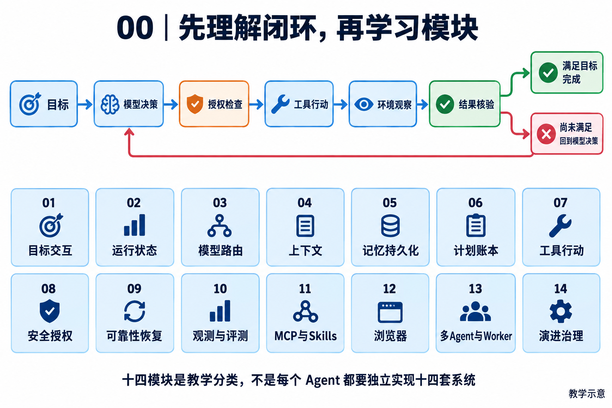

# 2026 AI Agent 教材总纲：14 个模块与写作约定

[返回目录](README.md)

> 本文件保存已经确定的教学范围与质量要求，供后续编写和上下文交接使用。
> 修订基准：2026-09-11；章节编号保持稳定，发现事实错误必须修订，不能以“目录冻结”为理由保留错误。

## 1. 先理解 Agent，而不是先背十四个名词

<!-- teaching-figure:00:start -->

读图：上半部分展示一次行动如何依据环境反馈继续推进，完成必须经过结果核验。下方十四项是学习索引，不是强制部署清单；图省略了取消、失败和人工等待等分支，详见各章。
<!-- teaching-figure:00:end -->

本书讨论以大模型为决策组件的 Agent：它围绕目标，依据当前信息决定下一步动作，得到环境反馈后调整后续行为，直至结束或交由人处理。普通问答主要生成回答，固定工作流主要按预先规定的流程执行；Agent 在一定范围内动态决定行动。三者可以结合：确定性规则负责计算、权限与提交，模型负责适合语言理解和开放决策的部分。

最小教学闭环是目标、模型决策、上下文/当前状态、行动与观察、终止条件。它可以短到几轮，只用一个工具；不必配备向量数据库、独立 Plan 模块、MCP、多 Agent 或自我修改系统。状态必然存在于执行过程中，但不必表现为一个名为 StateMachine 的类。显式状态机、持久化和恢复的复杂程度，取决于运行时长与失败代价。

本书扩大到生产工程的学习范围：当系统开始改文件、发消息、处理敏感数据、后台执行或服务多人，就需要相应的权限、可观测性、成本与恢复设计。不能把“生产中应考虑这些问题”偷换成“每个 Agent 必须独立实现 14 个子系统”。

## 2. 十四个模块的稳定范围

| 模块与入口 | 核心问题 | 必须分清的边界 |
| --- | --- | --- |
| [01 目标与交互](01-目标与交互层.md) | 用户究竟要什么，何时澄清和接管？ | 有目标描述不等于有可检验完成条件；交互校验不等于身份认证。 |
| [02 Runtime 与状态机](02-Runtime与状态机.md) | 一次任务怎样推进、停止和收口？ | 概念流程不是项目统一枚举；内存状态不是持久恢复。 |
| [03 模型与推理路由](03-模型与推理路由.md) | 选择什么模型与调用方式，成本如何控制？ | 静态 tier 映射不是动态智能路由；用量统计不是硬性预付额度。 |
| [04 上下文工程](04-上下文工程.md) | 当前模型应看到什么，窗口不足怎么办？ | 压缩不是无损，摘要不能把低信任来源变成授权。 |
| [05 记忆与持久化](05-记忆与持久化.md) | 什么需要保存、检索、更新和删除？ | 向量相似度不是真实性；会话、RAG 与事务账本不同。 |
| [06 Plan 与任务账本](06-Plan与任务账本.md) | 如何拆解工作并记录实际进度？ | 计划是可变策略，任务状态是待核验的记录；项目 Todo 没有 cancelled 枚举。 |
| [07 工具与行动](07-工具与行动层.md) | 模型意图怎样变成可验证动作？ | schema 合法不等于业务合法；并发安全标记不等于依赖分析。 |
| [08 安全身份与授权](08-安全身份与授权.md) | 谁能在何种范围内执行什么？ | Prompt 约束、业务授权、OS 沙箱和委派授权不能互相替代。 |
| [09 可靠性与恢复](09-可靠性与恢复.md) | 超时、崩溃、重复提交时怎么办？ | Lease/Fence 约束的存储写入不等于外部副作用 exactly-once。 |
| [10 观测、Harness 与评测](10-可观测性Harness与评测.md) | 怎样知道做了什么、做得好不好？ | agent harness 与 evaluation harness 不同；文本自报不是环境结果。 |
| [11 MCP 与 Skills](11-MCP与Skills.md) | 如何接入外部能力和可复用工作方法？ | 协议规范不等于本项目实现范围；Skill 可以仅含指令。 |
| [12 Browser 与 Computer Use](12-Browser与ComputerUse.md) | 没有稳定 API 时如何观察和操作？ | 浏览器不是整个桌面；点击成功不等于业务成功。 |
| [13 多 Agent、Worker 与集群](13-多AgentWorker与集群.md) | 怎样拆分任务、调度资源和合并结果？ | 角色委派、并行请求、多进程和多机部署是不同层次。 |
| [14 演进与发布治理](14-演进与发布治理.md) | 如何验证并采纳改进，而非放大错误？ | 候选不是上线；有效签名不是质量证明；反思不是参数训练。 |

基本闭环先学 01、02、04、07；随后补 03、05、06，并把 08、09、10 作为动作风险增加时的工程约束。11、12 是按接入场景启用的扩展，13、14 是明确有并行或持续改进需要时的进阶。这里是学习顺序，不是严格的代码依赖图。

## 3. 一个贯穿全书的案例

假设用户要求“根据本周项目更新生成周报草稿”。01 先明确时间范围、资料和“草稿不发送”；02 驱动回合；03 选择模型；04 只带相关变更；05 检索先前约定的格式；06 跟踪收集、整理和核验；07 调用只读工具并写入约定文件。08 控制资料访问与写入范围，09 处理工具超时和中断，10 检查草稿存在、引用正确、未擅自发送。

若更新来自外部平台，11 可以使用 MCP；没有合适 API 时，12 可以采用获授权的浏览器操作；资料彼此独立且工作量较大时，13 才考虑子 Agent 并行；多次失败后，14 将改进建议放进评测流程。该案例是一种教学设计，不表示项目已接通这些外部平台。

同一个“完成”必须从用户角度定义：草稿内容、文件位置、引用和未完成项均满足约定。模型说“周报已写好”、工具返回“success”或 Todo 被勾选，都不能单独替代这个验收。

## 4. 每章必须兑现的写作约定

每章先用一个具体问题和连续讲解建立概念，再展示案例的输入、状态变化、动作与反馈。英文术语首次出现应解释，跨章术语可指向术语页。不能先抛答案表格，再把必要的教学段落附在最后。

源码区至少提供一个真实文件和关键符号、对应测试、明确的当前边界。设计建议使用“应当/可以设计”，源码事实使用具体函数行为，实际测试使用本轮运行记录；三者不得混写。对于框架或协议，只引用一手资料，并说明所核验的版本或访问日期。

每章至少五道展开题：概念、设计、项目深挖、故障、取舍。每题包含考察意图、回答顺序、可展开的示范回答、两个追问及方向、失分点和证据。答案不是背诵口令：学习者要补入自己复现的条件与结果。题目只能称模拟题，未经来源证明不能标注成“字节原题”“阿里必问”。

每章还有动手练习、失败分支、验收标准、白板评分及诚实简历表达。知识讲解至少达到约 1000–2000 中文字的实质深度，必要时更长；代码、链接和重复模板不应凑篇幅。章节增加体量时，应优先增加机制、反例和真实实验，而非同义句填充。

## 5. 事实、日期和后续维护

外部资料采用 2026-09-11 本轮能够取得的官方页面；动态文档不一定提供该日的版本快照，因此“访问日期”不等于“发布日期”，不承诺全网最新或穷尽所有主流框架。MCP 在本书中明确引用已核对的 2025-11-25 规范页面，不把这个版本号冒称为今天所有实现的共同版本。

项目状态以当前源码和[验证记录](18-评审与验证记录.md)为准，旧路线图、文件数量与勾选图标不能替代测试。后续修订保留模块编号，追加具体变更原因与证据；测试失败不得通过删除记录或改写成“基本通过”来处理。

[主流比较](15-主流Agent对比与定位.md)负责横向定位；[项目答题路线](16-NaumiAgent项目介绍与答题路线.md)负责综合表达；[阅读方法](17-阅读方法与术语.md)负责基础词汇和学习路径。三者补充正文，不取代正文。

## 6. 从模块知识走向独立实践

主线读者是已有编程基础、正在准备 Agent 应用开发岗位的学生和转岗开发者。先通过[学习定位](19-学习定位与成果路线.md)明确基础和成果，再按[环境与主线](20-实战主线与环境手册.md)完成周报草稿实验。理论章节保持 14 个模块不变，新增实践章节不强行挤入架构分类。

[业务迁移](21-业务场景迁移实验.md)、[独立改造](22-独立改造任务与参考思路.md)、[实验报告](23-评测故障与实验报告.md)与[求职自测](24-求职训练与能力自测.md)连接学习和面试。完整成果应有环境记录、任务演示、源码走读、个人补丁、实验报告与可追问的项目介绍。只完成离线练习时，应准确说明没有调用真实模型；只完成设计时，不写成已经上线的功能。
