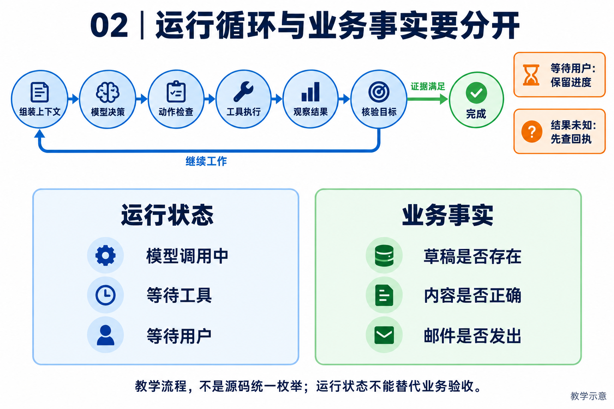

# 02｜Runtime 与状态机：让每一次行动有来有回

[返回目录](README.md) · [阅读方法与术语](17-阅读方法与术语.md)

> 读者目标：能画出一次模型—工具—观察循环，区分会话、运行和业务状态，解释保存状态为什么还不等于安全恢复。
> 题目为按工程问题设计的模拟题，不冒充任何公司的真实面试记录。

## 从一个具体问题开始

<!-- teaching-figure:02:start -->


读图：上方是教学用的模型—工具—观察循环，下方区分执行阶段与业务事实。等待用户或查询未知结果时要保存进度，不应盲目重复动作；这些概念标签不是项目中的统一状态枚举。
<!-- teaching-figure:02:end -->

状态机并不神秘，它只是把“系统现在处于什么阶段、下一步允许做什么”写成明确规则。一个简单 Agent 可以在循环中调用模型、执行工具、传回结果，直到停止；这也有隐含状态，并非完全“没有状态机”。当网络中断、用户取消或工具只执行一半时，如果没有明确记录这些状态和迁移条件，恢复就很难判断下一步。问题在于状态语义是否清楚，不在于是否使用某个状态机框架。

假设 Agent 正在“下载报表并发送邮件”。如果进程在下载后、发信前崩溃，恢复时有三个完全不同的选择：重新下载、只发送邮件、或者先检查附件是否已存在。正确选择取决于持久状态，而不是模型上次说过什么。更危险的是发信请求超时：服务端可能已发出邮件，也可能没有。此时如果 Runtime 简单重跑，会造成重复邮件。状态机让我们把“已发起、结果未知、待对账”这样的中间事实表示出来。

初学者还要区分“业务状态”和“运行状态”。业务状态是工单已创建、邮件已发送；运行状态是某个 Worker 正在执行、等待人工确认、租约失效。两者不能混为一谈。NaumiAgent 采用多个小状态机正是为了避免耦合：Todo 关心任务的待办/进行中/完成；子 Agent 关心委派、运行、取消和回收；Harness Lease 关心谁有权运行；它们通过事件和回执合作，而不要求一个类了解所有事情。

画状态图时，先列终态：`completed`、`failed`、`cancelled`，再列等待状态：等待用户、等待工具、等待资源。随后为每条迁移写触发条件和副作用。例如从 `executing` 到 `completed` 的触发不是“模型输出了完成”，而是所需工具回执、Todo 对账和成功判定都满足。这样设计后，测试也变得直接：给定初始状态与事件，断言只能到达合法下一状态。这正是 Runtime 从 Demo 走向可恢复系统的起点。

## 把机制走一遍

教学流程：用户提交报错 → 建立本轮运行 → 组装上下文 → 模型选择读文件工具 → 执行后返回 tool result → 模型提出修复 → 检查结果 → 输出。ReAct 指根据观察继续选择行动的循环；固定工作流则预先限定步骤。二者可以结合，且不必为每个循环阶段都定义一个枚举。

## NaumiAgent 源码走读与边界

[AgentEngine.run、_react_loop](../../src/naumi_agent/orchestrator/engine.py)：run 先取会话并绑定 task_store，处理用户输入 hook、建立 Harness completion run、注入记忆，再调用 planner。根据执行模式进入编排或 ReAct。返回 completed 后若完成门尚未最终评估，会再次检查，必要时改为 completed_unverified 或 blocked，之后保存会话。教材中的 planning→executing 图是教学模型，不是此类的完整枚举。

[HarnessRunState](../../src/naumi_agent/harness/completion.py)：它的注释明确是本轮临时完成状态。不能因为 Harness 其他模块有 Store，就说每个 Harness 对象都持久化。

对应测试：[test_pursuit_lease.py](../../tests/unit/test_pursuit_lease.py)、[test_todo_reconciliation.py](../../tests/unit/test_todo_reconciliation.py)。阅读函数与断言后再运行；测试文件的存在本身不能证明生产可用。

## 大厂项目深挖：任务跑到一半，用户刷新或服务重启怎么办

场景模拟：企业任务助手检索完资料、刚写出草稿，进程退出；重新进入页面后，用户希望知道任务是否还在执行。平台工程岗需要解释执行进度、页面展示与业务结果的关系，而不是只画一条 ReAct 循环。题目为岗位导向模拟，不代表某家公司原题。

项目回答：“NaumiAgent 通过 AgentEngine 的运行与回合控制流组织模型和工具，相关对象各有生命周期，不是一个统一枚举覆盖所有状态。内存中的下一步动作不能直接当作重启后的依据。我的恢复设计会从持久记录识别任务与执行尝试，校验当前执行权，再核对已发生的动作；如果草稿已经存在，就验证它是否对应本任务，而不是从头再写一份。对于外部动作结果不明的情况，先进入对账，不能直接标为失败重试。”后半段是恢复设计原则，具体路径是否已通过仍以第 18 章测试记录为准。

连续追问一：“每轮都存数据库就够了吗？”不够。要说明保存的是模型消息、工具请求还是业务提交，以及它们之间的先后关系。工具副作用已经发生、回执尚未保存时仍可能崩溃；多存几条聊天记录不能填平这个窗口。恢复点要与外部业务查询或幂等契约配合。

连续追问二：“页面显示 running，但没有新输出怎么办？”区分连接存活、执行者存活和任务取得进展。页面可以展示最后更新时间、当前动作与待人工处理原因，但超时阈值和自动接管必须依据具体动作语义。一个长查询可能正常，持续重放同一失败动作却没有进展。

连续追问三：“状态机是不是越细越好？”状态应区分会改变可执行动作和恢复决策的情况。单纯展示文案可以是派生视图，不必全变成持久状态。新增状态还要说明合法入口、出口、终态、迁移失败和旧数据兼容，否则枚举更多只增加不一致风险。

个人改造建议：选一个本地文件任务，记录任务标识、执行尝试和产物关联，分别在执行前、文件写入后、记录回执后注入中断，再验证恢复输出。报告必须区分实际进程中断实验和单元测试模拟；同时加入重复恢复与取消后恢复用例。展示同一任务没有错误覆盖其他产物，比声称“支持断点续跑”更能经受源码追问。

## 面试陪练：从概念到追问

### 1. 概念题：Agent 必须有一个显式的大状态机吗？

考察意图：能否区分概念和实现形式。

回答顺序：结论 → 工作机制 → 本章项目证据 → 适用边界。

示范回答：必须能说明控制流和状态，但不一定有一个巨型 FSM 类。简单 Agent 可以用循环与变量；长任务通常会把 Goal、工具 Job、审批等分开建模。NaumiAgent 的引擎循环与多个领域枚举共存。是否需要持久化，要看中断后需要恢复哪些事实。

继续追问：while 循环也是 Agent 吗？→可以，看是否基于观察决策；状态拆多了怎么办？→定义跨模块契约。

常见失分：把某组枚举当作 Agent 的行业定义。

证据入口：[AgentEngine.run、_react_loop](../../src/naumi_agent/orchestrator/engine.py)；设计类回答是教学方案，不能当成现有产品保证。

### 2. 设计题：如何设计一轮运行的完成条件？

考察意图：区分模型结束与业务验收。

回答顺序：结论 → 工作机制 → 本章项目证据 → 适用边界。

示范回答：先让任务声明产物或断言，再记录工具结果和检查结果。模型不再调用工具，只代表本轮准备回答；完成门应验证文件、测试或业务状态。缺少必要检查时给出未验证状态，避免把自然语言结束误报成任务成功。

继续追问：纯问答怎么验收？→使用对应质量准则，无需文件 gate；检查器崩溃？→标基础设施错误。

常见失分：把 finish_reason 当成业务成功。

证据入口：[AgentEngine.run、_react_loop](../../src/naumi_agent/orchestrator/engine.py)；设计类回答是教学方案，不能当成现有产品保证。

### 3. 项目题：从用户输入到最终回答，代码怎么走？

考察意图：是否真正读过执行链。

回答顺序：结论 → 工作机制 → 本章项目证据 → 适用边界。

示范回答：我会按 AgentEngine.run 的顺序讲：会话绑定、hook、Harness run、记忆、planner、执行循环、完成门、保存会话。重点解释完成门可以改写 completed。流式入口另外存在，因此不能用这条非流式路径证明所有前端都完全相同。

继续追问：哪个对象持久化？→查 Store，HarnessRunState 是临时对象；流式是否一致？→需查 run_streaming 并做跨入口测试。

常见失分：只列 engine.py 文件名而不讲调用顺序。

证据入口：[AgentEngine.run、_react_loop](../../src/naumi_agent/orchestrator/engine.py)；设计类回答是教学方案，不能当成现有产品保证。

### 4. 故障题：保存 checkpoint 就能从崩溃处恢复吗？

考察意图：理解副作用和检查点边界。

回答顺序：结论 → 工作机制 → 本章项目证据 → 适用边界。

示范回答：检查点只能说明已保存的状态。若外部写入成功但检查点尚未提交，恢复仍可能重复写入。因此要结合操作 ID、外部查询和幂等支持；旧执行者还需 fencing。NaumiAgent 的 Pursuit 租约测试展示的是本地所有权与终态保护，不能外推到所有第三方服务。

继续追问：副作用不支持查询？→保留未知并人工对账；旧进程醒来？→目标边界校验 epoch。

常见失分：承诺 checkpoint 自动提供 exactly-once。

证据入口：[AgentEngine.run、_react_loop](../../src/naumi_agent/orchestrator/engine.py)；设计类回答是教学方案，不能当成现有产品保证。

### 5. 取舍题：为什么不直接用 LangGraph？

考察意图：是否了解框架已有能力。

回答顺序：结论 → 工作机制 → 本章项目证据 → 适用边界。

示范回答：LangGraph 已有持久化、interrupt 和恢复能力，采用它能节约基础设施成本。NaumiAgent 自建路径便于把领域授权与演进回执做成自己的契约，但要承担更多维护和回归成本。选择应由业务约束和团队能力决定，不能声称框架只有画图。

继续追问：何时优先用框架？→标准编排且生态适合；如何对比？→用同一任务和故障矩阵。

常见失分：把对手没有的能力凭空列成自身优势。

证据入口：[AgentEngine.run、_react_loop](../../src/naumi_agent/orchestrator/engine.py)；设计类回答是教学方案，不能当成现有产品保证。

## 动手练习、白板题与验收

画“修复文件”的模型循环，并在图上标出会话保存、完成门、工具未知结果三个位置。阅读测试 test_failed_final_verification_never_persists_completed，解释为何没有完成证据时不能存 completed。

仓库根目录运行（需已完成项目开发环境安装）：

```bash
.venv/bin/python -m pytest tests/unit/test_pursuit_lease.py -q
```

白板评分：模型循环正确 1 分；三个边界各 1 分；指出临时状态与数据库状态不同 1 分。 本章实验范围与本轮实际执行结果见[验证记录](18-评审与验证记录.md)。
