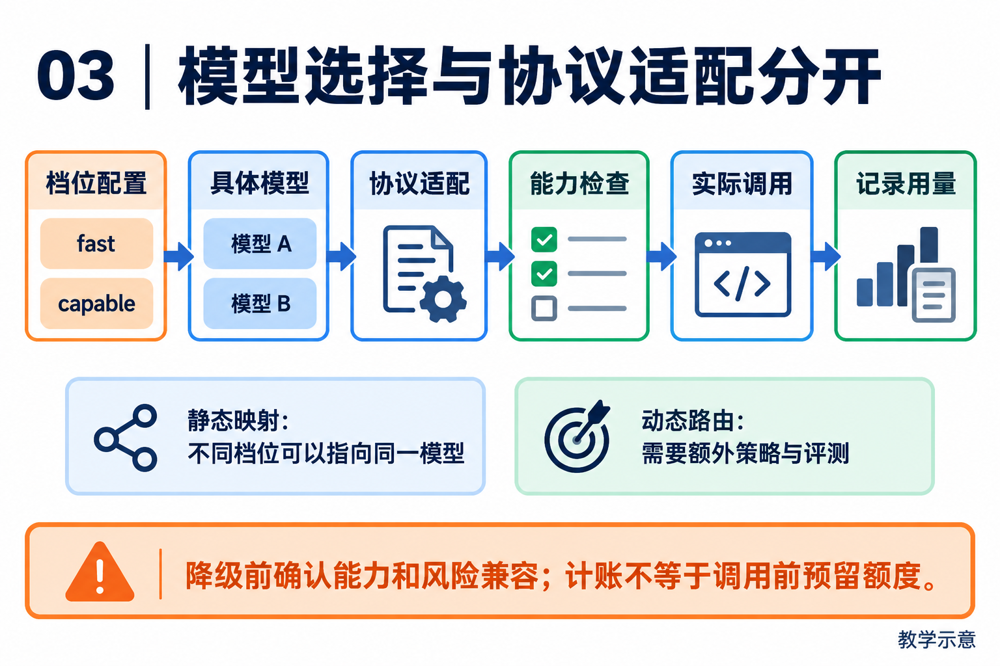

# 03｜模型与推理路由：把选择策略与协议适配分开

[返回目录](README.md) · [阅读方法与术语](17-阅读方法与术语.md)

> 读者目标：能区分模型档位、真实供应商、协议能力和故障降级，设计一次可比较的模型选择实验。
> 题目为按工程问题设计的模拟题，不冒充任何公司的真实面试记录。

## 从一个具体问题开始

<!-- teaching-figure:03:start -->


读图：沿主链区分档位配置、具体模型和协议适配。模型 A/B 只是占位符，不能从 fast/capable 的名字推断实际型号或自动智能路由；降级仍需满足原任务的能力与风险要求。
<!-- teaching-figure:03:end -->

很多入门项目会在配置里指定一个模型，然后所有任务都使用它。如果这个模型满足质量、成本与可用性要求，单模型同样可以用于生产，不必为了复杂而引入路由。不同模型和服务在延迟、上下文长度、工具调用、结构化输出、多模态与价格上存在差异；当任务之间需求差异明显时，才值得测试分档选择的收益。生成严格结构的工具参数时，也不能随意切到不支持相应能力的服务。

路由器负责把请求送到选定模型，并处理调用所需配置。最简单的是静态映射：fast 档位对应配置中的某个模型；更复杂的教学方案可以按任务策略、能力契约、实时配额和服务健康选择目标。后者需要额外的信号、选择算法和评测，不能从“存在路由器”推断出来。无论是否动态选择，都要核对工具调用、结构化输出和推理强度等能力，并记录实际使用的模型，方便解释结果与排查错误。

NaumiAgent 的 `ModelRouter` 将不同 Provider 的 transport 收在同一边界内。上层引擎只关心“请求模型并得到规范化响应”，不用知道某家使用 OpenAI 风格、原生 Messages 还是其他协议。这里的关键取舍是：统一抽象需要保留差异。若某 Provider 不支持某项能力，Router 应显式报出不兼容，而不是悄悄丢掉参数，造成模型看似运行却行为变形。

初学者设计 fallback 时尤其要小心。对“总结一篇文章”，限流后换一个相近模型通常合理；对“依据法律条款生成并提交退款”，弱模型或不同模型可能改变判断和工具参数，此时更安全的策略是暂停、提示用户或重新确认。面试中说清这个区别，会比背诵“多模型降级”更能体现工程判断力。

## 把机制走一遍

教学例子：整理日志用 fast，复杂修复用 capable，这只是档位策略；两个档位也可以指向同一个模型。先解析档位对应的模型，再解析 provider、端点与协议，最后校验工具调用和输出上限。业务风险识别器和动态路由器是可选增强，不能从“有 Router 类”推断已经实现。

## NaumiAgent 源码走读与边界

[ModelRouter.resolve_model、resolve_target、call](../../src/naumi_agent/model/router.py)：resolve_model 返回 _tier_map 的配置映射。call 按指定 model 或 tier 选模型，解析 transport，处理 reasoning effort 和消息，再调用 LiteLLM，汇总 tool_calls、usage 与模型身份。模型信息存在来源标记和 fallback 警告。这支持能力适配和身份排查，不足以证明已经按任务风险、实时配额自动选择模型。

[TokenBudget、BudgetTracker.track / is_exceeded](../../src/naumi_agent/safety/budget.py)：预算默认字段可为 None；track 累计已产生用量，is_exceeded 再检查上限。不能将这种计账表述为调用前预留额度或保证不超支。

对应测试：[test_model_router.py](../../tests/unit/test_model_router.py)、[test_context_assembly.py](../../tests/unit/test_context_assembly.py)。阅读函数与断言后再运行；测试文件的存在本身不能证明生产可用。

## 大厂项目深挖：降低模型成本，怎样不牺牲任务成功率

场景模拟：一个研发资料助手需要提取更新、综合风险并生成草稿。所有步骤使用同一强模型，调用成本偏高；团队要求提出优化方案。应用岗要讲质量与成本，平台岗还要讲额度、并发和供应商故障。这里是设计训练，不提供未经测量的收益数字。

项目回答：“我先区分调用适配和选择策略。NaumiAgent 的 ModelRouter 提供 tier 到模型的配置映射，不能因此称为已经实现的智能动态路由。我会先测固定模型基线，再尝试对格式提取使用较低成本模型、对冲突综合使用较强模型，并保持相同验收集。若小模型造成更多补救轮次，总成本可能反而上升，所以比较单位成功任务成本和端到端时延，而不只比较单次 token 价格。”实际价格须在实验当时按供应商信息记录。

连续追问一：“小模型出错就换大模型，不就解决了吗？”需要先定义程序能识别哪些失败，如 schema 不合法、来源缺失；模型表面流畅但事实错误，未必触发降级。还要限制重试和升级次数，记录同一任务的全部调用成本，防止在多个模型之间循环。

连续追问二：“剩余预算只够一半输出怎么办？”先说明项目的事后用量统计不等于预留机制。可设计按输入估算、输出上限和安全余量申请额度，调用结束后结算并释放差额；供应商实际计费与估算仍需对账。并发请求若各自读取同一余额再执行，会同时超额，因此预留需要原子性，而不是只加一个 if。

连续追问三：“主模型超时，能直接切换吗？”纯生成请求和已经触发工具动作的任务必须分开。切换模型不应导致重复执行上一轮业务写入，先确认请求阶段与已有工具记录。不同模型的上下文容量、工具协议和结构化输出能力也需要适配验证，不能只替换名称。

个人改造建议：先实现可配置的分阶段选择策略和统一调用记录，不宣称已有自动最优路由。用同一任务集比较基线与候选，报告全部尝试的费用、成功任务数、重试次数和时延分布；另测空输入、供应商限流与额度争抢。离线固定返回值可以验证计账和控制流，不能证明真实模型质量或实际费用下降。

## 面试陪练：从概念到追问

### 1. 概念题：fast、capable、reasoning 是模型类型吗？

考察意图：是否理解抽象层。

回答顺序：结论 → 工作机制 → 本章项目证据 → 适用边界。

示范回答：在这个项目中它们是调用档位，映射由配置决定，甚至能指向同一个模型。档位名称不保证模型支持推理强度或工具调用；真实能力应查 provider catalog 和运行契约。这样上层可以表达需求，部署者决定具体模型。

继续追问：一个模型多个档位有用吗？→可阶段性统一，再测量拆分收益；名称包含 reasoning 就支持吗？→不保证。

常见失分：把档位标签当作供应商能力保证。

证据入口：[ModelRouter.resolve_model、resolve_target、call](../../src/naumi_agent/model/router.py)；设计类回答是教学方案，不能当成现有产品保证。

### 2. 设计题：如何为不同任务选择模型？

考察意图：能否设计实证策略。

回答顺序：结论 → 工作机制 → 本章项目证据 → 适用边界。

示范回答：先列任务集和成功断言，再比较质量、首响应时间、总延迟和成本。简单任务选低成本模型，复杂任务只有测得收益才切换。对需要写入的任务，模型切换后仍需校验参数与授权；换模型不能自动扩大权限。

继续追问：成本怎么计算？→包含多轮输入、输出和重试；如何判断升级时机？→基于失败类型和固定策略。

常见失分：凭模型排行榜排名选所有业务。

证据入口：[ModelRouter.resolve_model、resolve_target、call](../../src/naumi_agent/model/router.py)；设计类回答是教学方案，不能当成现有产品保证。

### 3. 项目题：Router 实际已经做了什么？

考察意图：能否约束项目表述。

回答顺序：结论 → 工作机制 → 本章项目证据 → 适用边界。

示范回答：已核对代码是档位映射、模型目标解析、协议参数整理和响应归一化。call 通过 LiteLLM 发请求，并记录用量和实际 provider 模型信息。文中不能再说它已经动态识别任务风险、自动依据实时健康切换，这需要另外的选择策略证据。

继续追问：fallback 字样代表什么？→很多是元数据缺失兜底；如何证实动态切换？→找选择逻辑与相应测试。

常见失分：看到变量 fallback 就声称跨供应商自动故障转移。

证据入口：[ModelRouter.resolve_model、resolve_target、call](../../src/naumi_agent/model/router.py)；设计类回答是教学方案，不能当成现有产品保证。

### 4. 故障题：收到 429 或流式输出中断怎么办？

考察意图：理解重试边界。

回答顺序：结论 → 工作机制 → 本章项目证据 → 适用边界。

示范回答：429 需要退避、上限和可观测的失败原因；不宜立即高频重试。流式中断要记录是否已经组装工具调用、工具是否执行。只重试模型请求与重放整段动作是不同操作。对结果未知的写入，先查询副作用再恢复。

继续追问：收到 401？→修复凭据，盲重试无益；已输出半份 JSON？→不可直接执行残缺参数。

常见失分：把所有失败都归为模型能力差。

证据入口：[ModelRouter.resolve_model、resolve_target、call](../../src/naumi_agent/model/router.py)；设计类回答是教学方案，不能当成现有产品保证。

### 5. 取舍题：为什么不所有任务都用最强模型？

考察意图：权衡质量与系统成本。

回答顺序：结论 → 工作机制 → 本章项目证据 → 适用边界。

示范回答：最强模型可能在复杂推理上更好，但总响应包含多轮延迟和工具耗时。应比较质量相同条件下的总成本，并为难题保留升级策略。项目的预算追踪是事后累计，若需要严格预算还应预留本次调用和并发请求的最坏开销。

继续追问：缓存有什么作用？→稳定前缀可能降低成本，要看供应商计费；省 token 会损失什么？→可能丢掉关键证据。

常见失分：只比较单次输出价格。

证据入口：[ModelRouter.resolve_model、resolve_target、call](../../src/naumi_agent/model/router.py)；设计类回答是教学方案，不能当成现有产品保证。

## 动手练习、白板题与验收

制作三行模型选择表：摘要、代码修复、发信。列出必须能力、fallback 条件和停止条件。读 test_resolve_tier 与 test_runtime_identity_exposes_catalog_provider_protocol_and_upstream，并解释它们没有发送真实供应商请求。

仓库根目录运行（需已完成项目开发环境安装）：

```bash
.venv/bin/python -m pytest tests/unit/test_model_router.py -q
```

白板评分：每个任务的能力/回退限制 3 分；能区分配置路由与动态策略 1 分；成本统计包含失败重试 1 分。 本章实验范围与本轮实际执行结果见[验证记录](18-评审与验证记录.md)。
