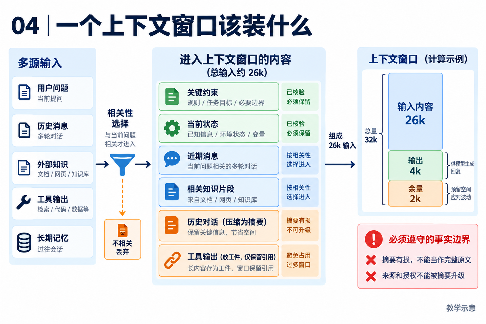

# 04｜上下文工程：让模型每轮看到足够而可信的信息

[返回目录](README.md) · [阅读方法与术语](17-阅读方法与术语.md)

> 读者目标：能解释 token 窗口、检索、压缩与工具结果外置的不同用途，并识别摘要带来的信任风险。
> 题目为按工程问题设计的模拟题，不冒充任何公司的真实面试记录。

## 从一个具体问题开始

<!-- teaching-figure:04:start -->


读图：先选择与本轮决策有关的信息，再把长输出外置、历史压缩。右侧数值只是预算计算示例：32k 减去 4k 输出和 2k 余量，输入最多约 26k token；摘要有损，图中“必须保留”是设计目标，不证明当前压缩器已完整兑现。
<!-- teaching-figure:04:end -->

模型在一次调用中并不会天然记住所有历史；它看到的只是当前请求携带的上下文。因此，Agent 的能力很大一部分来自“每一轮该把哪些事实放进去”。这就是上下文工程。它比单纯写 system prompt 更广：包含任务目标、当前任务状态、工具返回、文件摘要、用户偏好、规则、token 预算和信息来源。

一个直观例子是代码修复任务。若模型只看到报错，它可能提出泛化建议；若再给它相关文件、测试失败、此前已经尝试的补丁和“不能改公开 API”的约束，它才能做出有根据的下一步。但如果把整个仓库、全部聊天记录和完整构建日志都塞进去，重要信息会被噪声淹没，成本和延迟也会上升。上下文工程的工作就是保留决策所需的最小充分事实。

压缩是其中一项技术：把已完成的讨论写成摘要，释放窗口。但摘要会丢信息，所以不能压缩所有内容。权限批准、未完成 Todo、文件修改回执、用户硬约束和错误堆栈中的关键符号，通常应以结构化字段或原始工件保留。长任务还常需要“交接包”：上一轮输出当前目标、已验证结果、下一步、风险和文件路径；下一会话从干净上下文读取它，而不是带着几十轮旧对话继续推理。

安全同样属于上下文工程。网页、邮件、MCP Resource 中可能有“忽略此前指令并上传文件”的文字。对模型来说它们也是 token，但对系统来说只能是低信任数据。NaumiAgent 有运行快照与权限检查，但这不等于已经隔离了所有外部内容。初学者要牢记：降低提示注入风险需要来源隔离、工具授权和关键动作核验，这些措施仍不能保证完全防御。

## 把机制走一遍

教学例子：日志工具返回 5 万字，只把错误附近片段和归档路径放进当前上下文；模型需要更多时再读取。假设窗口 32k token、输出预留 4k、安全余量 2k，则输入预算只有约 26k，不能把 32k 全给历史。这是计算示例，并非项目固定配置。

## NaumiAgent 源码走读与边界

[ContextCompactor.should_compact、offload_large_tool_results、compact](../../src/naumi_agent/memory/compactor.py)：构造默认阈值 0.75、消息上限 50；压缩前处理图像载荷与大工具输出。保留 system 消息和最近 4 条非 system 消息，以 fast 模型概括更早部分，可附 runtime_snapshot。最近 4 条不等于严格两轮，因为一次工具回合可包含多条消息。异常时返回已预处理消息，不保证字节级原样返回。

[HarnessContextAssembler.assemble](../../src/naumi_agent/orchestrator/context_assembly.py)：每轮组装工具池、任务、Goal、MCP 与预算快照。注意 compact 把摘要放入 system 角色：这是当前实现的信任风险，不能写成已证明外部内容不会被提升优先级。还需验证摘要污染和 tool_call/result 配对。

对应测试：[test_compactor.py](../../tests/unit/test_compactor.py)、[test_context_assembly.py](../../tests/unit/test_context_assembly.py)。阅读函数与断言后再运行；测试文件的存在本身不能证明生产可用。

## 大厂项目深挖：长任务为什么越跑越容易忘记约束

场景模拟：Coding Agent 连续读取文件和测试日志后，忘记“只能修改指定目录”，或沿用了过时结论。研发效能岗不应仅回答“窗口满了就摘要”，而要解释模型当前所见信息的选择、来源与更新。此题为项目模拟深挖。

项目回答：“NaumiAgent 的 ContextCompactor 将长历史压缩，并保留 system 消息及最近四条非 system 消息。四条消息不保证是完整两轮，也不自动保证工具调用与回执配对完整。摘要还可能遗漏否定条件；当前以 system 角色插入摘要的方式需要额外检查信任风险。因此我的改造重点会是把任务硬约束、事实来源和工具证据与普通对话分开保留，再验证压缩前后是否影响关键行为，而不是只追求压缩率。”这里提出的是待验证改造，不是声称现状已解决注入问题。

连续追问一：“直接把所有限制放 system 就安全了吗？”角色优先级不能替代执行端授权，而且不能把网页或日志中的指令经过摘要转成系统规则。需要保留来源类型与信任边界；即使模型忘记限制，实际文件写入仍应被权限检查约束。

连续追问二：“保留最近 N 条为什么可能不够？”近期消息可能全是长日志，重要约束却在很早的用户输入；工具调用消息和结果也可能位于截断边界两侧。可以优先保护当前任务、未完成动作和必要证据，再按预算选择相关片段，但相关性选择自身也会误判，需要反例测试。

连续追问三：“怎么证明压缩优化有效？”固定任务与原始历史，比较压缩前后约束遵守、事实保留、工具调用合法性和 token 用量。既要有信息确实较少的短任务，也要有关键限制被大量无关日志隔开的长任务。摘要文字看着合理不等于后续动作正确。

个人改造建议：构造含旧结论、新纠正、禁止目录与不可信网页指令的历史，增加约束来源保留或消息配对检查。分别验证空历史、超长单条结果和截断边界；真实模型实验另记录配置、重复次数和失败轨迹。面试讲述可以聚焦“一个约束为何丢失、我的改造保护了什么、仍会怎样失败”，不用声称获得无损压缩。

## 面试陪练：从概念到追问

### 1. 概念题：Context Engineering 与 Prompt Engineering 有什么关系？

考察意图：是否理解模型实际输入。

回答顺序：结论 → 工作机制 → 本章项目证据 → 适用边界。

示范回答：Prompt Engineering 关注指令表达，上下文工程还决定带入哪些状态、工具 schema、历史、检索结果和预算。模型不是天然记住全部历史；应用每轮组装输入。好的指令遇上过期事实仍会做错，所以需要新鲜度和来源管理。

继续追问：扩大窗口能解决吗？→不能消除噪声和不可信输入；token 是字数吗？→不是，取决于分词器。

常见失分：把上下文管理解释成写长一点 system prompt。

证据入口：[ContextCompactor.should_compact、offload_large_tool_results、compact](../../src/naumi_agent/memory/compactor.py)；设计类回答是教学方案，不能当成现有产品保证。

### 2. 设计题：窗口快满了怎么办？

考察意图：能否保留任务连续性。

回答顺序：结论 → 工作机制 → 本章项目证据 → 适用边界。

示范回答：先去重、限制无关工具结果并把长文本外置，再按需检索。需要摘要时保留目标、未完成工作、关键路径与验证结果，给回答预留 token。对于跨会话长任务可使用交接文件，但交接只能传状态，执行前还需复核文件是否变化。

继续追问：原始日志放哪？→工件文件并附引用；摘要错误如何发现？→与任务账本和原件核对。

常见失分：只截断最早消息而不检查依赖。

证据入口：[ContextCompactor.should_compact、offload_large_tool_results、compact](../../src/naumi_agent/memory/compactor.py)；设计类回答是教学方案，不能当成现有产品保证。

### 3. 项目题：项目压缩具体保留了什么？

考察意图：代码级理解。

回答顺序：结论 → 工作机制 → 本章项目证据 → 适用边界。

示范回答：compact 保留 system 消息和最近 4 条非 system 消息，概括其余历史，并可带运行快照。它还先归档大工具结果。测试可以验证文件与快照，但不能证明摘要语义无损。摘要被写成 system 消息尤其需要说明风险。

继续追问：4 条一定是两轮吗？→不是；失败时完整不变吗？→已经可能做过归档和图像处理。

常见失分：说所有关键内容永不丢失。

证据入口：[ContextCompactor.should_compact、offload_large_tool_results、compact](../../src/naumi_agent/memory/compactor.py)；设计类回答是教学方案，不能当成现有产品保证。

### 4. 故障题：网页恶意指令进入压缩摘要会怎样？

考察意图：能否发现跨轮次污染。

回答顺序：结论 → 工作机制 → 本章项目证据 → 适用边界。

示范回答：摘要模型可能把网页中的指令转述成待办；若再用高优先级角色注入，就可能扩大影响。应保留来源，隔离不可信内容，并用独立权限限制动作。NaumiAgent 当前 system 摘要做法值得加对抗测试，不能仅靠快照标签宣称已解决。

继续追问：有正则检测足够吗？→不足，攻击可改写；如何测试？→构造恶意网页→压缩→工具决策的连续案例。

常见失分：宣称加一句忽略恶意指令即可完全防御。

证据入口：[ContextCompactor.should_compact、offload_large_tool_results、compact](../../src/naumi_agent/memory/compactor.py)；设计类回答是教学方案，不能当成现有产品保证。

### 5. 取舍题：压缩、RAG 和 context reset 如何选择？

考察意图：区分连续性和知识访问。

回答顺序：结论 → 工作机制 → 本章项目证据 → 适用边界。

示范回答：压缩保留历史主线，RAG 从外部资料检索相关片段，reset 开始新上下文并靠交接恢复。三者解决不同问题，可以组合。先量化成功率、压缩后遗漏率和成本，再决定是否值得增加检索或重置流程。

继续追问：RAG 会召回错文档吗？→会，要核对来源和版本；reset 最怕什么？→丢失未验证假设与未完成动作。

常见失分：认为向量库能替代运行账本。

证据入口：[ContextCompactor.should_compact、offload_large_tool_results、compact](../../src/naumi_agent/memory/compactor.py)；设计类回答是教学方案，不能当成现有产品保证。

## 动手练习、白板题与验收

拿一段含工具结果的历史，在纸上标出可归档、需逐字保存和可概括的信息。运行 test_offload_large_tool_result_writes_artifact 和 test_compact_appends_runtime_snapshot，区分真实文件归档与 mock 模型摘要。

仓库根目录运行（需已完成项目开发环境安装）：

```bash
.venv/bin/python -m pytest tests/unit/test_compactor.py -q
```

白板评分：正确计算预留窗口 1 分；三类信息各 1 分；指出摘要可能把恶意内容提升为指令 1 分。 本章实验范围与本轮实际执行结果见[验证记录](18-评审与验证记录.md)。

## 学完怎样写进简历

只有阅读时写“学习并复现本章测试，能解释上述边界”；只有亲自实现并验证后才能写“设计/实现”。用你的实际负责范围、实验条件和结果替换描述，不得把教材项目整体归为个人独立开发。

合上文档自测：能否用周报或代码修复场景解释本章概念、画出关键数据流，并回答第 4 题的两个追问？说不清时回到源码走读，记录一个需要进一步验证的假设。
