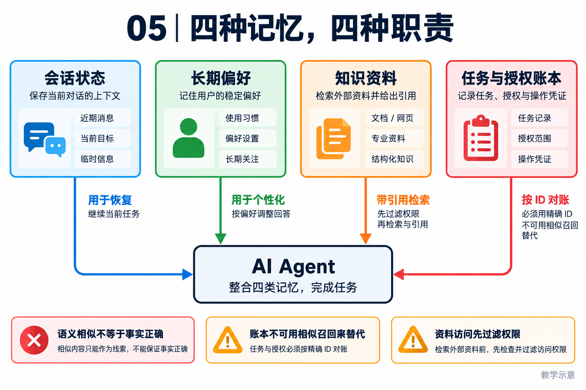

# 05｜记忆与持久化：区分事实、偏好、资料和执行账本

[返回目录](README.md) · [阅读方法与术语](17-阅读方法与术语.md)

> 读者目标：能区分会话状态、长期记忆与 RAG，知道相似度检索为什么不能充当事实校验。
> 题目为按工程问题设计的模拟题，不冒充任何公司的真实面试记录。

## 从一个具体问题开始

<!-- teaching-figure:05:start -->


读图：四个容器对应四种职责，并非四套存储都必须部署。长期偏好和知识检索用于辅助决策，任务与授权记录按精确标识核对；相似度、内容长度和被召回次数都不能直接证明事实正确。
<!-- teaching-figure:05:end -->

讨论 Agent 记忆时，很多人第一反应是向量数据库。向量检索很有用，但它只擅长“从许多文本里找语义相近内容”，并不天然提供事务、版本、权限、撤销或精确更新。要理解记忆，先问这条信息在未来扮演什么角色。

用户说“我偏好中文、希望回答简洁”，这是长期偏好，可以被检索并允许用户更改；本轮工具刚返回的订单号是工作记忆，必须优先进入后续决策；当前会话的任务列表是可恢复状态；“用户在何时批准了哪次发送”则是运行证据，不能被一句摘要替代。把这四类信息混放在一个向量库里，会产生很奇怪的故障：检索没有召回时，Agent 忘了关键授权；相似文本被误召回时，又可能把旧订单当成当前订单。

NaumiAgent 将会话、长期记忆、任务 Store 与 Harness 证据分在不同模块，是为了让它们拥有不同的生命周期。长期记忆需要来源和时间戳；用户要求遗忘时需要可撤销；任务状态在重启后需要精确恢复；评测和授权回执需要审计。初学者可以把它类比为人：便利贴、日记、待办事项和银行流水都叫“记忆”，但绝不会用同一种保管方式。

最后要强调新鲜度。即使记忆中写着“客户 A 的联系人是张三”，执行发信前仍应从当前 CRM 或用户输入确认，因为联系人可能已变更。Agent 的长期记忆应该辅助决策，不应取代对高风险外部事实的实时观察。

## 把机制走一遍

教学例子：向量检索把“王经理负责华东”召回，只说明语义相关；新的人事记录可能显示负责人已更换。RAG（检索增强生成）通常经过资料摄取、切块、索引、召回、重排和带引用生成，用于查资料；记忆可以存偏好与经验；任务账本必须按 ID 精确查询。业务数据的读取权限应在检索前过滤，不能期待生成时再让模型忘掉越权内容。

## NaumiAgent 源码走读与边界

[MemoryEntry、LongTermMemory.store](../../src/naumi_agent/memory/long_term.py)：MemoryEntry 有 category、metadata、时间、访问次数和 active/dormant 状态；底层使用 Chroma PersistentClient。store 按同类内容相似度去重，默认阈值 0.92，合并保留更长内容并更新元数据。检索还有时间与访问因素。这些是信息管理启发式，不是冲突事实的逻辑判定器，尤其“更长”不代表“更新、更正确”。

[_extract_memories](../../src/naumi_agent/memory/compactor.py)：压缩可触发长期信息提取，取决于是否注入长期记忆依赖。需要区分模型提取候选和权威事实；不能宣称所有记忆写入都逐条经过用户批准。

对应测试：[test_long_term_memory.py](../../tests/unit/test_long_term_memory.py)、[test_compactor.py](../../tests/unit/test_compactor.py)。阅读函数与断言后再运行；测试文件的存在本身不能证明生产可用。

## 面试陪练：从概念到追问

### 1. 概念题：RAG、长期记忆和会话历史是不是一回事？

考察意图：区分三种信息用途。

回答顺序：结论 → 工作机制 → 本章项目证据 → 适用边界。

示范回答：会话历史记录交互，长期记忆提炼可复用偏好或经验，RAG 从资料中检索与当前问题相关的片段。它们可以共享存储技术，但生命周期不同。订单是否已提交要查订单系统，不能靠向量库召回一句旧聊天判断。

继续追问：RAG 一定用向量库吗？→可用关键词、SQL 或混合检索；记忆必须长期吗？→也有短期工作记忆。

常见失分：把任何存入向量库的文本都叫可靠记忆。

证据入口：[MemoryEntry、LongTermMemory.store](../../src/naumi_agent/memory/long_term.py)；设计类回答是教学方案，不能当成现有产品保证。

### 2. 设计题：如何为企业知识库设计检索？

考察意图：理解数据进入模型前的流程。

回答顺序：结论 → 工作机制 → 本章项目证据 → 适用边界。

示范回答：先清洗和切块，保留文档来源、版本与权限，再用关键词/向量混合召回和重排选片段，生成时附引用。要分别测召回和回答质量。如果资料无答案，应允许拒答或补充查询。这里是扩展设计，不能当作 NaumiAgent 已有完整企业 RAG 的证据。

继续追问：怎么测召回？→用有标注的相关片段；权限在哪过滤？→在越权内容进入模型之前。

常见失分：只比较 embedding 模型，忽略数据和访问范围。

证据入口：[MemoryEntry、LongTermMemory.store](../../src/naumi_agent/memory/long_term.py)；设计类回答是教学方案，不能当成现有产品保证。

### 3. 项目题：NaumiAgent 如何去重长期记忆？

考察意图：能否从实现发现局限。

回答顺序：结论 → 工作机制 → 本章项目证据 → 适用边界。

示范回答：同类别记忆达到相似度阈值后合并，保留更长内容并更新元数据。这减少重复，但语义相近的相反事实也可能被错误合并。面试时应解释真实策略，并提出冲突记录与版本权威判断，而不能说它会自动识别所有旧事实。

继续追问：阈值 0.92 能通用吗？→需要数据评估；更长是否更好？→不保证，因此是已知取舍。

常见失分：把去重描述成知识真值维护。

证据入口：[MemoryEntry、LongTermMemory.store](../../src/naumi_agent/memory/long_term.py)；设计类回答是教学方案，不能当成现有产品保证。

### 4. 故障题：两条记忆互相冲突怎么办？

考察意图：理解信息时效。

回答顺序：结论 → 工作机制 → 本章项目证据 → 适用边界。

示范回答：先比较来源、适用范围和时间；同一对象可以同时存在不同范围的有效事实。高风险动作前重新查询权威系统，不能直接用相似度最高的一条。若无权威来源，应暴露冲突让用户确认，并避免污染后续自动提取。

继续追问：用户偏好变了？→保存更新/撤销关系；旧备份还保留吗？→需单独定义保留规则。

常见失分：总选更新的一条而忽略来源真实性。

证据入口：[MemoryEntry、LongTermMemory.store](../../src/naumi_agent/memory/long_term.py)；设计类回答是教学方案，不能当成现有产品保证。

### 5. 取舍题：为什么不用一个数据库保存全部状态？

考察意图：理解存储语义。

回答顺序：结论 → 工作机制 → 本章项目证据 → 适用边界。

示范回答：可以用一个物理数据库，但应分清精确状态、证据和模糊检索的语义。任务状态需要事务和唯一约束，知识检索需要相关性排序。NaumiAgent 分用 SQLite 与 Chroma，各有迁移和备份成本；选择是工程权衡，不是越多存储越先进。

继续追问：单库行不行？→关系库加向量扩展也可；删记忆等于删审计吗？→不是，要定义范围。

常见失分：把技术组件数量当作架构成熟度。

证据入口：[MemoryEntry、LongTermMemory.store](../../src/naumi_agent/memory/long_term.py)；设计类回答是教学方案，不能当成现有产品保证。

## 动手练习、白板题与验收

设计两条互相矛盾的负责人记录，写出来源、时间、适用范围和撤销方案。读取 test_merge_keeps_longer_content 及 test_recall_for_session_keeps_current_memories_and_global_preferences，解释当前策略与企业多租户访问控制的距离。

仓库根目录运行（需已完成项目开发环境安装）：

```bash
.venv/bin/python -m pytest tests/unit/test_long_term_memory.py -q
```

白板评分：RAG 与记忆区分 1 分；来源/时间/范围各 1 分；指出向量相似度不是正确性 1 分。 本章实验范围与本轮实际执行结果见[验证记录](18-评审与验证记录.md)。

## 学完怎样写进简历

只有阅读时写“学习并复现本章测试，能解释上述边界”；只有亲自实现并验证后才能写“设计/实现”。用你的实际负责范围、实验条件和结果替换描述，不得把教材项目整体归为个人独立开发。

合上文档自测：能否用周报或代码修复场景解释本章概念、画出关键数据流，并回答第 4 题的两个追问？说不清时回到源码走读，记录一个需要进一步验证的假设。
