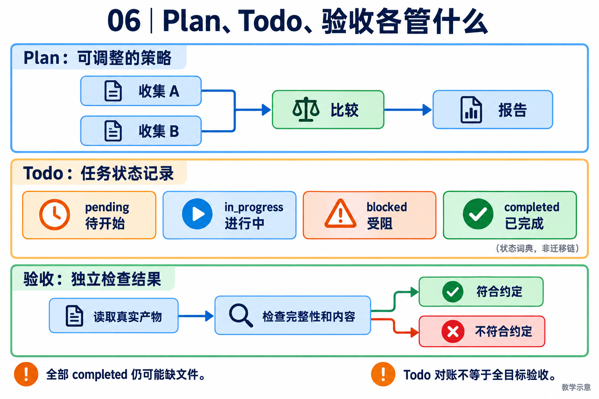

# 06｜Plan 与任务账本：计划可以变化，执行事实要能核对

[返回目录](README.md) · [阅读方法与术语](17-阅读方法与术语.md)

> 读者目标：能区分计划、Todo 状态和业务结果，解释依赖图以及终态对账的真实覆盖范围。
> 题目为按工程问题设计的模拟题，不冒充任何公司的真实面试记录。

## 从一个具体问题开始

<!-- teaching-figure:06:start -->


读图：上方 Plan 表达依赖与策略，中间 Todo 只是状态词典，不能把四张卡当作必经迁移链。下方独立读取产物：状态都标 completed，仍可能缺文件或内容不符；本项目 Todo 对账的覆盖范围见源码段。
<!-- teaching-figure:06:end -->

Plan 的价值在于给复杂任务一个可调整的方向。例如“调研三个供应商并推荐一个”可以先计划搜集资料、比较价格、验证集成能力、写报告。这个计划是模型基于当前信息形成的假设，遇到一家供应商网站不可访问、预算发生变化时，应该允许重规划。若把 Plan 当成不可改变的流程，Agent 会僵化；若完全没有 Plan，Agent 又容易在工具调用之间迷失方向。

Todo/任务账本解决的是另一件事：记录可被外界验证的工作事实。它不需要保存模型冗长的思考过程，只需清晰表达“资料已收集”“价格核验受阻”“报告待审核”。每个任务最好有唯一 id、状态、负责人、依赖、更新时间和阻塞原因。NaumiAgent 的 `todo_write` 与手动 `/todo` 使用同一 Store，正是为了让人和 Agent 看到同一份真相，而不是各自维护一套列表。

二者结合的常见流程是：Agent 根据 Goal 生成 Plan，同时把第一个可执行步骤写入 Todo；每完成一次工具行动，就更新账本；发现新证据后可以修改剩余 Plan，但不能篡改已完成记录。最终回答前执行 reconciliation，检查是否仍有 `in_progress` 项。如果有，就说明“任务完成”的结论缺少依据，需要继续、标记阻塞或明确取消。

对入门者最有帮助的练习是先不用模型，手工为一个任务写 Plan 与 Todo。你会发现 Plan 里常有“判断”“比较”“决定”等认知动作，而 Todo 里应该是可检查的成果。把两者分开后，Agent 的可解释性、恢复能力和人机协作都会明显提高。

## 把机制走一遍

教学例子：先收集 A/B 两份资料，再比较，再写报告。A 与 B 可以并行，比较依赖两者；把依赖写成有向无环图（DAG），箭头表示谁必须先完成。计划遇到缺数据可以调整；账本需记录 B 被阻塞。全是 completed 的列表仍不能证明报告正确，因为状态也可能被误写。

## NaumiAgent 源码走读与边界

[reconcile_todos](../../src/naumi_agent/tasks/reconciliation.py)：第一次发现 IN_PROGRESS 会返回 RETRY，要求模型更新状态；第二次仍有进行中项就调用 block_unreconciled_tasks；Store 读取失败返回 NONE 加 warning。它不是检查所有 pending 任务都完成的总验收器。状态模型只有 pending、in_progress、blocked、completed，没有 cancelled 枚举。

[TaskStatus、Task.is_blocked](../../src/naumi_agent/tasks/models.py)：Task 有 owner、blocks、blocked_by。缺失的依赖被视为阻塞，避免删除前置任务后意外放行；这也意味着清理任务需要维护引用一致性。

对应测试：[test_todo_reconciliation.py](../../tests/unit/test_todo_reconciliation.py)、[test_tasks.py](../../tests/unit/test_tasks.py)。阅读函数与断言后再运行；测试文件的存在本身不能证明生产可用。

## 大厂项目深挖：为什么勾完任务，还不能宣布交付

场景模拟：一个研发助手计划“读需求、改代码、跑测试”，随后把所有 Todo 标为完成，但测试未实际运行。平台与研发效能岗位需要解释计划、执行事实和交付验收之间的区别。此题是基于项目缺口设计的模拟追问。

项目回答：“Plan 是随信息变化的策略，Todo 是进度记录，都不是独立结果证明。NaumiAgent 的 reconcile_todos 读取 in_progress 项，先要求纠正，再将仍未对账的项阻塞；它不会因为存在 pending 就自动判整个目标失败，也不能核验 completed 对应的产物。所以我会把终态对账和业务验收分成两层。离线实验中，missing-artifact 和 tampered-artifact 正好说明账本完成、文件缺失或错误可以同时存在。”这里可直接展示实验，而不只复述定义。

连续追问一：“强制所有 Todo 完成不就好了？”计划中可能有可选项、被新信息替代的步骤或不再适用的任务。要求全部勾选可能诱导模型虚假完成。应区分仍然有效的必需目标、被替代的计划和真实产物；若新增取消或替代关系，需要明确扩展数据模型，不能声称现有四个 TaskStatus 已含 cancelled。

连续追问二：“那能否完全不要 Plan？”短任务可以直接执行，但复杂任务需要可见的依赖和检查点，帮助判断遗漏、阻塞与预算分配。采用计划不是为了保证模型一定正确，而是为了让失败可定位。计划粒度应能指导行动和验收，没必要把每个文本处理动作都存成任务。

连续追问三：“读取账本失败为什么不能当作没有任务？”未知状态与空集合不同。当前对账函数会返回 warning；调用者是否阻止成功收口仍需沿控制流核验。若要改成失败关闭，也应区分有副作用的高风险交付和只读结果展示，并设计用户可理解的恢复提示。

个人改造建议：针对草稿任务增加独立完成检查，分别返回账本情况、产物情况和未验证原因，不把两类判断揉成一个布尔值。至少覆盖 pending 但文件正确、completed 但文件缺失、completed 但内容错误，以及账本不可读。面试时说明“实验按预期识别失败”与“业务任务成功”是两种结果；五个教学用例都符合预期，不等于五个任务全部完成。

## 面试陪练：从概念到追问

### 1. 概念题：Plan、Todo 和执行结果是什么关系？

考察意图：区分意图与事实。

回答顺序：结论 → 工作机制 → 本章项目证据 → 适用边界。

示范回答：Plan 表达当前策略，Todo 记录任务状态，工具结果或业务断言证明实际成果。模型可以改剩余计划，但需要保留已发生动作。NaumiAgent 的 Todo 提升可见性，却不能独立证明文件内容或外部操作正确。

继续追问：Todo 写 completed 能信吗？→仍需结果证据；Plan 必须入库吗？→取决于恢复需求。

常见失分：把 Todo 当成经过机械验证的业务真相。

证据入口：[reconcile_todos](../../src/naumi_agent/tasks/reconciliation.py)；设计类回答是教学方案，不能当成现有产品保证。

### 2. 设计题：如何处理任务依赖和重规划？

考察意图：理解有向依赖关系。

回答顺序：结论 → 工作机制 → 本章项目证据 → 适用边界。

示范回答：先为步骤分配 ID，把前置条件写成边。只有依赖满足才调度；新证据出现时更新未执行分支，并说明原因。若 B 资料拿不到，可让 A 继续读取，但比较不能虚构 B。循环依赖需要检测并提示重新拆分。

继续追问：删掉前置任务？→维护引用或继续阻塞；局部重规划？→保留已验证成果。

常见失分：让模型自然语言说完依赖就认为调度器已支持。

证据入口：[reconcile_todos](../../src/naumi_agent/tasks/reconciliation.py)；设计类回答是教学方案，不能当成现有产品保证。

### 3. 项目题：项目的 Todo 对账具体检查了什么？

考察意图：对实现范围的准确理解。

回答顺序：结论 → 工作机制 → 本章项目证据 → 适用边界。

示范回答：reconcile_todos 只找 IN_PROGRESS：首次要求纠正，重复则标 blocked。无进行中项返回 NONE，读库失败也返回 NONE 但带 warning。因此它解决的是悬挂任务状态，整体交付仍要靠 Harness 完成检查等环节。

继续追问：所有任务 pending 能通过吗？→此函数不会认为存在 active；异常会 fail closed 吗？→本函数不是，调用者需处理 warning。

常见失分：说它强制所有任务完成才能回答。

证据入口：[reconcile_todos](../../src/naumi_agent/tasks/reconciliation.py)；设计类回答是教学方案，不能当成现有产品保证。

### 4. 故障题：Agent 声称完成但 Todo 仍在运行怎么办？

考察意图：能否设计有限纠正循环。

回答顺序：结论 → 工作机制 → 本章项目证据 → 适用边界。

示范回答：先要求它对账并提供结果证据。不能无限让模型重复自查，因此设置纠正次数，仍不一致时转 blocked 并说明未完成。NaumiAgent 采用一次纠正机会再阻塞的逻辑。状态读失败要明确暴露，不能悄悄把任务当成功。

继续追问：为什么不自动完成？→缺证据；为什么不无限重试？→避免空转与成本放大。

常见失分：自动把所有任务勾选完成以保持界面整洁。

证据入口：[reconcile_todos](../../src/naumi_agent/tasks/reconciliation.py)；设计类回答是教学方案，不能当成现有产品保证。

### 5. 取舍题：简单任务也需要 Plan 和 Todo 吗？

考察意图：是否懂得控制复杂度。

回答顺序：结论 → 工作机制 → 本章项目证据 → 适用边界。

示范回答：读取一个文件直接回答可以不建完整 DAG；跨工具、多步骤或需要恢复的任务更值得使用账本。计划本身有 token 和维护成本。用相同任务比较成功率、漏项率和延迟，再决定何时启用，而非强制所有请求先规划十步。

继续追问：计划粒度多细？→以可独立验证成果为单位；多 Agent 怎样共享？→统一 Store 和更新约束。

常见失分：认为越长的计划代表越强的推理。

证据入口：[reconcile_todos](../../src/naumi_agent/tasks/reconciliation.py)；设计类回答是教学方案，不能当成现有产品保证。

## 动手练习、白板题与验收

画资料 A/B→比较→报告的 DAG，列出 B 失败后哪些任务还能继续。运行四个 reconciliation 测试，分别记录无 active、第一次、第二次、Store 失败的返回值。

仓库根目录运行（需已完成项目开发环境安装）：

```bash
.venv/bin/python -m pytest tests/unit/test_todo_reconciliation.py -q
```

白板评分：DAG 正确 1 分；四种返回行为各 1 分。不要把 pending 或 blocked 自动改成完成来取得高分。 本章实验范围与本轮实际执行结果见[验证记录](18-评审与验证记录.md)。
