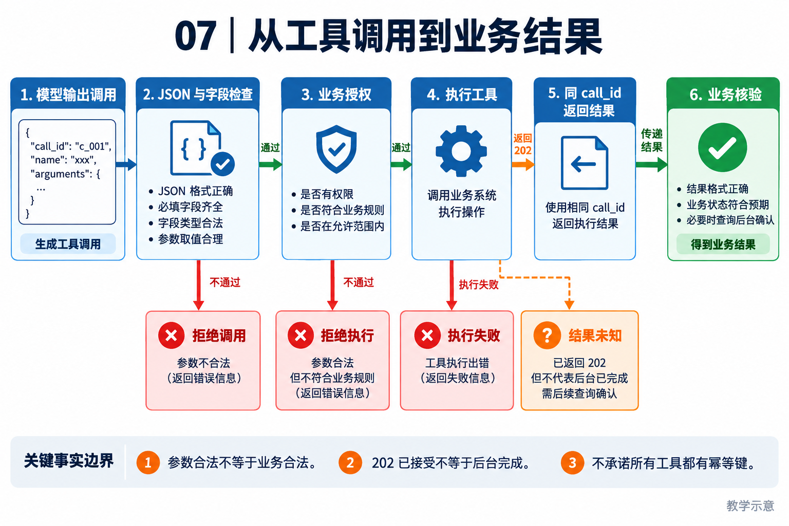

# 07｜工具与行动层：从模型参数到真实结果

[返回目录](README.md) · [阅读方法与术语](17-阅读方法与术语.md)

> 读者目标：能描述工具调用协议、参数验证、并行限制和结果核验，知道 tool success 与业务成功的区别。
> 题目为按工程问题设计的模拟题，不冒充任何公司的真实面试记录。

## 从一个具体问题开始

<!-- teaching-figure:07:start -->


读图：主链展示模型意图如何经过校验与授权后成为动作，再返回可核验结果。图中的 HTTP 202 是异步服务的示例，不是所有工具的固定返回值；已接受请求、执行完成和业务成功要分别判断。
<!-- teaching-figure:07:end -->

语言模型可以生成“我已经创建了工单”这句话，却不能仅凭文字真的修改 Jira、写文件或发送邮件。工具层的作用就是把模型提出的意图转成真实世界的可控操作。Function calling 只是让模型以结构化 JSON 表达“我想调用什么函数、传什么参数”；完整的工具系统还必须校验参数、检查权限、执行、处理异常、读取结果，并把结果以模型能理解的结构返回。

以“创建工单”为例，一个好 Tool contract 不应只写 `create_ticket(title, body)`。它还应声明调用者需要什么权限、标题长度限制、相同请求是否幂等、超时后如何确认、返回的是工单 ID 还是仅接受请求、哪些错误可以重试。这样 Runtime 才知道什么时候可以自动重试，什么时候必须让 Agent 向用户解释“状态未知”。

NaumiAgent 的 `ToolRegistry` 负责统一注册与冲突检查，`Tool` 基类约束工具的元数据和执行方式，批处理编排器决定无依赖工具能否并行。这里体现的设计思想是：工具接口对模型友好，但内部执行对工程事实负责。模型收到的 ToolResult 应包含成功、拒绝、错误或回执，而不是把 Python 异常原样抛回对话。

初学者常犯的错误是先提供一个万能 Shell 工具，认为它能解决所有集成问题。它确实强大，却同时绕过了输入 schema、最小权限、可观测性和审计。更好的路径是先为高频、明确动作写专用工具；必要时保留受限 Shell，并把路径、命令、确认和输出都纳入策略。工具越强，契约和治理越要具体。

## 把机制走一遍

教学链路：模型给出 call_id、tool_name、arguments → 解析 JSON → 校验字段与权限 → 调用工具 → 用相同 call_id 返回结果 → 模型继续判断。schema 是参数结构，不会证明收件人正确或路径已获授权。工具返回“202 已接受”说明任务提交成功，不意味着后台作业已经完成。

## NaumiAgent 源码走读与边界

[Tool、ToolMetadata、ToolResult、ToolExecutionError](../../src/naumi_agent/tools/base.py)：Tool.execute 的接口返回 str；引擎侧可包装 ToolResult，含 call_id、status、content、duration_ms、error_code、retryable。ToolMetadata 描述只读、破坏性、并发安全、确认与中断行为。没有统一的 output schema、幂等键或超时字段保证所有工具都支持这些特性，需看具体工具及执行层。

[build_tool_batches、execute_tool_batch](../../src/naumi_agent/orchestrator/tool_batches.py)：按工具 is_concurrency_safe 划分连续批次，不安全工具构成串行屏障；结果按原索引排序。它没有静态推断任意业务读写依赖，因此不能说能自动识别所有无依赖调用。

对应测试：[test_tool_batches.py](../../tests/unit/test_tool_batches.py)、[test_tool_registry.py](../../tests/unit/test_tool_registry.py)。阅读函数与断言后再运行；测试文件的存在本身不能证明生产可用。

## 大厂项目深挖：怎样把一个企业接口接成可靠的 Agent 工具

场景模拟：已有工单系统提供“查询”和“更新负责人”接口，现要允许 Agent 使用。应用开发岗位需要解释模型生成的参数怎样经过程序检查，平台岗位还需说明接口契约、错误分类和重试语义。这不是任何公司的真实内部接口。

项目回答：“我会先定义工具输入与输出，以及动作的副作用等级。NaumiAgent 的 Tool 基类要求 execute 实现实际动作，当前返回字符串，执行引擎再组织 ToolResult；不能把它描述成所有工具天然具有统一业务回执。接入写接口时，我需要在执行前校验工单和操作者的权限，确认请求标识，在执行后核对服务回执。模型提出‘更新成功’或参数符合 JSON schema，都不能替代这些检查。”

连续追问一：“既然 schema 已定义，为什么还要校验？”类型合法不代表对象存在、状态允许修改或用户有权限。负责人是合法字符串，也可能属于其他部门。除了输入形状，还要检查业务不变量和当前数据；校验与执行之间发生变化时，应由服务端条件更新等机制保证契约，而非依赖模型记住旧状态。

连续追问二：“哪些工具可以并行？”独立只读查询通常较易并行，但查询间有数据依赖，或者读写同一对象时，就要按依赖和一致性要求组织。NaumiAgent 的并发安全标记不等于自动推断任意调用关系。不能把‘模型一次返回三个调用’理解成三者一定安全独立。

连续追问三：“接口报错后让模型修参数重试可以吗？”格式错误可能通过补参纠正；权限拒绝不应靠换说法绕过；写入超时则可能结果未知，先查询而非盲目重试。错误应让调用方知道哪些可重试、哪些需要用户、哪些需要对账，同时避免把凭据和完整内部响应暴露给模型。

个人改造建议：选择一个本地虚构工单存储，实现同一底层动作的手动入口与 Agent 工具入口。验证缺参、越权、非法状态、重复请求和写后回包丢失；读回真实存储核验结果，不只断言返回字符串包含 success。简历重点写清你实现的接口契约与故障测试，企业实际接入经验只有真实完成后才能写。

## 面试陪练：从概念到追问

### 1. 概念题：Function Calling 会自动执行函数吗？

考察意图：理解模型与程序分工。

回答顺序：结论 → 工作机制 → 本章项目证据 → 适用边界。

示范回答：模型通常只生成结构化调用请求，应用负责真正执行并送回结果。工具名和参数都可能不合法，必须经 schema、语义和权限校验。NaumiAgent 的 Tool 基类和调用回执提供接口，但工具返回成功仍应按业务定义解释。

继续追问：JSON 合法就安全？→不等于值合法或有权限；多个 tool call 怎么对应？→使用 call_id。

常见失分：把模型文本中的已执行当成真实操作。

证据入口：[Tool、ToolMetadata、ToolResult、ToolExecutionError](../../src/naumi_agent/tools/base.py)；设计类回答是教学方案，不能当成现有产品保证。

### 2. 设计题：如何设计一个创建工单工具？

考察意图：是否覆盖接口契约。

回答顺序：结论 → 工作机制 → 本章项目证据 → 适用边界。

示范回答：明确标题、项目 ID 和正文范围，权限限定到项目；返回工单 ID 和当前状态。对重复提交使用业务请求 ID，超时后查询同一 ID。不同错误分类成参数错误、权限拒绝、可重试网络失败和结果未知。幂等必须由存储/服务端支持。

继续追问：服务不支持幂等？→先查询或人工对账；结果正文过大？→外置工件并保留引用。

常见失分：只有函数签名，没有错误和副作用语义。

证据入口：[Tool、ToolMetadata、ToolResult、ToolExecutionError](../../src/naumi_agent/tools/base.py)；设计类回答是教学方案，不能当成现有产品保证。

### 3. 项目题：如何并行调用多个工具？

考察意图：能否准确解释调度算法。

回答顺序：结论 → 工作机制 → 本章项目证据 → 适用边界。

示范回答：项目根据 is_concurrency_safe 和容量上限把连续安全调用分批，遇到非安全工具先清空批次并串行执行。execute_tool_batch 隔离普通异常并按调用原索引返回。这是保守的元数据调度，不能替代业务依赖分析。

继续追问：两个 safe 工具共享文件呢？→标记可能错误，需资源级约束；取消呢？→继续核对 TaskGroup 和工具中断契约。

常见失分：声称系统自动推断所有读写冲突。

证据入口：[Tool、ToolMetadata、ToolResult、ToolExecutionError](../../src/naumi_agent/tools/base.py)；设计类回答是教学方案，不能当成现有产品保证。

### 4. 故障题：工具异常应该怎样回传模型？

考察意图：让错误可恢复且可理解。

回答顺序：结论 → 工作机制 → 本章项目证据 → 适用边界。

示范回答：提供稳定错误码、简洁原因和重试属性，保留内部诊断但不泄露凭据。ToolExecutionError 对公开消息和错误码做约束。外部适配器不一定全使用此类型，例如 MCP bridge 仍可返回错误字符串，因此统一接口不等于错误已完全统一。

继续追问：什么时候能自动重试？→确认幂等及错误类型；调用成功但异步作业失败？→查询最终作业状态。

常见失分：把完整异常堆栈和密钥一起塞给模型。

证据入口：[Tool、ToolMetadata、ToolResult、ToolExecutionError](../../src/naumi_agent/tools/base.py)；设计类回答是教学方案，不能当成现有产品保证。

### 5. 取舍题：专用工具和 Shell 如何选择？

考察意图：权衡表达能力与可控性。

回答顺序：结论 → 工作机制 → 本章项目证据 → 适用边界。

示范回答：高频、稳定业务适合专用工具，因为参数和权限容易限定。Shell 更灵活，适合开发任务，但依赖执行隔离、命令风险检查和输出管理。可以组合，关键是按动作风险设置边界，并验证专用工具没有在内部绕过授权。

继续追问：工具太多怎么办？→按需发现和精简 schema；封装 Shell 就安全？→不会，底层权限仍重要。

常见失分：把万能 Shell 当作所有业务集成的最佳解。

证据入口：[Tool、ToolMetadata、ToolResult、ToolExecutionError](../../src/naumi_agent/tools/base.py)；设计类回答是教学方案，不能当成现有产品保证。

## 动手练习、白板题与验收

在测试中观察 safe-a、safe-b、unsafe、safe-c 被分成三个批次。再设计“读配置→改配置→重读”的预期顺序，说明若写工具误标 safe，会出现什么错误。

仓库根目录运行（需已完成项目开发环境安装）：

```bash
.venv/bin/python -m pytest tests/unit/test_tool_batches.py -q
```

白板评分：三批次正确 1 分；解释并发标记 1 分；call_id 配对 1 分；结构校验与权限分开 1 分；业务结果核验 1 分。 本章实验范围与本轮实际执行结果见[验证记录](18-评审与验证记录.md)。

## 学完怎样写进简历

只有阅读时写“学习并复现本章测试，能解释上述边界”；只有亲自实现并验证后才能写“设计/实现”。用你的实际负责范围、实验条件和结果替换描述，不得把教材项目整体归为个人独立开发。

合上文档自测：能否用周报或代码修复场景解释本章概念、画出关键数据流，并回答第 4 题的两个追问？说不清时回到源码走读，记录一个需要进一步验证的假设。
