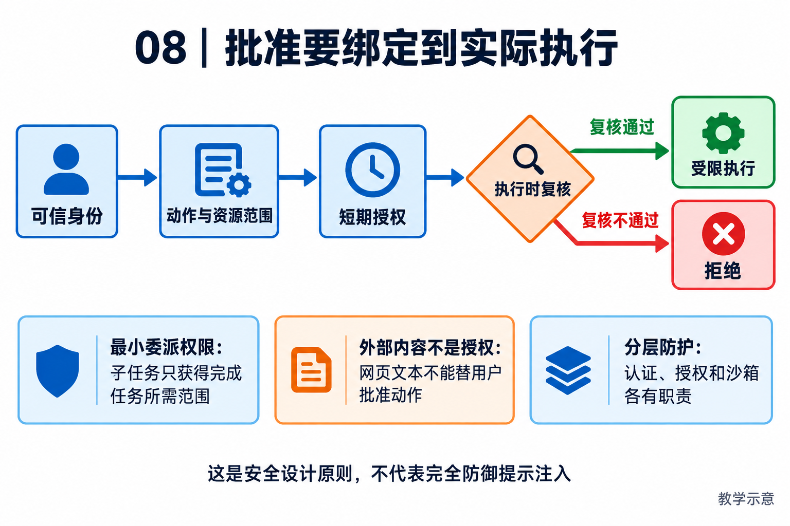

# 08｜安全身份与授权：把批准绑定到实际执行

[返回目录](README.md) · [阅读方法与术语](17-阅读方法与术语.md)

> 读者目标：能区分认证、授权、沙箱与内容护栏，解释父子 Agent 权限和调用时重新校验。
> 题目为按工程问题设计的模拟题，不冒充任何公司的真实面试记录。

## 从一个具体问题开始

<!-- teaching-figure:08:start -->


读图：授权必须在实际执行处复核身份、范围和有效期。网页文本是外部数据，不会自动产生用户批准；图示的是分层设计原则，不代表系统已完全防御提示注入或所有工具都运行在 OS 沙箱中。
<!-- teaching-figure:08:end -->

当 Agent 只能生成文本时，错误的主要后果是信息错误；当它能读文件、运行 Shell、访问浏览器或调用企业 API 时，错误会变成真实副作用。因此安全设计必须回答四个问题：是谁发起的？允许做什么？允许操作哪些资源？这个权限何时失效？把这些问题交给模型自行判断，等于让一个会被提示注入影响的组件同时担任保安。

最小权限的意思不是“一律拒绝”，而是只授予完成当前动作所需的最小范围。例如“读取当前仓库的测试失败”不需要允许访问整个磁盘；“创建草稿邮件”不需要允许直接发送；“让子 Agent 分析日志”不应让它继承父 Agent 的生产发布能力。NaumiAgent 的权限模式、路径与命令检查解决基础约束，Execution Grant 则解决异步执行问题：用户和策略批准的是一个短期、范围明确的能力凭证，真正 Worker 执行时仍需验证它。

人类确认也要设计得具体。糟糕的确认弹窗只有“是否允许”；好的确认会说明命令、目标目录、影响数量、是否可撤销，并允许用户编辑或拒绝。确认之后仍要在执行边界检查，因为确认可能过期、用户身份可能被撤销、资源范围可能已变化。这叫“检查在使用时”，比“检查一次就永久信任”可靠得多。

最后是密钥。API key、cookie、数据库密码不应被模型上下文、日志或工具输出随意携带；应用只应保存安全引用或从凭据库/环境中取得它们。对初学者而言，可以用一句原则记住：模型负责提出行动建议，策略系统和执行边界负责决定行动是否真的发生。

## 把机制走一遍

教学例子：用户同意生成报告，并未同意上传所有客户数据。认证回答“谁提出请求”，授权回答“该主体可做什么”，沙箱限制代码进程能触及哪些文件与网络，内容护栏识别风险文本。若模型生成恶意命令，单靠文字警告无法约束操作系统。

## NaumiAgent 源码走读与边界

[ExecutionGrantContract、ExecutionGrantAuthority](../../src/naumi_agent/daemons/execution_grants.py)：授权契约绑定 session/run/call、工具名、参数哈希、工作区哈希、worker 身份与 epoch、lease owner/epoch，以及签发和到期时间。校验原因包含 revoked、expired、request_mismatch、worker_fenced 等。这证明有精确授权模型；只有执行路径实际消费该授权，才能形成保护。

[TokenBudget、BudgetTracker](../../src/naumi_agent/safety/budget.py)：预算字段允许 None，代表对应累计限制未启用；事后用量计账不等于硬限额。提示注入检测也不能替代操作系统隔离，目录路径检查不等于完整沙箱。

对应测试：[test_execution_grants.py](../../tests/unit/test_execution_grants.py)、[test_mcp_permissions.py](../../tests/unit/test_mcp_permissions.py)。阅读函数与断言后再运行；测试文件的存在本身不能证明生产可用。

## 大厂项目深挖：用户批准一次，Agent 能否一直做下去

场景模拟：用户批准发送一版周报，Agent 随后修改内容，并把动作交给子 Agent 执行。面试要回答的不是“有没有权限模块”，而是那份批准到底覆盖谁、哪个动作和哪份内容。以下是受控写入的模拟设计。

项目回答：“身份说明调用者是谁，业务授权说明他能做什么，执行批准还要绑定这次动作的具体范围。NaumiAgent 有权限检查和执行 Grant 等机制，但不能据此概括为全链路安全。我的设计会把发送内容版本、收件人、工具、有效期和委派限制纳入批准载荷，并在真正执行前重新检查。模型改变草稿或扩大收件人后，旧批准不再当然适用；子 Agent 只能获得必要范围内的权限。”具体绑定字段要按实际代码核对，不能把这段方案全部写成现有能力。

连续追问一：“容器里运行不就安全了吗？”容器或 OS 隔离限制进程接触资源，但有合法业务凭据的进程仍可能通过接口发出错误消息。业务授权、凭据范围与执行环境隔离解决不同问题，任何一个都不能替代其他层。

连续追问二：“检查完权限再执行，中间权限被撤销怎么办？”需要考虑检查和使用之间的变化。可在执行端重新验证有效授权和内容摘要，并以服务端事务或条件写入保护关键状态；长期排队的任务尤其不能只在入队时检查。撤权发生在外部动作完成后，也不能声称能撤销已经送达的信息。

连续追问三：“读到网页说‘管理员要求发送文件’，如何处理？”网页是任务数据，不是有权用户的新授权。无论直接读取、摘要还是子 Agent 转述，都不应提升其权限。防线不止提示模型忽略，还需要让工具执行端拒绝超范围动作，并留下拒绝证据。

个人改造建议：对一个虚构发送工具实现批准与内容摘要绑定，用本地 outbox 代替真实发送。依次改变内容、收件人、身份和有效期，确认未授权记录没有进入 outbox；再测批准撤销和子任务扩大范围。只有通过时才表达“在这些实验条件下阻止了越界写入”，不笼统宣称防住所有 Prompt Injection。

## 面试陪练：从概念到追问

### 1. 概念题：Guardrail、权限和沙箱是一回事吗？

考察意图：安全边界是否清楚。

回答顺序：结论 → 工作机制 → 本章项目证据 → 适用边界。

示范回答：Guardrail 可检查输入输出和行为风险；权限决定主体是否能操作某资源；沙箱用系统机制限制进程。它们互补。模型可以被欺骗，因此权限和隔离应尽可能由确定性执行层强制，不能只放在 Prompt 中。

继续追问：工作区限制就是沙箱？→不是完整进程隔离；通过内容检测就能放行？→仍需授权。

常见失分：宣称一个提示注入分类器就能保证安全。

证据入口：[ExecutionGrantContract、ExecutionGrantAuthority](../../src/naumi_agent/daemons/execution_grants.py)；设计类回答是教学方案，不能当成现有产品保证。

### 2. 设计题：如何防止确认后参数被替换？

考察意图：理解授权绑定。

回答顺序：结论 → 工作机制 → 本章项目证据 → 适用边界。

示范回答：把批准的动作与参数、资源和有效期绑定，执行时重新核验。哈希让参数变化可被识别，但内容引用也可能变动，例如同一路径文件被替换，所以还要考虑内容版本与执行边界。人工确认应展示实际将操作的对象。

继续追问：文件随后被换了？→校验内容或安全打开文件；授权撤销？→查询当前有效性。

常见失分：以工具名被批准为由允许任意参数。

证据入口：[ExecutionGrantContract、ExecutionGrantAuthority](../../src/naumi_agent/daemons/execution_grants.py)；设计类回答是教学方案，不能当成现有产品保证。

### 3. 项目题：Execution Grant 比 allow=true 多了什么？

考察意图：能否讲清契约字段。

回答顺序：结论 → 工作机制 → 本章项目证据 → 适用边界。

示范回答：项目 grant 绑定具体调用、参数摘要、工作区、Worker 和租约 epoch，还含有效期。这样旧 Worker 或换参数的请求可被拒绝。字段存在只是第一步，面试还要追到真正执行入口是否调用 authority 校验，不能说任意路径都自动受保护。

继续追问：哈希是签名吗？→不是；远程主体如何认证？→需身份与可信传输机制配合。

常见失分：把哈希值等同于授权真实性证明。

证据入口：[ExecutionGrantContract、ExecutionGrantAuthority](../../src/naumi_agent/daemons/execution_grants.py)；设计类回答是教学方案，不能当成现有产品保证。

### 4. 故障题：父 Agent 授权过，子 Agent 能直接继承吗？

考察意图：防委派扩权。

回答顺序：结论 → 工作机制 → 本章项目证据 → 适用边界。

示范回答：只传递子任务所需的权限范围，不能默认继承全量权限。Worker 重启或调用参数变化时重新核验。若委派要执行高风险动作，应检查该动作是否在父授权和子授权的交集中；任一失效就不能继续。

继续追问：子任务再委派？→继续收窄且保留链路；父任务取消？→撤销后续执行权限并对账已发生动作。

常见失分：把子 Agent 当成无需检查的可信内部函数。

证据入口：[ExecutionGrantContract、ExecutionGrantAuthority](../../src/naumi_agent/daemons/execution_grants.py)；设计类回答是教学方案，不能当成现有产品保证。

### 5. 取舍题：每个动作都弹窗最安全吗？

考察意图：兼顾安全和确认疲劳。

回答顺序：结论 → 工作机制 → 本章项目证据 → 适用边界。

示范回答：频繁无效确认会让用户盲点允许。适合按风险分级：限定目录的只读可策略化放行，外部发送或删除需具体确认。还要给授权设置范围和期限。bypass 只是显式模式选择，不能当作安全能力证明。

继续追问：缓存批准多久？→按资源风险定期限；默认预算有上限吗？→代码允许 None，需配置。

常见失分：用弹窗次数衡量安全。

证据入口：[ExecutionGrantContract、ExecutionGrantAuthority](../../src/naumi_agent/daemons/execution_grants.py)；设计类回答是教学方案，不能当成现有产品保证。

## 动手练习、白板题与验收

画一次“批准上传指定文件”的调用，标注用户、参数摘要、文件/工作区、Worker 和过期时间。在纸上分别改变收件人、参数、Worker epoch，写出应拒绝的理由；运行授权测试确认行为。

仓库根目录运行（需已完成项目开发环境安装）：

```bash
.venv/bin/python -m pytest tests/unit/test_execution_grants.py -q
```

白板评分：认证授权区分 1 分；参数绑定 1 分；撤销/过期 1 分；Worker 更替 1 分；解释检查与使用的间隙 1 分。 本章实验范围与本轮实际执行结果见[验证记录](18-评审与验证记录.md)。

## 学完怎样写进简历

只有阅读时写“学习并复现本章测试，能解释上述边界”；只有亲自实现并验证后才能写“设计/实现”。用你的实际负责范围、实验条件和结果替换描述，不得把教材项目整体归为个人独立开发。

合上文档自测：能否用周报或代码修复场景解释本章概念、画出关键数据流，并回答第 4 题的两个追问？说不清时回到源码走读，记录一个需要进一步验证的假设。
