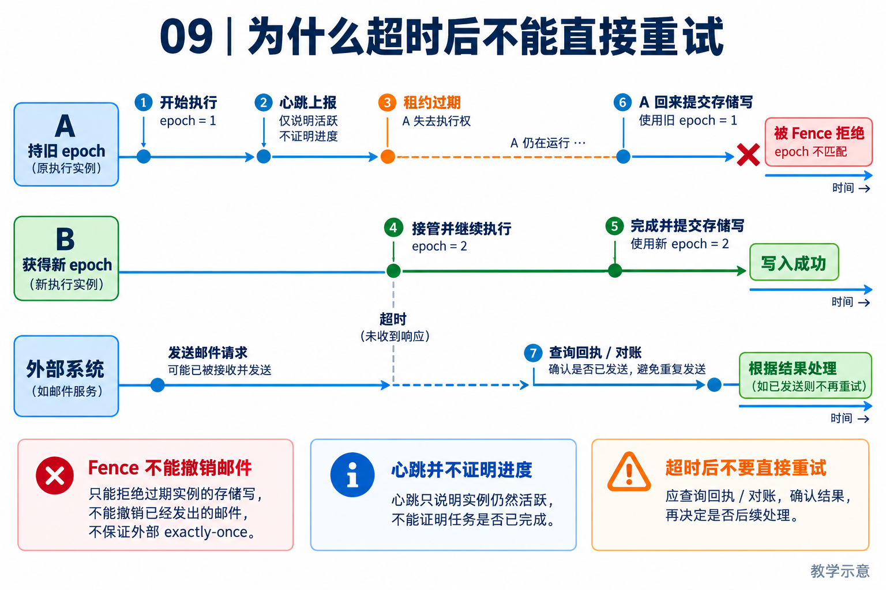

# 09｜可靠性与恢复：先分清失败和结果未知

[返回目录](README.md) · [阅读方法与术语](17-阅读方法与术语.md)

> 读者目标：能说明幂等、租约、心跳和 fencing 的不同作用，针对旧执行者恢复设计时间线。
> 题目为按工程问题设计的模拟题，不冒充任何公司的真实面试记录。

## 从一个具体问题开始

<!-- teaching-figure:09:start -->


读图：从上到下分别观察旧执行者、新执行者与外部服务。新 epoch 可帮助存储边界拒绝旧提交，却不能撤销已发送邮件；超时后先查回执或对账，心跳也不能代替进展与成功证据。
<!-- teaching-figure:09:end -->

传统程序报错时，常见处理是重试。但 Agent 调用外部系统后，超时并不代表失败：网络可能在响应返回前断开，远端服务却已经创建了订单或发出了邮件。此时重试可能造成双重扣款、重复通知或两次部署。可靠性工程的第一课是区分三种结果：确定成功、确定失败、结果未知。只有确定失败且动作幂等时，自动重试才安全。

幂等是指同一个业务请求执行多次，最终效果和执行一次相同。创建工单可以携带 client request id；再次请求时服务端返回原工单而非新建。对不支持幂等的系统，Runtime 至少要在重试前查询环境状态。NaumiAgent 在长任务上继续加入 Lease、Heartbeat 和 Fence：Lease 表示当前 Worker 暂时拥有执行权；Heartbeat 表示它仍存活；Fence 是写入时的“时代号”，过期 Worker 即使突然恢复也不能覆盖新 Worker 的结果。

恢复并非“重启程序后从头来”。应先读取持久任务、动作账本、心跳与回执，判断哪个步骤已完成、哪个未知、哪个可以继续。未知副作用尤其需要人工处理或补偿策略。比如部署命令运行中断，系统可以查询服务版本与健康检查，而不是再执行一次部署。Harness 的 replay 也不是为了重复造成副作用，而是用于复盘、验证或在安全环境重放。

面试时如果被问到 exactly-once，不要轻易承诺。跨网络和跨第三方服务，真正的 exactly-once 往往做不到；更现实的答案是使用幂等 key、持久回执、Lease/Fence、读后核验与补偿流程，让业务效果尽可能接近一次且可对账。

## 把机制走一遍

教学时间线：A 持 epoch=7 执行 → 网络暂停、租约到期 → B 取得 epoch=8 → A 恢复并尝试写回。只有写回边界校验当前 epoch，才能拒绝 A。心跳新鲜仅说明活着，不说明有进展；数据库拒绝旧结果也无法撤销 A 已发给第三方的邮件。

## NaumiAgent 源码走读与边界

[HarnessRunLease、HarnessRunFenceReceipt](../../src/naumi_agent/harness/run_lease.py)：lease 包含工作区、run kind、run ID、owner、epoch 与期限；fence 回执记录提交 epoch、当前 epoch 和拒绝原因。Pursuit 用这些契约保护运行边界。它不是给任意第三方服务添加事务，也不能仅靠本地 epoch 保证外部写入一次。

[Pursuit 租约生命周期](../../src/naumi_agent/orchestrator/pursuit_lease.py)：本轮对 test_pursuit_lease.py 实测发现恢复案例出现 PursuitStoreConflictError，详情见验证记录。可以讲已有租约机制及测试，但不能声称所有恢复路径已通过。

对应测试：[test_pursuit_lease.py](../../tests/unit/test_pursuit_lease.py)、[test_execution_grants.py](../../tests/unit/test_execution_grants.py)。阅读函数与断言后再运行；测试文件的存在本身不能证明生产可用。

## 大厂项目深挖：超时重试为什么会造成重复业务动作

场景模拟：Agent 调用工单创建接口，服务已经创建工单，但响应丢失；旧 Worker 又因为网络隔离失去租约，新 Worker 接手。平台岗位必须同时解释重试、副作用和执行权，不能用“加分布式锁”一句话收尾。

项目回答：“我把失败与结果未知分开。NaumiAgent 的 Lease 与 Fence 用来约束相关存储提交，过期执行者不应继续写入受保护状态；但本地 epoch 不能让外部接口自动具备 exactly-once。我的业务接入会使用稳定请求标识，让外部服务支持幂等提交或按标识查询。恢复时先核对是否已经创建工单，再决定重试；如果服务既不支持查询也不支持幂等，就保留未确认状态并交由人处理。”现有恢复测试的失败仍保留在第 18 章，不把设计答案当成已通过证明。

连续追问一：“幂等键在每次重试随机生成可以吗？”不可以，否则外部服务看到的是新业务请求。业务操作身份应在重试间保持稳定，执行尝试标识可以变化；同一键还要绑定一致的请求内容，避免一个键对应两种业务动作。

连续追问二：“有租约，旧 Worker 为什么还能出问题？”旧进程可能不知道自己已过期，也可能在失去租约前已经发出网络请求。Fence 必须由接收受保护写入的一方校验才有作用；不能假设一个本地布尔标志会阻止所有远端副作用。

连续追问三：“重试次数越多成功率越高吗？”重试会占用预算、放大拥塞，也可能重复动作。应按错误类型决定是否重试，配置退避、次数与总时长限制；超过限制后保留任务状态、请求标识和最后证据，方便人工或后续恢复，而非无声丢弃。

个人改造建议：用可控的本地服务模拟“成功后丢响应”，实际启动两个执行者制造接管，核对业务记录是否重复、旧 epoch 提交是否被拒绝。另测请求内容冲突、幂等记录过期和查询失败。单元测试可先覆盖控制流，但只有真正进行了进程与服务故障实验，才把结果描述成该环境下的端到端恢复验证。

## 面试陪练：从概念到追问

### 1. 概念题：Heartbeat、Lease、Fence 分别解决什么？

考察意图：区分活性、所有权与写入保护。

回答顺序：结论 → 工作机制 → 本章项目证据 → 适用边界。

示范回答：Heartbeat 定期报告状态，Lease 给执行权设置期限，Fence 在结果或写入边界拒绝旧持有者。心跳还在不代表任务有进展，租约失效也不自动终止进程。因此要同时设计停滞检测、执行取消和当前 epoch 校验。

继续追问：活着但死循环？→看进展证据和期限；租约到期谁处理？→执行/协调边界重新判断。

常见失分：把心跳存在等同于任务健康。

证据入口：[HarnessRunLease、HarnessRunFenceReceipt](../../src/naumi_agent/harness/run_lease.py)；设计类回答是教学方案，不能当成现有产品保证。

### 2. 设计题：怎样避免重试造成重复发送？

考察意图：理解分布式副作用。

回答顺序：结论 → 工作机制 → 本章项目证据 → 适用边界。

示范回答：调用前使用稳定业务请求 ID，远端按 ID 去重；超时后先查该请求。服务若不支持去重也无法查询，就将结果记为未知并交给人。内部 outbox 可以保证投递意图持久，但重复投递仍要靠接收端幂等处理。

继续追问：换个重试 ID？→会破坏去重；outbox 等于 exactly-once？→不是。

常见失分：仅重试三次就宣称可靠。

证据入口：[HarnessRunLease、HarnessRunFenceReceipt](../../src/naumi_agent/harness/run_lease.py)；设计类回答是教学方案，不能当成现有产品保证。

### 3. 项目题：NaumiAgent 如何识别旧运行者？

考察意图：读懂所有权字段。

回答顺序：结论 → 工作机制 → 本章项目证据 → 适用边界。

示范回答：租约和 fence 回执记录 owner 与 epoch，提交必须匹配当前有效租约。测试可模拟过期接管。但本轮出现一个 checkpoint 恢复冲突，因此准确表达是“存在并已部分验证的恢复机制，有已复现的失败”，而非“任意故障均可恢复”。

继续追问：epoch 能乱跳吗？→需持久、受权威管理；哪里失败？→恢复案例的 checkpoint 持久化。

常见失分：隐藏红测试，用模块存在代替通过证据。

证据入口：[HarnessRunLease、HarnessRunFenceReceipt](../../src/naumi_agent/harness/run_lease.py)；设计类回答是教学方案，不能当成现有产品保证。

### 4. 故障题：旧 Worker 已向外部系统发出动作，fence 有用吗？

考察意图：识别保护边界。

回答顺序：结论 → 工作机制 → 本章项目证据 → 适用边界。

示范回答：如果外部系统不识别 fence，本地只能拒绝旧结果记录，不能阻止已经发出的外部动作。应该在动作开始前校验授权，并结合目标系统幂等或条件写入；中间仍可能有时间窗口。能保证到哪必须按每个写入边界说明。

继续追问：文件系统怎么处理？→锁、版本/原子替换并按场景验证；不可逆动作？→授权更严并提供对账。

常见失分：声称 fencing 能自动回滚远端副作用。

证据入口：[HarnessRunLease、HarnessRunFenceReceipt](../../src/naumi_agent/harness/run_lease.py)；设计类回答是教学方案，不能当成现有产品保证。

### 5. 取舍题：能否保证 exactly-once？

考察意图：避免分布式口号。

回答顺序：结论 → 工作机制 → 本章项目证据 → 适用边界。

示范回答：先明确保证的是消息处理次数还是业务效果。跨系统常用至少一次投递加幂等、唯一约束和对账来得到业务上的一次效果。若没有共同事务或远端幂等，不能泛称 exactly-once；恢复质量应通过故障注入测量。

继续追问：应该监控什么？→重复效果、恢复时间、未知任务积压；重试越多越好？→会增加副作用风险和成本。

常见失分：不定义作用域就承诺绝对一次。

证据入口：[HarnessRunLease、HarnessRunFenceReceipt](../../src/naumi_agent/harness/run_lease.py)；设计类回答是教学方案，不能当成现有产品保证。

## 动手练习、白板题与验收

画 A/B 两个执行者与数据库的时间线，故意让 A 在 B 接管后恢复。运行本章测试并保留失败输出。白板讨论“第三方邮件服务不识别 epoch”时还需要什么：业务幂等键、状态查询或人工对账。

仓库根目录运行（需已完成项目开发环境安装）：

```bash
.venv/bin/python -m pytest tests/unit/test_pursuit_lease.py -q
```

白板评分：epoch 时间线 1 分；租约和心跳区分 1 分；外部副作用边界 1 分；未知结果处理 1 分；如实记录测试失败 1 分。 本章实验范围与本轮实际执行结果见[验证记录](18-评审与验证记录.md)。
