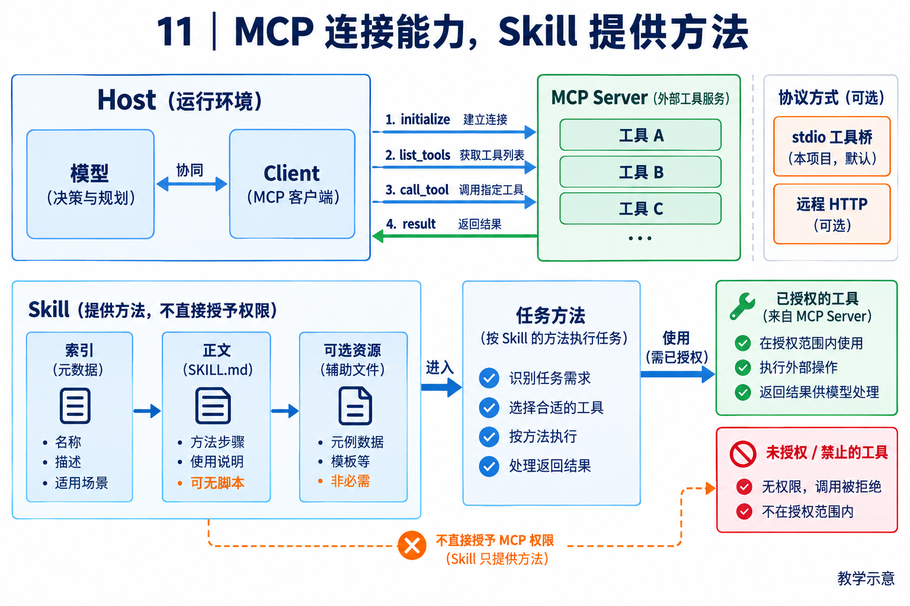

# 11｜MCP 与 Skills：协议连接和按需学习各司其职

[返回目录](README.md) · [阅读方法与术语](17-阅读方法与术语.md)

> 读者目标：能画出 MCP Host/Client/Server 关系，区分 stdio 与远程 HTTP，并解释合法 Skill 不一定包含脚本。
> 题目为按工程问题设计的模拟题，不冒充任何公司的真实面试记录。

## 从一个具体问题开始

<!-- teaching-figure:11:start -->


读图：先看 Host 内的 Client 如何连接 Server，再看 Skill 如何按需提供任务方法。图中远程 HTTP 表示协议层的另一种传输选择，不表示本项目已实现该入口；当前章节核对的是 stdio 工具桥，加载 Skill 也不会自动授予工具权限。
<!-- teaching-figure:11:end -->

如果每接一个资料库都重新写一套模型专用接口，维护成本会很高。MCP 用协议规范应用与能力提供者的通信。Host 是承载模型和用户交互的应用，Client 是 Host 内与一个 Server 通信的连接组件，Server 提供能力。调用通常经历 initialize 协商、列出工具、调用工具和返回结果。模型本身不会凭空连接服务器，连接生命周期由应用管理。

协议中的 Tools 是可请求的动作，Resources 是上下文资料，Prompts 是可选择的模板。支持哪项要看协商和具体实现，不能因为装了 MCP SDK 就声称全支持。stdio 常用于本地子进程的标准输入输出；远程 HTTP 则涉及传输、认证和授权配置。这两条部署路径需要分开讲。

Skill 解决另一件事：某类任务该按什么方法做。一个 Skill 至少有带元数据与说明的 SKILL.md，脚本、参考资料和素材是可选的。只有说明的 Skill 仍可合法且有价值，例如约定报告格式。它与普通 Prompt 的差别在可发现的包装、触发说明和按需加载组织，不在是否强制带代码。元数据先提供能力索引，命中后再读正文，需要时继续取资源，这叫渐进加载。

Skill 返回说明之后，Agent 是否继续运行脚本、调用工具并验证结果，要看运行时和实际轨迹。不能把“加载了技能”写成“已经完成技能任务”。MCP 的接入权限与 Skill 后续动作权限也都需要独立核查。

## 把机制走一遍

教学组合：周报 Skill 说明先取数据再核对引用；CRM MCP 提供 read_complaints 工具。模型读 Skill 后请求 MCP 工具，Host 检查授权、Client 发调用、Server 返回数据；模型生成报告并进行验收。Skill 不自动赋予 CRM 读取权限。

## NaumiAgent 源码走读与边界

[MCPClientManager.connect、MCPToolBridge.execute](../../src/naumi_agent/mcp/client.py)：当前 connect 使用 stdio_client 启动配置的 command/args，initialize 后 list_tools，转成带服务命名空间的本地 Tool。bridge 调 call_tool 并将结果转成文本，错误也可能成为字符串。此入口没有远程 HTTP OAuth、Resources/Prompts 的完整实现证据，因此将它写成“完整 MCP 平台”是不准确的。

[SkillTool.execute、SkillDispatchTool.execute](../../src/naumi_agent/skills/tool.py)：SkillTool 校验参数后 render 返回指令；带动态命令的模板会影响权限元数据。SkillDispatchTool 基类要求 engine 覆写执行。SkillLoader 的发现/冲突处理不等于已经验证完整供应链撤权与所有脚本执行结果。

对应测试：[test_mcp_client.py](../../tests/unit/test_mcp_client.py)、[test_skills.py](../../tests/unit/test_skills.py)。阅读函数与断言后再运行；测试文件的存在本身不能证明生产可用。

## 大厂项目深挖：团队接入多个工具，为什么不能只堆 MCP 和 Skill

场景模拟：研发助手要连接知识库、代码平台和工单系统，并复用团队操作规范。面试要说明能力接入与方法复用各解决什么问题，以及引入外部组件之后谁承担执行责任。本题为平台与研发效能岗位模拟。

项目回答：“MCP 提供客户端与服务端交互的协议，Skill 提供按任务加载的说明及可选资源。NaumiAgent 当前可以沿 stdio 连接、发现工具并调用工具，但这不能证明它实现了所有远程授权或协议能力。一个 Skill 可以只有说明，不一定包含代码；真正修改文件或工单的动作仍要经过工具执行与权限检查。我会把连接契约、操作方法和授权分别管理，而不是认为导入扩展就自动获得了可靠业务能力。”

连续追问一：“已有 HTTP API，为什么还要 MCP？”先比较调用者数量、工具发现需求、schema 维护和现有 SDK 成本。单一稳定接口可以直接封装工具；多个兼容客户端需要共享能力时，协议化接入可能减少重复适配，但也引入连接生命周期和版本兼容工作。不是任何接口套上 MCP 都会变得更可靠。

连续追问二：“服务端更新了工具 schema 怎么办？”工具名称相同不代表参数和副作用不变。可设计能力清单与版本记录，在变化时重新校验调用、权限与兼容性，并对未知工具采取明确策略。缓存发现结果可以降低开销，但失效和重连后的更新必须纳入测试。

连续追问三：“Skill 写着必须执行脚本，能直接执行吗？”加载的文本只是方法说明，不是用户对任意脚本的批准。要检查脚本来源、所需资源和任务授权；名称冲突、过期说明、指向缺失文件也应向用户解释。子 Agent 读取同一 Skill，同样不会自动继承父级的全部权限。

个人改造建议：用一个本地 MCP 测试服务提供只读与写入工具，设计一次 schema 变化和一次断连，验证发现、调用、错误反馈与权限拒绝。再编写一个引用这些工具的 Skill，证明“能加载说明”和“完成实际动作”各自需要什么证据。若只验证 stdio，简历就写 stdio 工具接入，不写完整远程企业身份体系。

## 面试陪练：从概念到追问

### 1. 概念题：MCP、Tool、Skill 有什么区别？

考察意图：分清协议、动作和方法。

回答顺序：结论 → 工作机制 → 本章项目证据 → 适用边界。

示范回答：Tool 是动作接口；MCP 标准化能力发现和调用通信；Skill 包装某类工作的说明与可选资源。一个 Skill 可以指导 Agent 调多个 MCP 工具，也可以完全不用 MCP。三者都不是完整 Agent，仍需模型决策和运行时控制。

继续追问：Skill 必须有 Python 吗？→不必须；MCP 必须有模型吗？→Server 可以只是数据服务。

常见失分：把三个名词都解释成自动执行插件。

证据入口：[MCPClientManager.connect、MCPToolBridge.execute](../../src/naumi_agent/mcp/client.py)；设计类回答是教学方案，不能当成现有产品保证。

### 2. 设计题：怎样接企业远程 MCP？

考察意图：识别远程授权与数据边界。

回答顺序：结论 → 工作机制 → 本章项目证据 → 适用边界。

示范回答：先确认传输和协议能力，再配置身份、必要 scope、资源访问和审计；只把可用工具交给模型。Tools、Resources 与 Prompts 分别核对支持。这个设计不能直接套到当前 NaumiAgent stdio 入口并声称已完成，需要实现与联调证据。

继续追问：stdio 怎么鉴权？→通常利用进程/环境凭据，不照抄 HTTP 流程；scope 越多越方便？→增加数据暴露范围。

常见失分：说所有 MCP 都默认具备 OAuth。

证据入口：[MCPClientManager.connect、MCPToolBridge.execute](../../src/naumi_agent/mcp/client.py)；设计类回答是教学方案，不能当成现有产品保证。

### 3. 项目题：NaumiAgent 调用 Skill 后发生什么？

考察意图：是否读到真正 execute。

回答顺序：结论 → 工作机制 → 本章项目证据 → 适用边界。

示范回答：SkillTool.execute 主要处理参数并渲染说明，返回给模型。动态内容可能执行命令，元数据会标注更高风险；统一调度基类还需 engine 覆写。结果里出现一段操作说明并不等于对应文件已生成，必须查后续工具轨迹。

继续追问：模板无脚本是不是套壳？→Skill 可合法为说明包；声明 allowed-tools 就已强制？→要查 Host 是否执行该策略。

常见失分：把渲染指令宣称为全部任务已自动执行。

证据入口：[MCPClientManager.connect、MCPToolBridge.execute](../../src/naumi_agent/mcp/client.py)；设计类回答是教学方案，不能当成现有产品保证。

### 4. 故障题：恶意 Server 或 Skill 能扩大权限吗？

考察意图：理解不可信扩展。

回答顺序：结论 → 工作机制 → 本章项目证据 → 适用边界。

示范回答：它可以通过描述或内容诱导模型，所以 Host 不应把描述当授权。加载时检查来源，执行时校验具体动作；失去可信来源后重新确认。当前 MCP bridge 还会文本化错误，需核实错误分类和敏感信息处理，不能说风险已完全消除。

继续追问：签名包就一定安全吗？→只能证明来源/完整性；Server 提示上传密钥？→与用户目标无关，执行层应阻断。

常见失分：把安装插件等同于信任其全部行为。

证据入口：[MCPClientManager.connect、MCPToolBridge.execute](../../src/naumi_agent/mcp/client.py)；设计类回答是教学方案，不能当成现有产品保证。

### 5. 取舍题：所有内部工具都要 MCP 化吗？

考察意图：协议收益是否值得成本。

回答顺序：结论 → 工作机制 → 本章项目证据 → 适用边界。

示范回答：多应用复用与第三方生态适合 MCP；同进程且强事务需求的能力可直接用原生 Tool。引入协议有连接、版本和错误转换成本。Skill 则按需加载任务知识，数量多时尤其需索引和冲突管理。选型由接入关系决定。

继续追问：会增加 token 吗？→全量工具 schema 会，需按需发现；Skill 能替代 API 吗？→不能，它仍需行动接口。

常见失分：为了追热点给每个函数增加远程服务。

证据入口：[MCPClientManager.connect、MCPToolBridge.execute](../../src/naumi_agent/mcp/client.py)；设计类回答是教学方案，不能当成现有产品保证。

## 动手练习、白板题与验收

画本地 stdio MCP 和远程 HTTP MCP 两张部署图；写一个只有说明的最小 Skill。运行 test_tool_execute 与 MCP 名称测试，观察“返回指令文本”和“业务任务完成”的差别。

仓库根目录运行（需已完成项目开发环境安装）：

```bash
.venv/bin/python -m pytest tests/unit/test_mcp_client.py -q
```

白板评分：三种 MCP 角色 1 分；传输区分 1 分；Skill 可无脚本 1 分；加载执行分离 1 分；授权边界 1 分。 本章实验范围与本轮实际执行结果见[验证记录](18-评审与验证记录.md)。

## 延伸阅读

[MCP 2025-11-25 规范](https://modelcontextprotocol.io/specification/2025-11-25)；[Agent Skills 格式规范](https://agentskills.io/specification)。固定 MCP 修订号用于核对，不声称这是截至某日唯一最新修订。
