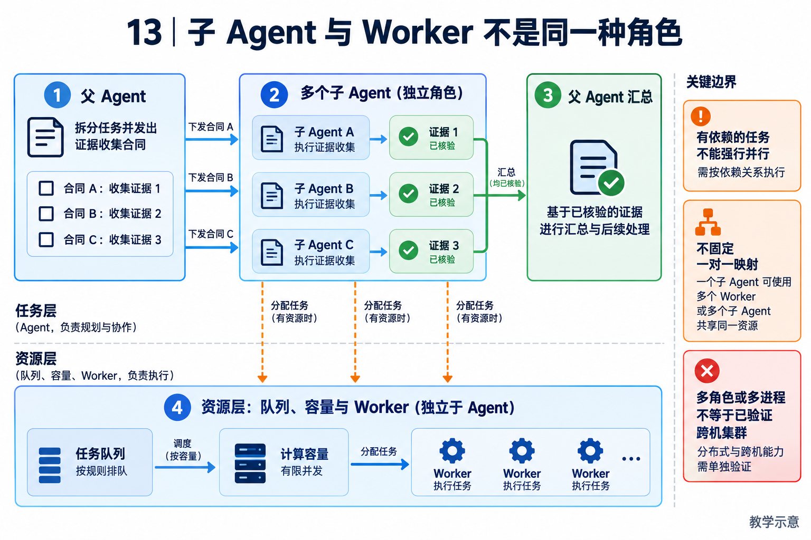

# 13｜多 Agent、Worker 与集群：任务拆分和资源调度是两件事

[返回目录](README.md) · [阅读方法与术语](17-阅读方法与术语.md)

> 读者目标：能区分认知委派、并行工具、后台 Worker 和分布式集群，并算清并行的收益与故障成本。
> 题目为按工程问题设计的模拟题，不冒充任何公司的真实面试记录。

## 从一个具体问题开始

<!-- teaching-figure:13:start -->


读图：上层拆分任务合同并回收证据，下层处理排队、容量和执行资源。子 Agent 是任务角色，Worker 是资源角色，不要求一一对应；图中的“已核验”是汇总前的要求，不意味着收到子 Agent 的文字就已经完成核验。
<!-- teaching-figure:13:end -->

单 Agent 已经能完成许多任务。只有当工作可以拆分、每部分相对独立、并行收益大于协调成本时，多 Agent 才值得引入。典型例子是研究任务：一个子 Agent 收集竞品功能，一个核验价格，一个阅读技术文档，父 Agent 在明确的输出格式下汇总。相反，让五个 Agent 同时“想想怎么修这个 bug”，通常只会产生重复 token、冲突建议和更难解释的过程。

委派前需要定义任务合同：子 Agent 的目标、允许访问的上下文和工具、deadline、输出 schema、失败语义，以及父 Agent 如何合并结果。上下文不能全部复制，否则成本随着 Agent 数量爆炸；更好的方式是传递最小必要输入，让子 Agent 返回结构化结论、证据链接和不确定性。NaumiAgent 的 message bus、team protocol 和 `SubAgentManager` 就是为这类生命周期与通信边界而设。

Worker 是另一个概念。子 Agent 描述认知上的委派；Worker 描述计算资源上的异步执行者。一个 Worker 可以运行子 Agent，也可以只负责耗时工具。引入队列、容量、监管与授权后，系统能处理更多并发，但必须面对排队、崩溃、重复投递和身份认证。NaumiAgent 的 daemon 模块提供 Worker 注册、容量预约、进程监管和工具 RPC 的基础。

谈“集群”时要诚实区分层级：本地多个 Worker、单机多进程、跨机器控制面、多地域多租户是不同难度。仓库已有受控 Worker 机制，不等于已经验证了公网大规模集群。面试中主动说明这个边界，反而能体现你理解分布式系统的成本。

## 把机制走一遍

把一份竞品报告拆成三个证据收集子任务，再交给父 Agent 汇总，是较清晰的并行场景。每个子任务需要目标、资料范围、截止时间、允许工具、交付结构和无法验证项。若三项分别耗时 20、30、40 秒，在资源充足且真正独立的理想条件下，收集阶段可由串行 90 秒接近并行 40 秒；实际还要加排队、启动、交接与汇总时间。这个算例不是 NaumiAgent 跑分。

若 A 必须先生成接口契约，B 才能写调用代码，就不能把 A、B 当作独立工具并行。DAG 是有向无环依赖图，用边表达“谁等待谁”。父 Agent 应核验子任务的工件和证据，不能只拼接文字。Worker 容量是另一个限制：即使逻辑上可并行，也可能因资源配额需要排队；队列中的等待状态不应误报为正在执行。

## NaumiAgent 源码走读与边界

[SubAgentManager](../../src/naumi_agent/orchestrator/subagent_manager.py)：提供 delegate、execute_sequential、execute_parallel、execute_dag 等入口，也有执行记录、容量等待、结果发布与回收相关逻辑。接口名称不能替代集成证明，讲解时应沿一次实际委派看登记、准入、执行和结果回收。一个子 Agent 是任务角色，一个 Worker 是承载执行的资源角色，两者不是一一对应的标准定义。

[WorkerRegistryStore](../../src/naumi_agent/daemons/worker_registry.py)：register、reserve_capacity、enqueue_capacity_waiter、claim_next_capacity_waiter 等方法把 Worker 身份历史、容量预约和排队建模在存储层。它们可以用于学习并发准入与恢复，但当前材料没有多地域、多租户、公网部署的压力数据，因此不称其为已经验证的大规模集群，也不把内部消息协议说成已兼容某个外部 A2A 标准。

对应测试：[test_worker_capacity_queue.py](../../tests/unit/test_worker_capacity_queue.py)、[test_subagent_manager.py](../../tests/unit/test_subagent_manager.py)。阅读函数与断言后再运行；测试文件的存在本身不能证明生产可用。

## 大厂项目深挖：为什么多加几个 Agent，任务反而更慢

场景模拟：资料助手把检索、总结、复核都交给不同 Agent，最后发现调用更多、结论冲突、时延上升。平台岗要能区分任务依赖和资源调度，应用岗要解释并行到底改善了哪部分业务，而不是用角色数量证明架构先进。

项目回答：“子 Agent 是任务委派和上下文边界，Worker 是执行资源，多个角色不一定意味着多个进程，更不代表多机集群。NaumiAgent 可以作为学习这些契约的入口，但本地多 Worker 实验不能证明生产集群能力。我会先画任务依赖：独立资料收集可以并行，综合和核验通常依赖前面的结果；如果只是并行查询，工具批处理可能已经够用，不一定需要为每个查询增加独立模型上下文。”

连续追问一：“怎样判断值得拆？”比较可并行部分占比、任务间依赖、输入分发与结果合并开销。并行度上升还会争抢模型额度、连接与数据库写入。先测串行基线，再记录不同并发度下的总时延、累计成本和失败率，不能只看最快的一个子任务。

连续追问二：“两个 Agent 给出矛盾答案，投票可以吗？”多数一致不等于正确，尤其当它们共享同一错误来源。汇总应保留来源、适用条件和冲突点，必要时重新检索或交由人判断；对文件或业务状态则直接检查环境。复核角色有独立职责，不代表天然拥有独立事实证据。

连续追问三：“父任务取消，子任务怎么办？”需要传播取消意图、停止尚未开始的工作，并处理已经执行的动作。子 Agent 只能获得任务必需权限；已发送的外部请求不能因父级取消就被视为从未发生。超时子任务应有明确回收和结果处置，不让迟到结果覆盖更新版本。

个人改造建议：以三份独立资料为输入，对比串行、工具并发与子 Agent 委派三种方案，保持同一验收条件。加入一个慢任务、一个失败任务和一组冲突来源，检查局部失败、取消传播和汇总引用。若实验没有真实模型，结论限定为调度行为；只有获得真实调用数据后才讨论质量、费用与端到端收益。

## 面试陪练：从概念到追问

### 1. 概念题：子 Agent、Worker 和集群有什么区别？

考察意图：是否把模型角色与计算基础设施分层理解。

回答顺序：结论 → 工作机制 → 本章项目证据 → 适用边界。

示范回答：子 Agent 是由父任务委派的执行角色，可以有独立上下文和工具范围；Worker 是接收任务并消耗资源的执行载体；集群进一步涉及多节点调度、身份、网络与容错。单进程也能有多个子 Agent，多 Worker 也可以只运行工具任务。本项目分别有 SubAgentManager 和 WorkerRegistryStore，正适合沿两个层次理解，而不是看到多个 Agent 名字就声称实现了分布式系统。

继续追问：① Handoff 呢？通常强调控制权转移，subtask 通常委派后回到父任务汇总。② 两次模型调用就是两个 Agent 吗？不必然，需要看是否存在独立任务生命周期与行动闭环。

常见失分：把并行 API 请求、Agent 角色和多机集群混为一谈。

证据入口：[SubAgentManager](../../src/naumi_agent/orchestrator/subagent_manager.py)；设计类回答是教学方案，不能当成现有产品保证。

### 2. 设计题：什么任务适合多 Agent？

考察意图：能否从收益而非热点术语出发设计。

回答顺序：结论 → 工作机制 → 本章项目证据 → 适用边界。

示范回答：我先判断子问题是否独立、输出是否可核验、协作开销是否低于并行收益。资料收集或分模块检查通常可拆；强共享状态、频繁互相等待的任务可能不适合。委派前限定目标、权限、时间和预算，汇总时核查证据。若只是三次独立搜索，用并行工具就可能够了，不一定需要三套独立模型上下文。

继续追问：① 怎么衡量是否更好？比较同一任务集的成功率、端到端时延和总成本。② 任务拆错了呢？支持取消与重新规划，保留已核验成果而非全部重跑。

常见失分：把 Agent 数量多当作先进性证据，不计算汇总和重复推理成本。

证据入口：[SubAgentManager](../../src/naumi_agent/orchestrator/subagent_manager.py)；设计类回答是教学方案，不能当成现有产品保证。

### 3. 项目题：怎么避免上下文和权限随着委派扩散？

考察意图：是否理解委派的输入输出边界。

回答顺序：结论 → 工作机制 → 本章项目证据 → 适用边界。

示范回答：教学设计上给子任务最小必要资料与明确工件地址，输出结论、证据和未解决项，而非整段父会话。权限也应按子任务收窄，不让每个 Worker 继承全部凭据。本项目可从 delegate 的配置、agent_tool_names 以及授权链追查具体传递内容；这些机制是否覆盖某种委派路径必须逐条核验，不能仅凭工具白名单存在就断言完全隔离。

继续追问：① 子任务确实需要额外文件呢？由父任务补充明确范围或请求相应授权。② 摘要丢了约束呢？用结构化必填字段和证据引用检查，不能让摘要替代权限事实。

常见失分：把整个父上下文与密钥无差别复制，或相信提示词可以强制隔离。

证据入口：[SubAgentManager](../../src/naumi_agent/orchestrator/subagent_manager.py)；设计类回答是教学方案，不能当成现有产品保证。

### 4. 故障题：Worker 卡住或结果晚到，父 Agent 怎么办？

考察意图：能否处理取消、失联和迟到结果的一致性。

回答顺序：结论 → 工作机制 → 本章项目证据 → 适用边界。

示范回答：需要区分正常排队、等待用户与真正失联。父任务记录 deadline、执行实例和结果归属，失联后结合心跳与 Lease 判断是否需要重新调度，旧执行者写入须经过 Fence。已经发送到外部的副作用还要对账，不能靠重派解决。WorkerRegistryStore 的容量预约与队列是源码入口，但应用仍需要证明取消、迟到结果和重复投递情况下不串任务、不泄漏容量。

继续追问：① 旧 Worker 突然回来呢？校验当前实例/epoch，拒绝过期提交并记录原因。② 自动重派前做什么？确认外部副作用是否已发生，避免重复发送或写入。

常见失分：超时就盲目启动第二个 Worker，或者父任务退出后永久保留占用。

证据入口：[SubAgentManager](../../src/naumi_agent/orchestrator/subagent_manager.py)；设计类回答是教学方案，不能当成现有产品保证。

### 5. 取舍题：多个 Agent 投票能消除幻觉吗？

考察意图：是否认识相关性错误和验证成本。

回答顺序：结论 → 工作机制 → 本章项目证据 → 适用边界。

示范回答：不能。多个 Agent 可能使用同一模型、同一错误资料和类似提示词，错误高度相关。投票可以用于产生候选或暴露分歧，但最终要回到可验证事实，例如来源文本、测试结果和业务终态。对代码修复，多个解释都说正确不如隔离环境中的回归测试；即使测试通过，也要审查测试覆盖范围与变更副作用。

继续追问：① 不同模型呢？有助多样性，但仍可能共享错误证据。② 什么时候值得评审 Agent？结果可验证、风险较高，且新增评审带来的收益超过成本时。

常见失分：把多数意见当成事实，或把模型自评当成独立环境证据。

证据入口：[SubAgentManager](../../src/naumi_agent/orchestrator/subagent_manager.py)；设计类回答是教学方案，不能当成现有产品保证。

## 动手练习、白板题与验收

为三个资料收集子任务写出输入、输出、授权、deadline 与合并规则；再把其中一个改成依赖前序结果，画出 DAG。运行容量队列测试，找出排队、取消和释放的断言。在本地实验中模拟容量为 1 时两个任务竞争，验收应包括没有超卖、等待可见、取消不遗留占用和结果正确归属。未运行跨机器压测前，不给出集群吞吐数字。

仓库根目录运行（需已完成项目开发环境安装）：

```bash
.venv/bin/python -m pytest tests/unit/test_worker_capacity_queue.py -q
```

白板评分：任务独立性 1 分；委派契约 1 分；上下文最小化 1 分；队列/故障处理 1 分；成本与规模证据 1 分。 本章实验范围与本轮实际执行结果见[验证记录](18-评审与验证记录.md)。
