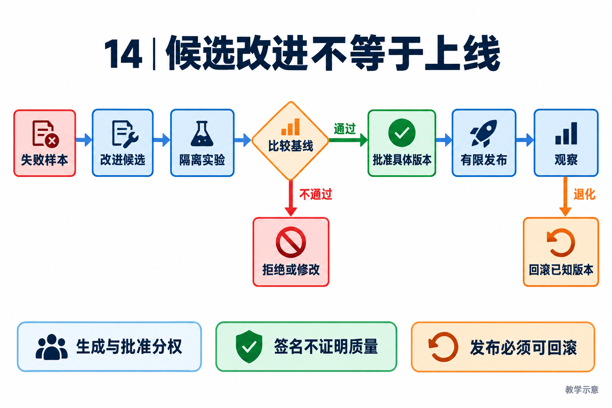

# 14｜演进与发布治理：候选改进必须允许被拒绝

[返回目录](README.md) · [阅读方法与术语](17-阅读方法与术语.md)

> 读者目标：能设计失败样本到可回滚变更的闭环，分清提示优化、工具扩展、代码修改与模型训练。
> 题目为按工程问题设计的模拟题，不冒充任何公司的真实面试记录。

## 从一个具体问题开始

<!-- teaching-figure:14:start -->


读图：从失败样本提出候选，在隔离环境比较后才能考虑批准与发布。不通过的候选必须能被拒绝，发布后退化必须有回滚路径；这是治理设计示意，不是项目所有发布路径已端到端验证的声明。
<!-- teaching-figure:14:end -->

Agent 的“自我演进”并不必然意味着重新训练模型。更新提示词、补充经过核验的记忆、改进工具实现或任务规划策略，都可能改变系统行为。训练或微调是更新模型参数的另一种方式，需要数据、训练目标和独立验证。把一次模型反思写回记忆，不能直接叫作能力已经提升；把代码改得能运行，也不能证明业务效果变好。

以代码修复 Agent 为例，它多次忘记运行测试。我们可以提出候选改进：完成前检查测试证据，而不是让模型再背一句“记得测试”。候选需要说明观察到的失败、改动范围、预期指标、风险和回滚方式；在固定任务集上比较改前改后，并检查安全性和耗时是否退化。只有证据支持且审批通过，才进入相应发布路径。这个流程的核心是把一个听起来合理的想法变成可以被证伪的实验。

Reward hacking 指系统通过钻指标空子得到高分，却没有达成真实目标。若只奖励“输出测试通过”，模型可能写出这句话而不运行测试；若只统计通过率，候选可能跳过困难用例。防线是独立保存任务集、运行环境与结果证据，明确禁止删题或改判分规则，并把成功率、成本、错误副作用一起观察。灰度是先让有限范围使用新版本；回滚是恢复已知可用版本，两者都需要真实执行路径，不是文档上的两个箭头。

## 把机制走一遍

教学案例：基线在 20 个固定修复任务中有 6 个未运行测试，候选增加完成证据门后，只剩 1 个未运行；但总时延增加且有 2 个任务被错误阻塞。不能只宣传“漏测下降”，还需核实这些任务是否真的修好、误阻塞能否接受、额外成本是多少。数值仅用于解释指标设计，不是项目实验结果。

安全闭环可画为：失败样本 → 不可执行候选 → 隔离实验 → 前后比较 → 审批绑定具体版本 → 分范围发布 → 观察/回滚。生成者不应同时拥有更改评测集、签署最终批准和发布生产的无限权限。审批后若代码、目标环境或证据包变化，需要重新核验批准覆盖范围，而不是拿旧签名放行新变更。

## NaumiAgent 源码走读与边界

[EvolutionCandidateDraft](../../src/naumi_agent/evolution/candidate.py)：使用严格数据模型表达候选、假设、风险与预期指标，并通过校验限制不一致输入。它是改进提案的契约，不等于提案已被执行或有效。整个 evolution 目录包含多阶段治理模块，本章只以实际读到的候选和签名路径证明这一部分能力，不推断所有部署模式已经端到端打通。

[EvolutionApprovalSignatureService](../../src/naumi_agent/evolution/approval_signatures.py)：prepare、submit 等入口围绕 challenge、payload 和 receipt 组织审批签名，载荷具有确定性序列化；验证逻辑与测试可用于理解批准如何绑定具体证据。签名能证明受信密钥对特定内容作出授权，不能证明候选质量，也不能替代密钥保管和角色独立。本轮签名测试中的命令元数据断言失败，见验证记录；没有改动运行时代码来掩盖失败。

对应测试：[test_evolution_approval_signatures.py](../../tests/unit/test_evolution_approval_signatures.py)、[test_evolution_candidate.py](../../tests/unit/test_evolution_candidate.py)。阅读函数与断言后再运行；测试文件的存在本身不能证明生产可用。

## 大厂项目深挖：Agent 可以改自己，怎样防止越改越差

场景模拟：Coding Agent 从失败日志提出修复，修改自己的工具代码，并声称测试通过，可以自动更新。研发效能与评测工程方向需要说明提案、验证、批准和发布的职责边界。自我演进是 NaumiAgent 的项目方向，但方向不能直接写成已证明的长期效果。

项目回答：“NaumiAgent 的候选契约可记录改进假设和风险，审批签名路径可以绑定特定载荷；签名证明授权关系，不证明代码质量。我的工程方案会让候选在受限环境里修改，使用独立的固定评测比较基线，检查风险后再批准具体版本。提出补丁的 Agent 不应自行修改验收规则、批准自己并直接替换运行中的系统。是否具备完整发布与回滚闭环，还要单独验证，不能只看目录里有这些模块。”

连续追问一：“把失败测试改成通过，算进化吗？”不算有效改进，除非测试本身确有错误且修订经过独立评审。应保留原始失败样本、基线和规则版本，区分修实现与修判分器。否则候选只是在优化分数，而没有改善任务表现。

连续追问二：“同一组题反复优化会怎样？”可能只适配已见样本。应将开发样本与保留验证样本分开，并检查跨任务退化、安全边界和成本；不能因为某类任务提高就隐去其他任务变差。模型非确定性还要求适当重复实验，而不是挑一次好结果。

连续追问三：“批准后又改了一行代码怎么办？”批准应绑定具体候选内容和评测证据，内容变化需要重新判断授权是否有效。回滚也不能只恢复代码：若候选改变数据格式或造成外部副作用，需要说明兼容方案与不能自动逆转的范围。

个人改造建议：选择一个已有失败用例，在隔离副本中提交候选修复，并准备一个会通过目标测试却破坏其他用例的反例候选。验证评测能拒绝退化、批准后篡改能被发现、采纳失败能保留旧版本。没有执行真实版本切换，就把成果写成候选评测与授权实验，不写“实现全自动自进化上线”。这也不等于 Agentic RL 或模型参数后训练。

## 面试陪练：从概念到追问

### 1. 概念题：自我演进与反思、微调是什么关系？

考察意图：能否区分系统行为改变与模型参数更新。

回答顺序：结论 → 工作机制 → 本章项目证据 → 适用边界。

示范回答：反思是分析一次行为或结果，可以生成改进建议，但建议可能错误。自我演进是更大的工程闭环，需要把建议转成候选，经过验证、批准和观察才采纳。微调则直接更新模型参数，只是可能采用的一种改进手段。本项目的候选与审批模块展示系统层治理，不应被描述成已经实现持续在线训练，也不能用反思次数衡量能力提升。

继续追问：① 写入记忆算进化吗？是行为变化的可能来源，但是否改善需要评测。② 自动生成工具呢？还需代码检查、执行隔离、注册授权和回归验证。

常见失分：把 Agent 写了几行反思等同于模型学会了新知识。

证据入口：[EvolutionCandidateDraft](../../src/naumi_agent/evolution/candidate.py)；设计类回答是教学方案，不能当成现有产品保证。

### 2. 设计题：如何避免自己出题、自己打分、自己上线？

考察意图：是否真正分离决策权限。

回答顺序：结论 → 工作机制 → 本章项目证据 → 适用边界。

示范回答：候选生成者可以提出改动，但不能任意改验收集或签署最终批准。评测应在固定版本和环境执行，保存失败样本与原始结果；审批绑定具体代码、证据和目标范围；发布者只接受满足门槛的包。高风险变更还需独立人员审批。若全部角色只是在同一高权限 Agent 提示词中换名字，实际上没有权限分离；必须由身份、密钥和执行入口共同约束。

继续追问：① 换一个模型做评审够吗？不够，它仍可能共享数据且没有独立权限边界。② 紧急修复能绕过吗？应有显式应急流程、范围限制和审计，而非模型自行豁免。

常见失分：把红军 Agent 与蓝军 Agent 的名字不同当成安全隔离。

证据入口：[EvolutionCandidateDraft](../../src/naumi_agent/evolution/candidate.py)；设计类回答是教学方案，不能当成现有产品保证。

### 3. 项目题：Candidate 和审批签名各自解决什么问题？

考察意图：能否沿代码解释提案和授权的差别。

回答顺序：结论 → 工作机制 → 本章项目证据 → 适用边界。

示范回答：EvolutionCandidateDraft 描述改进假设、风险和预期指标，使提案有结构、可检查；它不授予执行权限。EvolutionApprovalSignatureService 将审批挑战、载荷与回执组织起来，使批准可绑定具体内容并核验来源。两者解决的是提案表达和授权可信度，不负责凭空证明效果。要说候选真的更好，还需独立评测结果；要说已上线，还需发布与健康验证。

继续追问：① 签名有效但代码改了呢？检查绑定范围和摘要，不能沿用不匹配批准。② 签名测试通过证明生产安全吗？只证明对应测试条件下的契约，需要另验密钥管理与部署链路。

常见失分：把密码学签名当作代码质量证明，或把候选状态当发布结果。

证据入口：[EvolutionCandidateDraft](../../src/naumi_agent/evolution/candidate.py)；设计类回答是教学方案，不能当成现有产品保证。

### 4. 故障题：离线分数涨了，线上体验却下降，怎么办？

考察意图：能否识别代理指标与真实目标偏离。

回答顺序：结论 → 工作机制 → 本章项目证据 → 适用边界。

示范回答：先限制影响范围，达到预设退化条件时回滚或暂停扩量，再分析任务分布变化、评测泄漏、工具环境差异和成本上升。保存候选、基线、运行轨迹与失败样本，避免一边修改指标一边宣布成功。新的评测集可以补充真实失败，但需保留旧基准便于比较。教材没有生产业务数据，所以这里是治理设计题，不声称本项目已完成这样的线上实验。

继续追问：① 通过率升但时延翻倍呢？依据事先约定的成本与时延护栏判定，不只看一个指标。② 回滚后数据怎么办？区分代码版本与外部副作用，必要时另做补偿与对账。

常见失分：离线单指标提升就直接全量发布，出问题后删除不利样本。

证据入口：[EvolutionCandidateDraft](../../src/naumi_agent/evolution/candidate.py)；设计类回答是教学方案，不能当成现有产品保证。

### 5. 取舍题：什么时候允许自动采纳改进？

考察意图：是否按风险和证据分级，而非追求无限自治。

回答顺序：结论 → 工作机制 → 本章项目证据 → 适用边界。

示范回答：可对范围窄、可逆、评测稳定且权限低的改动设计自动准入，例如受控提示模板的离线候选筛选；涉及权限、生产数据、发布密钥或执行沙箱的改变，应提高独立审批要求。自动化程度由影响范围、可检测性与回滚成本决定。对 NaumiAgent，我会先展示实际候选和签名契约，再说明仍缺哪些集成或业务证据，不把愿景写成运行保证。

继续追问：① 自动化是否就没人负责？不是，策略、审批者和回滚责任仍需明确。② 怎么证明长期变强？用固定与新增任务集持续比较质量、成本和安全退化，公开失败而非挑选样本。

常见失分：把“无需人类”作为唯一目标，或把所有改动都设为一票放行。

证据入口：[EvolutionCandidateDraft](../../src/naumi_agent/evolution/candidate.py)；设计类回答是教学方案，不能当成现有产品保证。

## 动手练习、白板题与验收

用“完成前强制核查测试证据”写一份候选提案，包含失败样本、可证伪假设、固定评测任务、误阻塞指标和回滚条件。运行签名测试时保留完整结果，不因存在已知失败就修改断言让其变绿。分析过期、载荷变化和重复提交的测试如何防止审批被误用。若没有发布环境，仅完成候选与本地签名实验，不执行生产发布。

仓库根目录运行（需已完成项目开发环境安装）：

```bash
.venv/bin/python -m pytest tests/unit/test_evolution_approval_signatures.py -q
```

白板评分：假设与指标 1 分；独立评测 1 分；角色和批准范围 1 分；回滚可执行性设计 1 分；真实收益与证据边界 1 分。 本章实验范围与本轮实际执行结果见[验证记录](18-评审与验证记录.md)。
