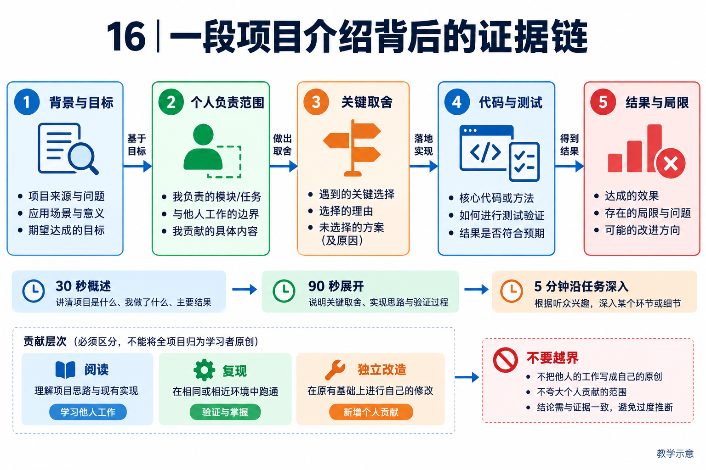

# 16｜NaumiAgent 项目介绍与答题路线：从读过到真正讲得清

[返回目录](README.md)

## 先确认你在这个项目中的真实角色

<!-- teaching-figure:16:start -->


读图：沿背景、个人范围、取舍、代码验证和局限组织讲述。30 秒、90 秒、5 分钟是三种展开粒度；阅读、复现、独立改造要按自己的真实经历选择措辞，而非把整套项目归为个人原创。
<!-- teaching-figure:16:end -->

面试官常通过“你负责哪一块、为什么改、怎么测”区分真正经历与背诵材料。读者如果只是阅读和复现，应说“我以 NaumiAgent 做源码学习和工程实验”；如果确实完成一个补丁，就说明具体文件、失败现象、方案与验证。不要复制“我设计了整个 Runtime”的简历句子。能诚实解释一个模块，比声称包办十四个模块更可信。

本项目以 Python Runtime 为核心，模型通过路由层调用，工具负责动作，任务与持久状态承担运行记录。教学定位是理解本地 Agent 如何逐步增加执行治理、恢复和评测能力。自我演进是项目方向；候选、审批、签名相关代码是当前可检查的部分，不能将它们等同于已证明长期自主变强。

## 先确定项目价值：可核验任务闭环，而不是技术名词数量

用于国内大厂求职时，推荐把项目定位为“面向企业研发与知识协作的可核验任务 Agent”。这是一种业务表达：用户委托收集、整理或修改工作，Agent 不仅给出文字，还要在授权范围内行动，并交付能检查的结果。周报只是易于复现的载体；同一工程问题可以迁移到研发资料整理、工单处理和代码修复。尚未实现的迁移场景应明确标注为方案。

介绍时选择一个主问题贯穿全程。例如“工具返回成功，为什么任务仍可能没完成”，可以串起账本、产物、恢复与评测；“任务变长后如何保留约束”，可以串起上下文、来源与权限。不要同时声称自己解决了全部十四个模块，也不要把多 Agent、MCP 和自演进都当作必须展示的亮点。面试可追问的技术深度，来自一个问题里的机制与取舍。

对于“为什么不用现成框架”，合适的回答是：学习项目让执行契约和失败分支可见，便于复现并形成自己的改进；真实业务选型仍要比较现成框架的持久化、接入和维护成本。NaumiAgent 的价值不需要建立在贬低 LangGraph、Dify 或其他工具之上。横向比较依据见第 15 章。

## 90 秒开场：学习者版本

> 我以 NaumiAgent 做了 Agent Runtime 的源码学习和针对性复现。我的理解是，Agent 不只是给模型加工具，而是一个有目标、有行动反馈和终止条件的循环。我重点研究了任务状态、上下文压缩和完成判定：模型的计划只是策略，任务账本保存状态，工具结果还要经过业务验收，才能说目标完成。
>
> 例如，压缩模块保留最近四条非 system 消息，不是保证保留完整两轮；摘要被放入 system 角色，还存在需要验证的信任风险。Todo 对账处理 in_progress 项，也不能独自证明整个目标完成。这些细节让我认识到，面试中应从实际契约讲设计，而不是只说用了状态机、向量库和 Harness。
>
> 我能够展示自己实际运行的测试与未通过项；没有用本项目的模块数量声称完成了大规模集群或生产业务验证。下一步改进应从一个明确失败场景出发，建立回归证据，再讨论是否推广。

以上“研究”和“运行”只有在你亲自完成后才能使用。尚未复现时改成“正在阅读，准备验证”。若你确为项目开发者，用实际负责的模块替换学习表述，不需要降低真实贡献，但必须有提交与结果支撑。

## 90 秒开场：完成个人改造后的求职版本

下面是表达结构，方括号必须替换为亲自完成的事实。未实现的部分不要照读；没有测量结果时，说明测试断言，不填写想象的业务收益。

> 我做的是基于 NaumiAgent 的企业任务助手实践，重点解决“任务显示完成，但交付物不满足要求”的问题。最初用周报草稿作为入口，因为它能明确检查来源、内容和文件，同时避免直接发送带来的外部风险。
>
> 我负责的是[具体改造]，没有从头开发整个 Agent。原有系统提供模型与工具循环、任务账本等能力；我通过[失败用例]发现[具体缺口]，比较了[方案一]和[方案二]，最终选择[方案及原因]。实现落在[文件与提交]，并明确区分任务状态和独立产物检查。
>
> 验证时使用[任务集与环境]，比较改动前后的[实际指标]，同时保留[失败样本]。目前证据支持的是[具体范围]，尚未证明大规模多租户或长期线上收益。如果接入企业写接口，我会先补授权绑定、结果未知时的对账和幂等测试，再扩大自动化范围。

应用岗展开来源与业务验收；平台岗展开恢复与并发；研发效能岗展开补丁和测试。切换的是强调重点，不是给同一个项目编三套不同经历。

## 五分钟项目深挖：沿一条链，而不是背目录

选择“修复一个报错并交付可验证补丁”。首先说明用户授权范围：允许读写哪些文件、能否安装依赖、是否允许外网、是否允许提交。完成条件至少包括修复目标、相关测试、未完成项和实际交付文件，不能只写“修好了”。

接着解释 [AgentEngine.run](../../src/naumi_agent/orchestrator/engine.py)如何组织一次运行：接收输入、上下文与工具准备、执行模型/工具回合、完成检查与保存。不要把教学状态图说成此文件中的唯一统一枚举；各对象有自己的生命周期，且内存状态与持久状态不同。

然后把镜头缩到一个具体问题。比如 [ContextCompactor](../../src/naumi_agent/memory/compactor.py)如何控制长日志、保留近期消息、生成摘要；或 [reconcile_todos](../../src/naumi_agent/tasks/reconciliation.py)如何处理遗留进行中任务。说出输入、分支和输出，比泛泛介绍十个类更能证明理解。

最后给出证据与边界：你跑了哪个测试、断言是什么、是否用了 mock、是否接触真实外部服务。展示失败并非必然减分；如果能清楚分离症状、已知证据和待验证根因，反而体现工程判断。不要把本轮发现的 checkpoint 冲突直接编成已经定位并修复的事故。

## 白板应画出哪些关系

```text
目标与限制 → 上下文装配 → 模型决策
   ↑                         │
任务/持久状态             提议工具调用
   ↑                         ↓
结果核验 ← 工具回执 ← 参数校验 + 授权 → 执行环境
   │
完成检查 → 完成 / 未验证 / 阻塞等结果

旁路：运行记录和评测观察上述过程
恢复：读取持久状态，校验执行权，并对账外部副作用
```

不要把安全画在执行之后，也不要从“日志存在”直接画箭头到“任务成功”。白板上的每条关键箭头都准备一个源码入口或教学假设标注。若项目只验证了部分路径，就把未核验箭头用文字注明。

## 综合设计题：企业内部周报 Agent

题目：为多个团队生成周报草稿，能从内部资料检索信息；用户确认后才允许发送。如何设计？

第一步不是选模型，而是澄清资料权限、时间范围、输出格式和发送对象。接入层验证用户身份，检索时限制其可访问资料；模型上下文保存来源和版本，不能因检索方便把全公司的文档交给它。对于当前任务，只生成草稿与获得发送授权是两个不同阶段。

第二步设计状态：收集、整理、待核验、待确认、发送中、已发送或失败。状态名是本题方案，不是 NaumiAgent 当前统一枚举。每次发送绑定草稿版本、收件人与业务请求标识；修改草稿后需要重新判断旧批准是否仍有效。发送后保存回执，不把模型输出作为已发送证据。

第三步处理不确定结果：发送请求超时，可能是未到达服务，也可能已经发送但回包丢失。优先按业务标识查询外部结果，不能盲目重试。多 Worker 执行要防过期执行者提交；本地 Fence 仍不能撤销已经发出的消息。

第四步设计评测：固定一组具有正确资料范围和预期事实的任务，检查引用正确性、遗漏、越权检索、未确认发送、时延和成本。模型评审可辅助，但关键动作与身份边界用确定性检查。先做单 Agent 和只读草稿闭环，再根据实测瓶颈考虑并行。

验收评分共 10 分：目标与权限 2 分、状态与批准绑定 2 分、超时对账 2 分、证据与评测 2 分、成本及范围控制 2 分。仅说“RAG + 多 Agent + MCP”而不能处理未确认发送，不能算完成设计。

## 按岗位选择重点，不编造公司题频

| 方向 | 先准备哪些章节 | 必须展示什么 |
| --- | --- | --- |
| Agent 应用工程 | 01、04、05、07、10、11 | 一条从用户需求到结果核验的实际流程。 |
| Agent 平台 / Infra | 02、08、09、10、13 | 状态、并发、恢复与失败语义，而非只有框图。 |
| Coding Agent | 04、06、07、08、09、10、12 | 文件修改范围、测试证据、取消与危险动作约束。 |
| 演进 / 评测工程 | 10、14，并补 08、09 | 固定基线、判分可靠性、审批范围与回滚条件。 |

这份材料侧重工程岗位，不能替代 Python 编程、操作系统、网络、数据库或算法基础。涉及模型训练、强化学习、推理服务优化的岗位还需要相应专项准备；不要把“Agent”职位名理解成十四章都以相同深度考察。

## 把学习变成可追问的项目经历

准备一张自己的证据卡：仓库版本、你负责的范围、观察到的问题、比较过的方案、实际改动、验证命令、失败结果、没有验证的部分。性能数字必须写环境、任务集、样本量与比较基线；没有测量就不写百分比。

合格表达：“阅读并复现上下文压缩相关测试，区分文件外置与模型摘要，识别摘要角色可能引入的信任风险。”完成真实补丁后才改成：“针对具体失败路径增加某项检查，并用这些回归用例验证。”本轮完整状态见[评审与验证记录](18-评审与验证记录.md)，不能只摘取其中的通过数量而隐去失败。
