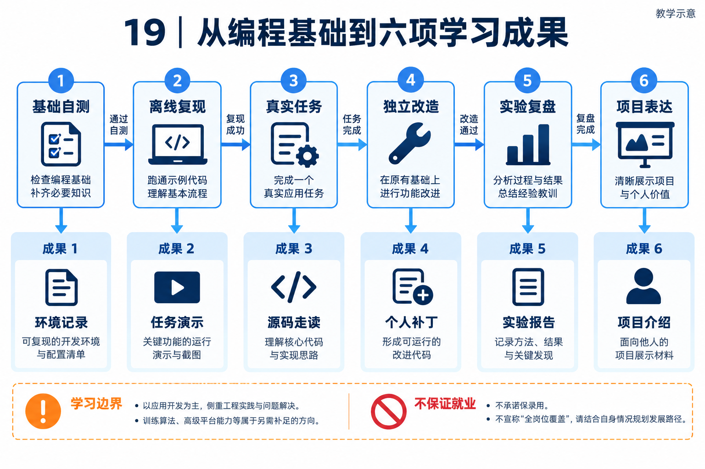

# 19｜学习定位与成果路线：从读懂项目到独立实践

[返回目录](README.md)

## 一句话定位

<!-- teaching-figure:19:start -->

读图：上半部分给出学习顺序，下半部分列出应逐步积累的六类成果，不要求每个阶段只产生一种成果。任务演示、环境记录和源码走读应持续补全；平台或算法岗位仍需要额外专项实践。
<!-- teaching-figure:19:end -->

本资料面向有基础编程能力、缺少完整 Agent 项目经验、准备阿里巴巴、腾讯等国内大厂工程岗位的应届生和转岗开发者，帮助其完成项目复现、独立改造、效果验证与项目面试表达。主攻 Agent 应用开发，提供平台工程与研发效能的进阶路线。它不是零编程入门课，不是模型训练全科课程，也不承诺覆盖所有大厂岗位或保证录用。

学习时请把教材与对应源码放在一起：遇到概念先读案例，遇到机制进入函数，遇到结论运行实验。源码不是必须一次读完的背景资料，而是帮助你核对每个技术判断的证据。项目计划开源；具体获取方式以项目正式发布信息为准，开始实验前需要已有可访问的源码副本。

## 从公开岗位出发，确定准备方向

资料核对日期为 2026-09-11。以下是少量公开样本，不是职位市场的完整统计，也不代表一家公司的统一面试标准。动态招聘页可能调整或下线，投递时应重新核对；访问日期不等于职位发布日期。

阿里巴巴智能引擎团队的官方 ROCK 招聘页列有 Agent Infra、强化学习环境、PostTrain 与训练基础架构等不同方向，并介绍了训练环境和模型工程平台工作。这支持“同属 Agent 相关领域，也有不同工程职责”的判断；本次未取得其 Agent Infra 单岗的完整任职要求，不据此补写年限、语言或必考清单。[来源：阿里巴巴 ROCK 团队招聘页](https://alibaba.github.io/ROCK/zh-Hans/careers/)。

腾讯官方招聘系统中的“AI Agent 开发工程师（游戏研发）”，岗位编号 R107498，公开内容涉及研发工具链集成、可执行与可观测的 Agent、效果评估，以及 Python/C++、Tool Calling、RAG 和游戏引擎经验。它提示我们准备项目时需要讲清任务接口、集成和评测，而不只是模型调用；游戏领域与 UE4/5 能力仍须另补，不能由通用 Agent 项目替代。[来源：腾讯 R107498 岗位页的公开检索内容](https://tencent.wd1.myworkdayjobs.com/zh-CN/Tencent_Careers/job/AI-Agent--_R107498-2)。本轮页面直读未返回正文，使用的是官方域名被索引的岗位文本，不据此保证当前投递状态。

下面的路线是依据这些职责差异和本项目能力所做的教学设计，不是上述团队发布的面试大纲。企业知识协作、研发任务助手等案例也是模拟业务，不暗示接入了阿里或腾讯的内部系统。

| 求职路线 | NaumiAgent 项目要讲的主线 | 优先章节与作品 | 仍须另补的能力 |
| --- | --- | --- | --- |
| Agent 应用开发（主线） | 从资料检索到可信草稿，再到受控业务动作 | 01、04、05、07、08、10、11；完成来源核验或权限过滤改造 | 具体业务知识、实际模型实验、目标职位要求的后端与部署基础 |
| Agent 平台 / Infra（进阶） | 任务怎样持久推进，多个执行者怎样避免冲突 | 02、03、06、08、09、10、13；完成恢复或预算实验 | 分布式系统、负载测试、队列与数据库实践；训练环境岗位还需对应环境基础设施 |
| Coding Agent / 研发效能（进阶） | 从问题定位到补丁、测试和人工采纳 | 04、06、07、08、10、12、14；完成一个可核验的研发工具改造 | 代码分析、构建与测试系统、实际工具链；游戏岗位额外需要引擎及领域经验 |

模型算法、Agentic RL、模型后训练、推理算子优化不属于本书同等覆盖的路线。第 14 章的工程改进候选不等于训练模型参数，第 03 章的模型调用路由不等于实现高性能推理引擎。选择此类岗位，需要另有训练数据、算法实验、算力与模型评估成果。

## 两类核心读者，共用主线但补课不同

第一类是具备课程项目经验的学生。他们可能会 Python，却没有处理过工具超时、状态恢复和权限。先完成离线实验，理解函数和数据库如何协作，再启动真实模型任务。前两阶段不要先读演进目录中的复杂审批链，而应能解释一次任务从输入到产物的完整路径。

第二类是后端或全栈开发者。他们通常熟悉 HTTP、数据库和服务部署，却可能把 Agent 当成普通接口。重点补齐模型非确定性、上下文、工具决策与评测，并将原有服务治理经验迁移过来。Java/Go 开发者可以阅读 Python 实现，但本资料不会把一份 Python 项目同时宣传成三种语言的实战课。

有经验的平台工程师可以选读恢复、授权、Worker 和 Harness 章节，但要准备自己的负载与故障实验。纯算法岗位还需要 Transformer、训练与后训练实践；纯产品岗位还需要需求研究、交互和商业指标训练。教材提供技术视角，不将这些人都列为同等覆盖对象。

## 学完应拥有六件具体成果

| 阶段成果 | 合格证据 | 不合格替代 |
| --- | --- | --- |
| 一份可复现环境记录 | 源码版本、Python/依赖、命令、错误处理 | 只有产品启动截图。 |
| 一次完整任务演示 | 输入、工具轨迹、产物及独立核验 | 模型输出“已完成”。 |
| 一份源码走读 | 关键函数、调用关系、数据与异常路径 | 只复制项目架构图。 |
| 一项个人改造 | 改动、测试、取舍与未覆盖边界 | 对原项目换名或换 UI。 |
| 一份实验报告 | 固定任务、基线、实际数据、失败样本 | 没有条件的提升百分比。 |
| 一套面试表达材料 | 项目介绍、深挖、白板与复盘 | 所有人背同一份工作经历。 |

这六项是学习验收，不是对公司录用决定的保证。读者不必开发整个平台才能形成有价值的经历，但必须亲手完成所声称的贡献。

## 开始前，做一次基础自测

准备一个几十行的 Python 程序：读取 JSON，检查必填字段，调用函数处理记录，再将结果写入新文件。给它增加空输入、错误字段和文件不存在三个测试。如果这些操作还需要逐行猜测，先补齐 Python 文件操作、异常和 pytest 基础，再进入主线；否则你容易把语言问题误认为 Agent 的复杂机制。

再检查三个工程能力：能否在独立环境安装依赖并记录版本；能否用 Git 查看自己究竟修改了什么；能否根据 traceback 找到抛错位置，而不只复制最后一句异常。进入 HTTP 与工具集成实验前，还需理解请求、响应、状态码与超时。无需先精通所有技术，但应知道出现问题时从哪个层次排查。

学习过程中记录实际源码提交，不要假设不断变化的主分支与教材永远一致。函数名称或测试结果不一致时，先核对版本，再判断是文档过时还是代码缺陷。保留自己的环境记录和失败输出，比只收藏一张成功截图更有助于后续复现。

## 按问题选择阅读顺序

前 14 章解释概念与源码。[第 20 章](20-实战主线与环境手册.md)带你建立环境并运行主线，[第 21 章](21-业务场景迁移实验.md)练习业务迁移，[第 22 章](22-独立改造任务与参考思路.md)安排独立改造，[第 23 章](23-评测故障与实验报告.md)组织评测与复盘，[第 24 章](24-求职训练与能力自测.md)把成果转化为面试表达。不必先读完所有理论才能运行第一个实验。

例如，你不理解“任务为什么被错误判定完成”，就先运行 missing-artifact 场景，再读任务账本和可靠性章节；你不理解“模型为什么会听从网页中的恶意指令”，就先区分可信指令与外部资料，再读上下文、安全与浏览器章节。用具体失败带着问题阅读，比同时记住十几个英文缩写更容易形成稳定理解。

## 用学习日志决定下一步

每次练习结束记录四件事：今天验证了什么，证据保存在哪里，哪个问题仍不能解释，下一次用什么实验区分可能原因。卡住时先分类：命令找不到通常属于环境问题；调用路径说不清属于源码理解问题；知道实现却无法证明正确，属于测试与评测问题。不同问题需要不同补课方式，不要一律靠继续读下一章解决。

阶段结束时，合上参考思路，重新复现一个反例，完成一个小改造，并向同伴解释为什么这样做。若只能照抄步骤，继续练习输入变化和错误路径；若可以独立完成，再扩展业务场景。衡量进步的单位不是读过多少页，而是你能独立解释和验证多少个工程判断。
