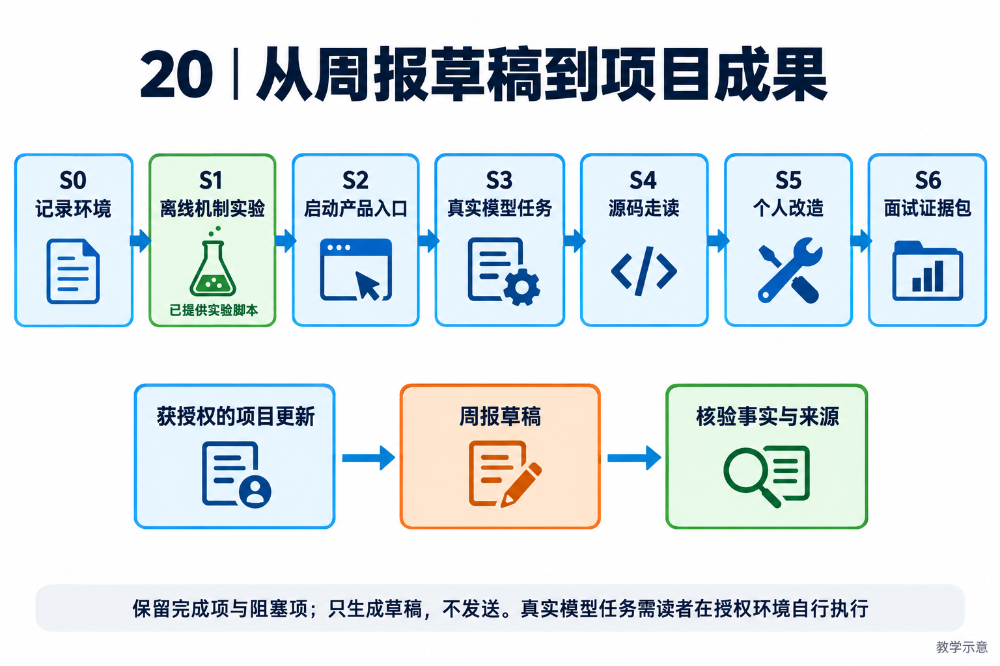

# 20｜实战主线与环境手册：从第一次运行到自己的项目成果

[返回目录](README.md) · [离线实验](labs/README.md)

## 主线目标与安全范围

<!-- teaching-figure:20:start -->


读图：先完成环境记录和离线实验，再在授权环境运行模型任务、走读源码、进行个人改造。下方周报链路始终只交付草稿，保留阻塞事实；除明确提供的离线脚本外，图中阶段不是已替读者完成的任务。
<!-- teaching-figure:20:end -->

主项目选择“研发周报草稿助手”：读取获授权的项目更新，保留完成项和阻塞项，输出带来源的草稿，但不发送邮件、不上传客户数据、不改生产仓库。这个场景足够小，能覆盖目标、上下文、工具、持久状态与验收；后续再迁移到知识问答、工单或代码修复，而不是一开始接入所有外部系统。

主线分为离线机制实验、真实模型任务和个人改造。离线部分已提供运行器；真实模型部分使用项目原有终端入口，由读者在自己的授权环境执行，本轮没有声称已经完成 live 验证。固定输入不保证模型每次走同一条轨迹，因此验收看结果与边界，不要求所有截图完全相同。

## S0：建立可复现环境

先获得有权限的源码副本。项目计划开源，但在公开地址确定前，不写虚构 clone 地址；仅有安装包的读者暂时不能执行本教材源码实验。进入源码根目录，记录当前版本和 Python 版本：

```bash
git rev-parse HEAD
python3 --version
uv sync --frozen --extra dev
```

以上安装命令需要已安装 uv，并可能联网下载依赖；它不是已在每个系统上完成的干净安装证明。项目声明 Python 至少 3.12，实际依赖兼容性以锁文件和安装结果为准。不要删除已有虚拟环境来解决未知错误；先确认当前目录、解释器和网络。本轮开发环境为 macOS / Python 3.14.3，不把它泛化为 Windows/Linux 兼容性验证。

macOS/Linux 下使用 `.venv/bin/python`，Windows 使用 `.venv\Scripts\python.exe`。准备一份环境记录，写明操作系统、源码提交、解释器和依赖安装结果。不要记录 API Key、Cookie 或真实客户路径。

## S1：不用模型先理解“完成”

```bash
.venv/bin/python scripts/interview_lab.py --case all
.venv/bin/python -m pytest tests/unit/test_interview_lab.py tests/unit/test_todo_reconciliation.py -q
```

按离线实验说明打开草稿和回执，解释五个场景。通过条件不是只有命令退出码 0，而是你能说明为什么 pending 返回 none，为什么 completed 仍可能没有文件，以及 stale 为什么最终变成 blocked。读 [TaskStore](../../src/naumi_agent/tasks/store.py) 与 [reconcile_todos](../../src/naumi_agent/tasks/reconciliation.py)，画出记录更新和产物核验的两个分支。

此阶段不需要模型 Key，也没有模型调用费用；新环境安装依赖仍可能联网。完成后应能给同学解释“任务账本不是业务事实本身”。

## S2：启动产品入口，区分本地诊断与模型请求

先在已安装的开发环境确认入口：

```bash
.venv/bin/naumi --help
.venv/bin/naumi doctor
```

Windows 可在激活虚拟环境后使用 `naumi`，或使用对应 Scripts 下的可执行文件。项目的 `doctor --live` 是显式模型连接诊断，会产生外部请求；不要把它混进零费用安装检查。本轮核验了 help 入口，没有替读者执行 configure 或使用凭据。

需要 live 阶段时，通过项目原有安全配置流程准备自己的模型与权限设置，不复制作者配置，不把密钥写进教材。先阅读[配置说明](../../README.md)，在一次性练习工作区启动 `naumi --tui`，使用已有 Textual 入口以减少前端构建前提。该命令仍可能进入初始化向导；“存在入口”不代表向导、模型连接和完整任务已在你的机器验证。

## S3：让真实 Agent 完成同一个目标

在你创建的练习目录中放一份 [weekly-updates.json](labs/weekly-updates.json) 副本。终端里的模型任务可以这样描述：

> 仅使用当前目录的 weekly-updates.json，整理一份中文周报草稿，保存为 weekly-report.md。逐条保留来源 ID，区分已完成和受阻更新，不编造线上验收结果。不得联网、发送消息、读取目录外文件或修改输入。完成后重新读取草稿，报告验证结果和未完成项；缺权限时先说明原因。

这里的文字是任务规格，不是操作系统沙箱。仍需配置工具执行权限，观察真实文件访问范围；不能因为提示词写了“不得”就宣称安全隔离。按项目支持的预算配置限制运行，并在出现重复无进展调用时终止。不要为了测试方便把权限设为无限制。

验收时独立打开文件，检查三条来源、受阻事实和不存在的“已上线”结论；检查工具轨迹是否确实读取输入并写入产物。没有文件、来源错误或越权动作都不通过。即使模型输出非常流畅，也不能补救这些失败。

## S4：沿真实轨迹映射到源码

不要从整个 engine 的第一行开始通读。围绕刚才的运行回答：用户输入从哪里进入？本次模型看到了哪些工具？哪一次调用写文件？结果怎样返回？任务何时保存？最终如何报告完成？

从 [AgentEngine.run](../../src/naumi_agent/orchestrator/engine.py)、[工具基类](../../src/naumi_agent/tools/base.py) 和 [上下文装配](../../src/naumi_agent/orchestrator/context_assembly.py)寻找入口，再核对实际使用的是流式还是非流式路径。记录观察到的函数与字段，不根据一种入口推断所有前端都一致。每个源码结论至少有一个调用点或对应测试。

## S5：完成一项自己的改造

从[独立改造任务](22-独立改造任务与参考思路.md)选择一项，先写验收再改代码。对初学者，优先扩展独立判定器或输出证据，不要直接动发布密钥、核心授权或整个恢复框架。保存修改前的失败样例和修改后的回归结果；可以使用 AI 辅助，但要能解释它改了什么、为什么不采用另一方案。

用同一输入比较改前改后，不能一边换模型、一边换任务、一边改判分再把提升归给补丁。模型结果可能有波动，应记录重复次数和失败样本。未实现的部分写成下一步，而不是在简历里补齐。

## S6：形成面试交付

最后整理运行演示、源码图、一个补丁、一份实验报告和一段项目介绍。演示可以录屏或现场运行，但必须说明版本与前提。报告使用[实验模板](23-评测故障与实验报告.md)，面试按[求职训练](24-求职训练与能力自测.md)排练。

本主线的毕业条件不是“读完七个阶段”，而是独立完成一个真实任务与一项可验证改造，并能解释至少两个失败路径。如果尚未完成 live 阶段，仍可展示离线机制实验，但不能写成“已实现完整自主 Agent 业务系统”。
