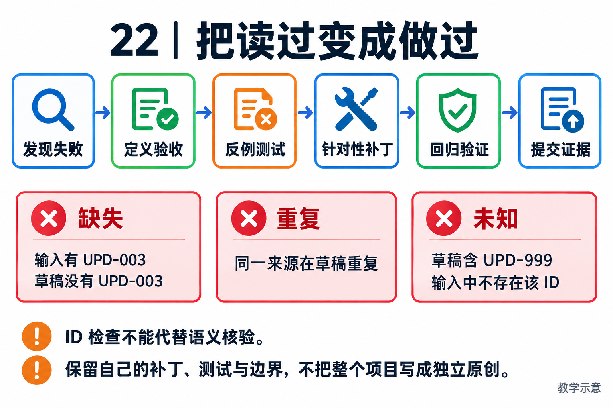

# 22｜独立改造任务与参考思路：把“读过”变成“做过”

[返回目录](README.md)

## 作业规则

<!-- teaching-figure:22:start -->

读图：从一个可复现的失败建立反例测试，再做范围明确的补丁。缺失、重复和未知来源是三种不同问题，UPD-999 表示不在输入中的引用；即使 ID 全部正确，仍需检查句子是否保留原始事实。
<!-- teaching-figure:22:end -->

本章的目标是让读者拥有可核验的个人贡献。先写需求与测试，再做修改；参考思路放在每题后半段，建议完成第一版后再看。改造不要求发明新框架，也不允许只改名称和界面后声称自主研发整个平台。

所有任务在个人练习分支或隔离副本完成，保留源码版本与已有改动。不要直接修改生产配置、测试数据或批准策略。本章提供需求、验收和参考方向，不冒称每项都有已完成的产品补丁。离线实验脚本是可执行的参考实现；其余改造需要读者动手实现并记录真实结果。

## 任务一：给草稿增加逐条来源校验

背景：文件存在，但报告可能漏掉一条受阻事项。仅检查文件名和 completed 状态不够。基于[离线实验](labs/README.md)，实现一个检查器，验证每条输入 ID 在输出中有对应事实，同时报告重复和未知 ID。禁止通过要求出现一句“已验证”替代实际检查。

验收至少覆盖：三个合法来源全部出现；漏掉 UPD-003；同一来源重复；出现不存在的 UPD-999；输入顺序改变；空文件；文件仍存在但被替换。输出应区分缺失、重复和未知来源，便于用户修正，不只返回一个 False。来源正确只是第一层，引用的句子是否保留受阻事实还需内容验证。

参考思路：将来源出现次数做成计数映射，与输入 ID 集合比较。来源计数可由确定性代码检查，但“提到 ID”不能证明事实准确；若模型改写正文，要设计结构化字段或人工评分，而不是把整个输出与一个唯一措辞做字节比较。现有实验的精确匹配适用于确定性模板，不应直接搬成通用自然语言评分器。

面试追问：为什么不用另一个模型判断？因为 ID 集合和重复计数可机械验证，更便宜且可解释；语言语义仍可能需要其他判分手段。提交物是代码、反例测试和一段边界说明。

## 任务二：改进知识检索，但保留权限和版本语义

使用第 21 章的数据，先实现一个可解释的关键词基线，再选择一种改进：同义词扩展、混合检索或重排。只能改变一个主要变量；保持题目、身份和评分规则不变，不以更换全部数据来证明检索变好了。

验收包括八道固定题、未知角色拒绝、旧资料替代关系和 R04 自称身份不能升级。记录每题召回的 ID 以及最终答案。若改进增加召回却把 KB-003 暴露给 employee，即使平均回答得分更高也不能通过安全验收。

参考思路：将权限过滤与相关性排序分开。先确定可访问集合，再排序；版本选择结合问题意图，历史比较题不能简单过滤旧版本。对五篇文档，复杂重排未必值得；合理结论可以是“未观察到收益，因此保留基线”。这是有效实验结果，不是作业失败。

面试追问：这证明大规模 RAG 有效吗？不证明，还需要更大数据、多义查询和实际成本测试。提交物是逐题结果表、变化解释与失败样本，而不是只有一张总分截图。

## 任务三：给一个只读业务工具建立完整契约

选择虚构工单查询，要求 ticket_id 格式明确，返回内容包含结果状态、工单版本和可引用字段。不存在、权限不足、服务超时必须具有不同的可处理语义；错误中不得包含密钥、Cookie 或原始敏感响应。

先阅读[Tool 基类](../../src/naumi_agent/tools/base.py)和[注册测试](../../tests/unit/test_tool_registry.py)。注意当前 Tool.execute 返回字符串，不能根据教材理想输出格式声称框架已经强制所有工具返回同一业务 schema。可以在你自己的适配层编码结构化结果，但要解释模型如何读取、错误如何传播。

验收包含正常 ID、空输入、超长 ID、畸形参数、不存在记录、无权访问以及超时。只读不代表可以读取所有租户记录，查询时仍需可信身份过滤。不要为了演示部署真实客户数据库；使用虚构数据即可验证接口逻辑。

参考思路：先验证输入，再做授权，再查询，再对可展示字段做白名单输出。运行时注册、手动入口和 Agent 自主调用应复用底层实现，按项目规范逐项检查。面试追问是“参数 schema 合法为什么仍可能危险”，答案应落在资源身份和业务授权，而非 JSON 语法。

## 任务四：给长输出外置增加可检查的边界

阅读[ContextCompactor](../../src/naumi_agent/memory/compactor.py)，设计一个围绕工件引用的增强，而不是重写整个压缩器。目标是让模型与读者知道长输出被放到哪里、是否被截断、是否还能读取原件；不能保证摘要语义无损。

先画出现有预处理、外置和摘要的顺序，再决定修改点。验收包括阈值附近的文本、空输出、重复调用、工件缺失和不可写目录。若修改摘要角色或来源策略，还要专门设计恶意输入跨压缩传播的测试；只改一个 role 字段后让普通测试通过，不足以证明注入风险已经解决。

参考思路：把事实引用与自然语言摘要分开，给原件记录大小、摘要范围和可核验指纹。指纹只能检查字节一致性，不负责判断事实正确。不要把用户批准或任务账本只保存到压缩摘要中。

## 任务五：做一次恢复问题的诊断，而不是先改测试

以[验证记录](18-评审与验证记录.md)中的 Pursuit 失败为案例，先在相同源码和环境复现，再记录预期与实际。若当前版本已不失败，记录变化，不强行制造旧错误。诊断目标是缩小 checkpoint 持久化冲突发生的位置和前置条件，而不是先删除断言。

验收要求一份因果假设表：观察事实、可能原因、能区分原因的实验、结果。修复前后的对比必须使用同一复现入口。测试期望漂移和真实逻辑回归都可能发生，不能看到异常类名就认定根因。

参考思路：沿恢复入口、持久版本和租约任期检查状态变化，区分本地账本提交与外部业务副作用。本章没有给出未经验证的“正确补丁”。复杂恢复代码属于进阶任务，新手可先完成诊断报告。

## 怎样评阅与写进简历

每项作业按问题定义、代码实现、错误覆盖、证据质量、取舍解释各 2 分，共 10 分。建议达到 8 分再用作重点项目经历；这是教材评分建议，不是招聘评分标准。没有独立实现时不写“负责研发”，没有真实测量时不写提升比例。

评阅时保留一次反例：让同学修改输入、取消任务或移走文件，看你的解释和实现是否仍成立。能承认当前边界并提出验证方法，比把所有异常吞掉后返回成功更有说服力。
