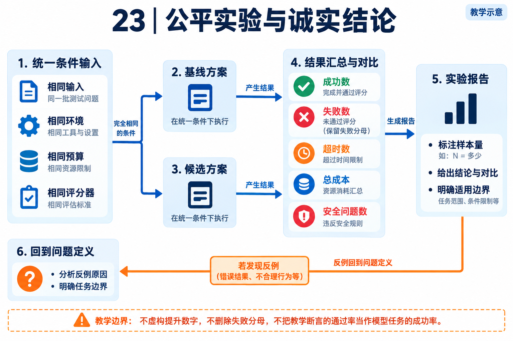

# 23｜评测、故障与实验报告：把项目亮点变成可检查的结论

[返回目录](README.md) · [Harness 原理](10-可观测性Harness与评测.md)

## 先写问题，再选指标

<!-- teaching-figure:23:start -->


读图：基线与候选共用预先固定的条件与判分规则，保留失败、超时、成本和安全结果。差异应按每次运行记录计算，不能只留下成功截图，也不能把离线教学断言通过率称为模型任务成功率。
<!-- teaching-figure:23:end -->

“我优化了 Agent”不够明确。是答案更正确、完成更多任务、少调用工具，还是成本降低？如果目标没说清，就容易挑一个变好的数字宣传，而忽略业务效果下降。本章要求每项改造在实验前写出假设、主指标和不可退化条件。

以知识问答为例，主指标可以是有依据的正确回答比例；护栏是越权资料不能进入上下文、无答案时不能胡编。以周报草稿为例，主指标是来源和状态均正确的交付比例；护栏是不得发送、不读取范围外文件。响应快不是唯一目标，拒绝所有任务也不能靠“零错误”拿高分。

## 四种证据分别记录

单元测试检查明确函数契约；离线运行检查真实本地文件与状态；live Agent 运行检查模型与工具闭环；生产数据检查实际使用条件下的效果。它们可以相互支持，但不能交换名称。尤其不要把使用 AsyncMock 的流程测试写成真实模型成功率，也不要把虚构教学业务称为企业客户案例。

[离线实验](labs/README.md)会产生三个文件类型：SQLite 任务库、草稿和 JSON 回执。模型请求数为零，两个布尔值分别表示教学预期与业务目标。这个设计帮助学习者避免“实验成功”等于“所有任务成功”的口径错误。本章统计它的结果时，应写五个机制场景是否符合预期，而不是五次模型任务成功率。

## 固定实验条件

至少记录源码提交、模型标识、调用参数、工具集合、权限设置、输入数据版本、运行环境和评测规则。输入数据可保存哈希，模型标识使用实际请求所解析的模型，不只写 capable 档位。不要记录密钥或用户凭据。

基线与候选应使用相同任务集。若改的是检索策略，尽量保持模型与生成提示不变；若改模型，就不要同时改检索和工具权限。不可避免多处变化时，应承认不能把收益归因到单个因素。重复次数提前写明，失败与超时计入记录；重跑直到成功后只保留最后一次，是选择性汇报。

小样例适合找明显错误，不适合证明广泛性能。八道检索题全部通过只能说明这些场景通过。建议先扩充不同表述、冲突资料和权限反例，再讨论推广；不凭少量结果给出统计显著或普遍提升的结论。

## 怎样计算，而不混淆分母

任务成功率的分母是预先纳入的有效任务运行次数，不是成功返回的请求数。基础设施错误单独标记，但仍报告其数量；不能无声删除。工具成功率要区分调用被接受、执行完成与业务结果有效。一次工具调用成功，不代表整项任务成功。

总耗时从用户任务开始到可验收结果结束，包含工具等待和重试。若报告模型首个输出时间，应单独命名，不能拿它替代端到端完成时间。样本很少时列出每次耗时，不用一个精确到小数点后的 P95 制造稳定性假象。

成本记录模型输入、输出与其他实际计费项。不同 Provider 可能有缓存或工具费用，按实验时的公开计费标准和账单口径说明，并注明核对日期。只有 token 数而没有对应计费信息时，应写用量，不直接写人民币成本。

## 故障矩阵：每次至少选一个失败分支

| 注入条件 | 预期观察 | 不应发生 |
| --- | --- | --- |
| 产物文件缺失 | 明确未交付，返回缺失证据 | 因 Todo completed 宣布成功。 |
| 文件内容不符 | 区分文件存在和内容核验失败 | 仅以文件大小非零放行。 |
| 遗留 in_progress | 对账请求，必要时进入阻塞 | 无限空转或自动勾选完成。 |
| 未授权资料匹配度很高 | 在进入模型前排除 | 最终不说数字就算没泄漏。 |
| 工具超时且结果未知 | 查询或对账，保留未知 | 立即重复高副作用操作。 |
| 页面等待人工 | 展示等待、支持取消 | 将超时或沉默作为批准。 |
| 摘要包含外部指令 | 识别来源风险，执行层限制动作 | 将摘要自动当成新授权。 |

本表是故障设计清单，不表示全部场景已在本轮实现或验证。真正运行哪一行，就给哪一行附命令、输入和结果。

## 现有失败如何成为复盘案例

先看第 18 章记录：Pursuit 恢复时出现 checkpoint 持久化冲突，另一个失败涉及 evolution 命令元数据断言。它们是之前一次执行的观察，本轮教学扩展没有修复这两处 Runtime/测试问题，也不宣称它们在未来版本仍一定失败。

复盘从“预期是什么、实际是什么”开始。写出至少两个可区分假设，再找最小实验。例如版本竞争、恢复状态的序列问题、测试构造与当前契约不一致，都只能先作为假设。不要用教材中的异常文本直接拼成未经验证的根因。若修复需要变更权限、发布或持久化协议，应独立审查，不能夹在文档修改里悄悄上线。

## 可直接填写的报告模板

```text
实验名称：
作者及实际负责范围：
源码提交 / 教材版本：
问题与可证伪假设：
基线配置：
候选改动：
固定任务集 / 数据哈希：
模型、工具、权限、系统环境：
预先约定的主指标与护栏：
运行次数与计入/排除规则：
逐次结果：case_id / outcome / latency / usage / evidence / failure_kind
对比结果：
出现的反例与失败：
能支持的结论：
不能支持的结论：
回滚或撤销方式：
下一步验证：
```

参考措辞：“在这八道固定教学题中，候选修复了旧版本资料误用，但尚未覆盖大型知识库与真实身份系统。”不要写“准确率全面提升、适用于所有企业”。实验没有提升也可以形成有价值的项目经历：你发现复杂策略没有带来收益，选择保留更简单的基线，并知道什么条件变化会重新评估。

## 答辩检查

面试官问“提升多少”，先说明指标、样本和基线，再报数字；问“为什么是你的改动造成”，解释控制变量和反例；问“线上能用吗”，区分离线、live 与生产证据。能准确限制结论，并不削弱项目，反而说明你知道实验方法和工程责任。
