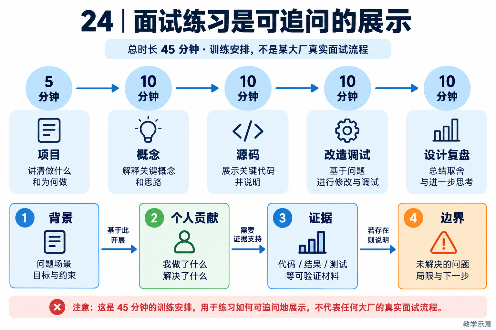

# 24｜求职训练与能力自测：学习成果怎样进入面试

[返回目录](README.md)

## 先匹配职位，不先背所有章节

<!-- teaching-figure:24:start -->

读图：按 5+10+10+10+10 分钟完成一次 45 分钟训练，再检查每个结论能否追到个人贡献与证据。这只是模拟训练安排，不是任何公司的题频或录用标准。
<!-- teaching-figure:24:end -->

读一个具体职位说明，圈出交付对象、技术要求、经验要求和加分项。Agent 应用岗位可能强调业务接入与检索；平台岗位可能强调鉴权、配额、并发和恢复；算法岗位可能另有训练要求。不要因为标题都含 Agent 就使用完全相同的准备顺序，也不要把教材内容与某家公司题频直接等同。

制作一个四列表：职位要求、自己已有证据、教材补充位置、仍然缺失的能力。没有真实经历的条目写“学习中”或“计划实验”，不能把读过章节变成工作经验。收集职位材料时保留官网链接、岗位编号与访问日期；过期职位仍可作历史参考，但不能冒充正在招聘。

## 阿里、腾讯等大厂岗位的三套模拟深挖路线

先阅读第 19 章的公开岗位样本与范围说明，再从下面选择一条主练路线。这些题由教材按工程职责设计，不是公司真题，不代表固定轮次、题频或职级标准。投递不同团队时，应使用实际 JD 校正路线，而不是假设同一公司只考一种风格。

### 路线 A：Agent 应用开发——从需求到可信业务结果

主问题：“为企业团队做一个资料助手，既能生成草稿，又能在确认后更新工单，你会怎样实现？”先澄清用户、资料、动作与验收，给出单 Agent 基线，再解释检索、工具、批准和产物检查。不要一开场就堆多 Agent 和向量库。

第一层追问要求你打开本项目的一次工具调用，说明参数到执行结果的路径；第二层加入过期资料与无权访问资料，要求设计来源和权限过滤；第三层令工单更新超时，要求区分失败与结果未知。参考回答的核心是：进入模型前限制资料范围，执行前检查动作授权，执行后通过业务回执核验；状态记录不能替代这三道边界。

可展示作品：一项来源核验或受控写入改造，附正常、越权、重复请求和内容缺失用例。若只运行离线草稿实验，明确没有真实模型和外部工单接入。准备投递应用岗位时，应另补一次真实模型任务，并记录模型配置、工具轨迹和失败样本，而非把离线实验改名为上线业务。

### 路线 B：Agent 平台 / Infra——从一次循环到可恢复执行

主问题：“把本地任务助手提供给多个团队同时使用，哪些地方必须改变？”先拆分任务状态、执行者、队列、存储、权限与额度，说明当前本地实现可复用什么、哪些要重做。不要因为项目使用 SQLite 就简单回答换成某数据库；关键是多租户隔离、原子提交、并发控制和故障恢复的契约。

第一层追问增加长工具调用与用户取消；第二层增加 Worker 崩溃和旧执行者迟到；第三层增加供应商限流及额度争抢。参考回答要明确：队列提供背压，额度预留必须具备原子性，租约接管需要在受保护写入端校验 Fence；外部副作用仍需业务幂等与对账。这些是拟扩展方案，不能直接说成 NaumiAgent 已达到生产集群水平。

可展示作品：一个实际故障注入实验，记录同一任务各执行尝试、最终产物和拒绝的过期提交。负载实验必须注明环境、并发数、任务长度、错误比例和排队时延；只测单个函数的 QPS 不能回答端到端承载能力。阿里官方样本同时包含训练环境等方向，投递时仍应确认是否需要本书以外的训练基础设施经验。

### 路线 C：Coding Agent / 研发效能——从报错到可采纳补丁

主问题：“让 Agent 根据报错修改代码，如何防止改错文件、漏跑测试或自称修复成功？”先限定仓库和动作权限，再说明问题定位、上下文选择、补丁生成、测试与人工采纳。把 AI 辅助编码过程和你亲自负责的工程改造分开讲清。

第一层追问加入超长日志和过期上下文；第二层让工具只返回‘测试通过’却没有可核对记录；第三层让 Agent 提议修改自己的测试和发布配置。参考回答应保留可信约束与来源，用实际测试命令、退出码和产物支撑结论，检查验收规则是否被候选改变，并使批准绑定具体补丁版本。

可展示作品：一个有真实失败起点、修复补丁、回归和退化反例的实验。腾讯 R107498 的研发工具链职责可作为方向参考，但通用代码补丁实验不能代替 UE 插件或游戏研发经验。没有相关领域经验时，诚实说明可迁移能力和补课计划，不将项目场景改写成参与过大型游戏生产。

## 统一评分：能否把亮点逐层落到证据

对每条路线，用同一组追问检查自己的回答：“为什么业务需要它？现成方法为什么不足？你具体改了什么？源码哪一段？失败时怎样？如何证明有效？扩大规模后什么会失效？”每个回答至少准备一处代码、一次实验或一个明确标注的设计假设。

基础层要求概念和调用链准确；进阶层要求有个人补丁、反例和对照；更深一层要求讨论并发、权限、成本与迁移限制。这个层次只用于安排训练，不换算成阿里 P 级、腾讯职级或录用概率。若关键回答只有术语而没有机制，就回到对应章节“大厂项目深挖”完成实验。

## 一份诚实的项目经历怎么写

项目描述分为背景、个人工作、验证结果和边界。应届生可以明确写课程/个人项目；转岗开发者说明原有后端经验如何用于 Agent，并区分是否真的接入过企业系统。公开项目本身不是减分项，关键是你对它做了什么，能否解释其中的技术决策。

仅阅读时可以写：“基于 NaumiAgent 进行任务状态与完成判定源码学习，复现五个离线场景。”独立改造后再写：“为草稿交付增加来源缺失、重复与未知引用检查，补充相关回归用例。”具体测试数和效果用个人实际结果填写，不复制教材作者的测试数字。

不能写：“独立开发整个 NaumiAgent，服务百万用户。”除非确有这些贡献和业务证据。也不应把未来计划开源说成自己已经维护大型开源社区。AI 辅助开发可以如实说明；你仍需对设计、修改和验证负责。

## 分三层准备项目介绍

30 秒版本只讲目标、个人贡献和一个结果，不背技术栈清单。90 秒版本增加一个关键取舍和验证方式。5 分钟版本沿一次任务深入，展示上下文、工具、状态、权限和结果如何协作，并保留失败路径。

例如介绍“任务完成判定”时，先讲为什么 completed 不能证明草稿存在，再展示 missing-artifact 反例；说明自己增加了什么检查，最后承认确定性模板匹配不适用于所有自然语言答案。这样每句话都能沿源码或实验追问，不依赖“智能”“自主”“工业级”等形容词。

完整项目开场可参考第 16 章，但应替换为真实个人经历。练习中若某个句子无法指出证据来源，就删掉、降级为设计方案，或补做实验。

## 一次 45 分钟模拟面试

前 5 分钟介绍项目与负责范围。接下来 10 分钟让同伴随机选择一个概念，例如 Plan 与 Todo、Tool 与 MCP、Lease 与 Heartbeat，要求用案例解释。再用 10 分钟进行源码深挖：给出实际函数，让你说明输入、异常与持久化语义。

随后 10 分钟做现场改造或调试，例如让草稿漏掉一个来源，要求你找到为什么现有检查未发现，并写出新的验收条件。最后 10 分钟做系统设计与复盘：如果多用户同时运行、工具超时或要加发送功能，哪些边界必须改变？

同伴不需要冒充真实招聘官。按照“概念准确、机制清楚、证据可查、取舍合理、表达清晰”各 0–2 分评分。此量表用于训练，不是某家公司的录用标准。把答不上来的问题归类为基础薄弱、源码不熟或实验不足，再安排下一次练习。

## 压力追问怎么回答

“这些功能框架都有，你做了什么？”回答个人具体改造、验证和取舍，不否认已有框架能力。“项目是不是照着教程写的？”明确起点来自公开项目，随后展示自己的分支、测试和实验。没有个人改造就承认主要是复现，不包装成完整自研。

“你怎么证明结果更好？”给固定任务、基线和失败样本，而不是说感觉更准确。“为什么不上多 Agent？”解释任务依赖、并行收益与协调开销；可以用并行工具解决时，不为术语增加多套上下文。“生产出问题怎么办？”先区分止损、证据保留、恢复和根因分析，不一上来让模型自动修改生产。

不会的问题可以说出已知事实、缺失证据和验证方案。不能为了表现熟练而编造线上事故、用户规模或指标。准确承认边界后继续分析，比一句“这个没研究过”更有信息量。

## 整理一份可追问的项目证据包

证据包不需要堆满整个仓库，保留五类材料即可：一页项目说明、一次任务演示、自己的改动与测试、一份实验报告、一个失败复盘。项目说明中标注原项目来源与个人负责范围；演示记录输入和产物；代码修改能定位到具体提交；实验报告包含基线与限制；失败复盘讲清如何从现象走到原因。

分享前在另一个目录检查文档链接、启动命令和样例文件，确保它们不依赖你电脑上的绝对路径。只使用可公开的虚构数据或已获授权的材料，删除截图中的凭据与个人信息。如果某个实验需要模型账号，准备不含密钥的配置说明，并同时保留离线演示；不能要求对方先获得你的账户权限才能理解贡献。

## 投递前的六项能力自测

第一，能否不看答案解释一次 Agent 循环，并指出模型决定与程序保证的边界？第二，能否沿源码追踪一次工具调用，说明参数、权限、异常和结果去向？第三，能否运行一个故障场景，解释为什么它不应被判为成功？这三项检查理解，不以背出术语数量计分。

第四，能否展示一项自己的修改，说明需求、方案取舍和错误路径测试？第五，能否解释一个实验指标的分母、基线和局限，而不是只读提升数字？第六，能否在新条件下调整设计，例如工具结果未知、多个用户并发或上下文超过预算？这三项检查实践与迁移，不要求假装拥有尚未获得的生产经验。

每项按“能独立完成”“需要提示”“尚未完成”记录，并附一个证据位置。需要提示的项安排变体练习，尚未完成的项回到对应章节，不用综合平均分掩盖关键短板。例如，不能解释权限边界时，即使项目介绍流畅，也不应把自己描述为已经掌握安全的业务写入能力。

## 面试后，怎样更新学习计划

面试结束当天记录题目主题、自己当时的回答、证据缺口和改进动作。区分“没有接触过”“做过但解释不清”“判断本身不准确”：第一类需要补实验，第二类需要重新组织表达，第三类需要回到源码或可靠资料修正概念。不要仅凭一场面试推断整家公司都偏好某种技术。

下一次准备时优先完成一个能够验证的改进，再更新简历与项目介绍。比如被问到超时后如何防止重复写入，就补一组成功、失败和结果未知的实验，而不是只背“使用幂等键”。持续形成“问题—实践—证据—表达”的循环，才能让这个项目真正支撑你的求职与后续工作。
