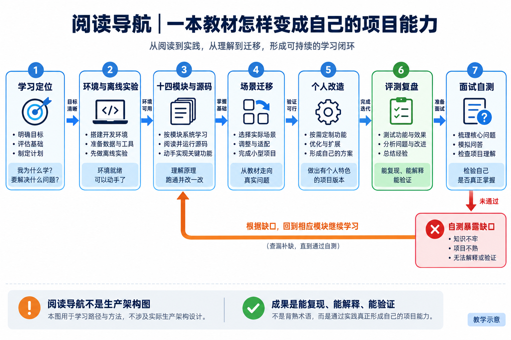

# 面向国内大厂求职的 AI Agent 项目实战与面试：NaumiAgent

> 面向有编程基础、以阿里巴巴、腾讯等国内大厂 Agent 工程岗位为目标的应届生与转岗开发者。
> 修订日期：2026-09-11。产品信息按本轮可取得的官方文档核对，不冒充所有产品在该日的完整历史快照。

这套材料以求职者为中心：用 NaumiAgent 建立一段能演示、能改造、能应对连续追问的项目经历。知识讲解服务于三个面试任务：解释业务为什么需要 Agent；说明自己解决了什么工程问题；用源码和实验回答“为什么这样做、出错怎么办、你证明了什么”。14 章是教学组织方式，不是行业强制标准，也不是项目全部能力均已生产验证的承诺。

项目的推荐叙事是“面向企业研发与知识协作的可核验任务 Agent”。周报草稿是低风险、易复现的入口；真正需要展示的能力是上下文与工具编排、状态与产物核验、权限与恢复、评测与持续改进。它不是已有大厂内部业务系统的复制品，教材中的企业场景也不是作者或读者的虚构工作经历。

准备阿里、腾讯等公司的面试，应先匹配具体职位，再选择应用开发、平台工程或研发效能路线。公开岗位依据与覆盖缺口见[岗位对照](19-学习定位与成果路线.md)，三套项目深挖训练见[求职训练](24-求职训练与能力自测.md)。目标是提高工程能力和面试准备质量，不承诺录用。

先用[学习定位与成果路线](19-学习定位与成果路线.md)检查基础，再跟随[实战主线](20-实战主线与环境手册.md)运行第一个离线实验。遇到概念问题查[阅读方法与术语](17-阅读方法与术语.md)和[14 模块总纲](00-agent-architecture-2026.md)。每章先解释问题和案例，再进入源码，最后练习概念、设计、项目、故障、取舍五类问答。学习不以背熟答案为终点，而以能够复现测试、解释失败和提出可验证改进为终点。

## 从第一次运行到项目面试

<!-- teaching-figure:nav:start -->


读图：沿学习路线积累能复现、能解释、能验证的成果。面试自测发现缺口后回到对应章节、源码或实验，不以背熟名词为终点；这张是阅读路线图，不是生产系统架构。
<!-- teaching-figure:nav:end -->

1. [学习定位与成果路线](19-学习定位与成果路线.md)：基础自测、适用岗位与六项学习成果。
2. [实战主线与环境手册](20-实战主线与环境手册.md)：围绕周报草稿建立环境，逐步理解模型、工具与核验。
3. [可运行的离线实验](labs/README.md)：用五种场景观察任务状态与真实产物为什么不能互相替代。
4. [业务场景迁移实验](21-业务场景迁移实验.md)：知识问答、工单与浏览器任务的输入、权限和失败边界。
5. [独立改造任务与参考思路](22-独立改造任务与参考思路.md)：五项不同难度的改造练习，形成自己的代码贡献。
6. [评测故障与实验报告](23-评测故障与实验报告.md)：建立基线，保留失败，写出可复核的结论。
7. [求职训练与能力自测](24-求职训练与能力自测.md)：匹配岗位、组织项目经历、模拟面试与查漏补缺。

离线运行器已提供；迁移场景和独立改造需要你按练习要求实现。不要把读过实验说明等同于已经完成实验。

## 一次任务怎样跑起来

```text
用户目标 → Runtime 组织上下文 → 模型提出下一步
              ↑                    │
              │              参数校验与授权
              │                    ↓
         核验并更新状态 ← 环境结果 ← 工具执行
              │
         达成 / 阻塞 / 取消 / 失败 → 向用户交代结果

贯穿每一步：身份与权限、预算、记录、完成判定
按任务需要：持久化与恢复、MCP/Skills、浏览器、子 Agent/Worker
跨版本改进：失败样本 → 候选 → 独立评测 → 审批 → 观察与回滚
```

权限必须在动作前约束执行，不是工具已经执行完才补一个安全层。观察和评测也不是最后贴标签，而是贯穿过程的证据收集。

## 14 章教材目录

1. [目标与交互层：先约定怎样才算完成](01-目标与交互层.md)
2. [Runtime 与状态机：让每一次行动有来有回](02-Runtime与状态机.md)
3. [模型与推理路由：把选择策略与协议适配分开](03-模型与推理路由.md)
4. [上下文工程：让模型每轮看到足够而可信的信息](04-上下文工程.md)
5. [记忆与持久化：区分事实、偏好、资料和执行账本](05-记忆与持久化.md)
6. [Plan 与任务账本：计划可以变化，执行事实要能核对](06-Plan与任务账本.md)
7. [工具与行动层：从模型参数到真实结果](07-工具与行动层.md)
8. [安全身份与授权：把批准绑定到实际执行](08-安全身份与授权.md)
9. [可靠性与恢复：先分清失败和结果未知](09-可靠性与恢复.md)
10. [Harness、可观测性与评测：怎样证明一次改动有效](10-可观测性Harness与评测.md)
11. [MCP 与 Skills：协议连接和按需学习各司其职](11-MCP与Skills.md)
12. [Browser 与 Computer Use：观察、行动与结果核验](12-Browser与ComputerUse.md)
13. [多 Agent、Worker 与集群：任务拆分和资源调度是两件事](13-多AgentWorker与集群.md)
14. [演进与发布治理：候选改进必须允许被拒绝](14-演进与发布治理.md)

每章包含五道基础展开题，以及一组“大厂项目深挖”：从业务场景进入，给出项目回答、连续追问、个人改造与实验验收；另有动手练习与白板评分。基础题帮助理解，深挖题训练在工程约束下作出取舍，不能用背答案代替亲手验证。所有题目均为岗位导向模拟题，不标榜“某厂原题”。正文强调解释和实例，篇幅检查不把链接与代码路径算作中文讲解。

## 项目面试与学习辅助

- [主流 Agent 对比与定位](15-主流Agent对比与定位.md)：区分框架、SDK、Harness、产品与平台，不编造功能优越性。
- [NaumiAgent 项目介绍与答题路线](16-NaumiAgent项目介绍与答题路线.md)：90 秒开场、源码深挖与综合设计题。
- [阅读方法、术语和学习路线](17-阅读方法与术语.md)：基础知识补齐、阅读代码的方法、分阶段自测。
- [评审与验证记录](18-评审与验证记录.md)：原稿问题、修订内容、实际测试结果、仍未验证的范围。

## 如何判断材料里的证据

“有代码”只说明存在实现；“测试通过”要看命令、环境和断言；“真实场景可用”需要实际操作链路；“生产有效”还需要真实用户、规模与长期指标。四者不能互相替代。本文特别保留源码不足与失败测试，面试时不要把它们背成已解决能力。

教材包含 Markdown 章节、虚构练习数据、离线运行器和对应测试。章节与源码链接采用仓库相对路径，请保留目录结构；复制到独立知识库时需要重新核对链接。使用 Obsidian 可直接打开文档目录，飞书发布或自动同步不属于本文已验证的阅读方式。
