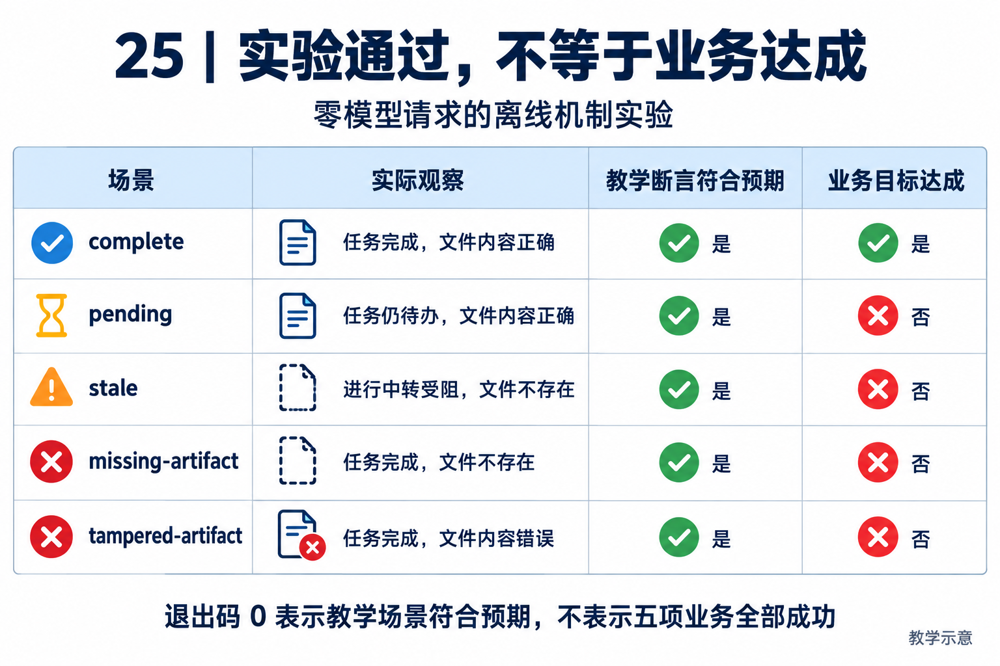

# 离线实验｜任务完成标记不等于交付完成

[返回教材](../README.md)

## 实验要解决的问题

<!-- teaching-figure:25:start -->


读图：逐行对照数据库状态、真实文件与两列布尔结果。pending 场景的文件内容正确但任务未收口；stale 场景是遗留进行中任务转为受阻且没有文件，不是文件过期。只有 complete 达成业务目标，五个场景都可满足教学预期。
<!-- teaching-figure:25:end -->

Agent 在界面上说“完成了”，数据库里的 Todo 也都变成 completed，用户要求的文件却不存在。这不是少写一句提示词的问题，而是把“执行者报告的状态”和“独立核验的交付物”混成了一件事。本实验让你亲自看到这两个事实怎样分离，并检查只看 Todo 对账会遗漏什么。

实验复用项目真实的 [TaskStore](../../../src/naumi_agent/tasks/store.py) 和 [reconcile_todos](../../../src/naumi_agent/tasks/reconciliation.py)，实际创建 SQLite 数据库、写草稿、重新打开数据库和读取文件。没有 mock 存储，没有请求模型，也没有注册一个新产品工具或修改 engine。它是确定性的运行机制实验，不是独立 Agent，更不是完整端到端模型评测。

[weekly-updates.json](weekly-updates.json) 是明确标注的虚构教学数据，不包含真实企业业务记录。它有两项完成更新和一项受阻更新。交付目标是“准确整理这三项为草稿”，不是让源项目中的所有工作都变成完成。草稿保留受阻事实，反而是正确行为。

## 准备与执行

需要源码仓与已安装的项目开发环境；仅安装二进制产品不包含这里的脚本和测试。Python 版本要求以[项目依赖](../../../pyproject.toml)为准。在仓库根目录执行：

```bash
.venv/bin/python scripts/interview_lab.py --case all
```

Windows 的 Python 可执行路径通常为 `.venv\Scripts\python.exe`，替换上面的可执行文件部分即可。该脚本本轮在 macOS 验证；Windows/Linux 不能因为 Python 语法可移植就被标成已实测。

脚本不读取模型密钥、不联网，不访问当前 `.naumi` 数据库。每次都在系统临时目录下新建独立目录，并输出 `artifact_root` 和每个场景的 `run_directory`。目录里有 `tasks.db`、`receipt.json`，部分场景还有 `weekly-report.md`。它不会覆盖已有文件，运行结束保留产物供你检查；系统可能清理临时目录，重要学习记录请另存自己的学习目录。清理时只删除你确认属于本次实验的精确目录，不删除整个系统临时目录。

如果环境未安装，先按[项目源码开发说明](../../../README.md)准备依赖。看到 `ModuleNotFoundError` 应检查虚拟环境，不要把环境错误当作 Agent 逻辑错误。脚本拒绝未知场景和不合格样例数据；输入错误或环境异常返回退出码 2，教学断言不符合预期返回 1。

## 五个场景怎样解读

| 场景 | Todo 最终状态 | 产物情况 | 关键观察 |
| --- | --- | --- | --- |
| complete | 全部 completed | 存在且匹配样例内容 | 本实验的交付条件满足。 |
| pending | 草稿任务 pending | 草稿内容正确 | 对账返回 none，但仍有未收口任务。 |
| stale | 先 in_progress，后 blocked | 不存在 | 第一次要求重试对账，第二次将遗留任务阻塞。 |
| missing-artifact | 全部 completed | 不存在 | 状态完成不能证明文件已经交付。 |
| tampered-artifact | 全部 completed | 文件存在但内容错误 | 文件存在不能证明交付内容正确。 |

输出中 `lesson_assertions_passed` 表示这个教学场景是否出现预期行为；`business_goal_met` 表示该场景的草稿目标是否满足。所有场景的前者都应为 true，但只有 complete 的后者为 true。所以退出码 0 的意思是“实验按预期展示了成功和失败”，不是“五项业务全部成功”。

具体判定在[实验脚本](../../../scripts/interview_lab.py)的 `checks` 字段：任务全部完成、文件存在、内容匹配、对账无警告。这里是教材自己的确定性判定器，不是 NaumiAgent 产品中的完整 CompletionGate。`fixture_sha256` 帮助识别输入版本，不能证明资料本身是真实的；`artifact_sha256` 证明文件字节指纹，不能代替业务语义判断。

## 按这个顺序动手，不要只看最后的绿色输出

第一次先运行 pending，打开 receipt，解释为什么 `first_reconciliation` 为 none，而交付仍然未通过。接着打开对应源代码，确认函数只筛选 IN_PROGRESS，不要从 none 推断“所有任务都已完成”。

第二次运行 stale，比较 first 和 second。找到数据库中的 blocked 状态，说明这是重新读取的持久状态而不是缓存变量。第三次比较 missing-artifact 与 tampered-artifact：前者缺文件，后者有文件但缺实际内容。最后运行 complete，确认受阻更新仍出现在草稿中，不能为了“看起来完成”而丢掉坏消息。

```bash
.venv/bin/python scripts/interview_lab.py --case pending
.venv/bin/python scripts/interview_lab.py --case stale
.venv/bin/python -m pytest tests/unit/test_interview_lab.py tests/unit/test_todo_reconciliation.py -q
```

交作业时提交一张对比表、一个脱敏回执和你的解释，不要求提交机器的绝对临时路径。每个结果写出“观察到了什么”和“没有证明什么”。例如重新打开 SQLite 能证明本地数据持久化，不证明跨机器恢复；确定性文件匹配能证明模板内容符合样例，不证明语言模型不会幻觉。

## 面试迁移与评分

面试官问“你怎么判断 Agent 做完了”，先用 missing-artifact 解释反例，再讲状态、产物和验收规则应相互核对。追问“文件内容也对了为什么 pending 不算完成”，说明这个实验要求账本与交付一致；真实业务可选择先对账再交付，具体策略必须明确，不能偷偷将 pending 当 completed。

满分 5 分：能区分两个布尔值 1 分；解释 none 的范围 1 分；解释两次对账 1 分；解释产物核验 1 分；诚实说明未调用模型 1 分。若你只运行了命令，应写“复现任务与产物对账实验”；只有亲自扩展并测试判定器后，才写“实现了某项检查”。

下一步进入[实战主线](../20-实战主线与环境手册.md)，在真正的模型决策和工具执行中保持独立核验。任何 live 实验都需要你自己的授权配置与运行记录。
