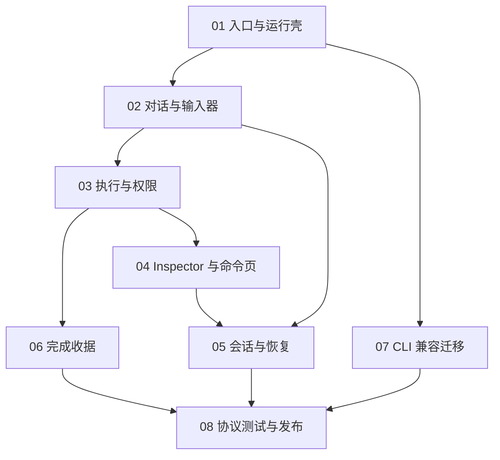

# Terminal UI 细粒度模块规格

本目录把 Terminal UI 产品化拆成可独立设计、实现、验证和提交的模块。每个模块必须复用现有 JSONL Bridge 和消息体系，不允许创建平行执行链路。

## 文档清单

| 编号 | 模块 | 文档 | 主要产物 |
|---|---|---|---|
| 01 | 默认入口与运行壳 | `01-default-entry-and-runtime-shell.md` | `naumi` 默认启动、回退、进程生命周期 |
| 02 | 对话时间线与输入器 | `02-conversation-timeline-and-composer.md` | 主时间线、多行输入、草稿、自动滚动 |
| 03 | 执行时间线与权限 | `03-execution-timeline-and-permissions.md` | 运行阶段、工具卡、权限状态机 |
| 04 | Inspector 与命令页 | `04-inspector-and-command-pages.md` | 响应式 Inspector、`/tasks`、`/agents`、`/workbench` |
| 05 | 会话持久化与恢复 | `05-session-persistence-and-recovery.md` | 切页不丢失、崩溃恢复、重放与去重 |
| 06 | 完成收据与验证 | `06-completion-receipt-and-validation.md` | 改动、测试、风险、审批、下一步闭环 |
| 07 | CLI 兼容与迁移 | `07-cli-compatibility-and-migration.md` | 旧 CLI/TUI 收口、兼容窗口、弃用策略 |
| 08 | 协议、测试与发布门禁 | `08-protocol-testing-and-release-gates.md` | Bridge v2、契约测试、发布证据 |

## 当前实施进度

| 模块 | 已完成 | 下一切片 |
|---|---|---|
| 01 默认入口与运行壳 | 默认 Terminal UI、跨平台启动、诊断与兼容回退 | 进入发布门禁时补安装态矩阵 |
| 02 对话时间线与输入器 | 多行编辑、原子 paste、受限高度 Composer、会话草稿恢复、`follow_tail`、语义未读计数、跳到最新、resize 消息锚点 | 用户消息发送确认、失败重试与去重 |
| 03-08 | 具备部分基础组件和协议，不视为模块完成 | 按依赖图逐切片推进 |

“已完成”只描述表中列出的切片，不代表对应模块的全部验收标准已经满足。

## 依赖关系

## 模块交付纪律

每次只实现一个模块中的一个可验收切片。每个切片必须依次完成：

1. 先补契约或失败测试。
2. 实现后运行 Node/Python 定向测试。
3. 用真实 Bridge 和真实 SQLite 会话完成一次手工端到端验证。
4. 自我审视用户体验、边界和未完成项。
5. 独立 commit 并及时 push。

全量 `pytest tests/ -x` 与完整 Node 测试只在大模块完成、协议版本变更或发布候选时运行。

## 责任边界

| 层 | 负责 | 不负责 |
|---|---|---|
| Terminal UI 前端 | 渲染、输入、导航、表现状态 | 推断执行成功、权限决策、持久业务状态 |
| JSONL Bridge | 事件适配、序号、重放、请求关联 | 重复实现 Agent 引擎 |
| Agent Engine | 推理、工具调用、运行终态 | 页面布局和快捷键 |
| Session Store | 会话、消息、运行记录 | 终端宽度和视觉折叠 |
| Workbench Store | 任务、Agent、验证和治理事件 | 普通输入草稿 |

## 第一阶段“可正式使用”定义

第一阶段不要求全部运营页面完成，但必须闭合以下路径：

`naumi 启动 -> 普通对话/创建任务 -> 流式过程 -> 权限处理 -> 工具结果 -> 完成收据 -> 会话恢复`

只要其中任何一步仍依赖旧 UI、静默失败、伪数据或无法恢复，第一阶段就不能标记完成。
