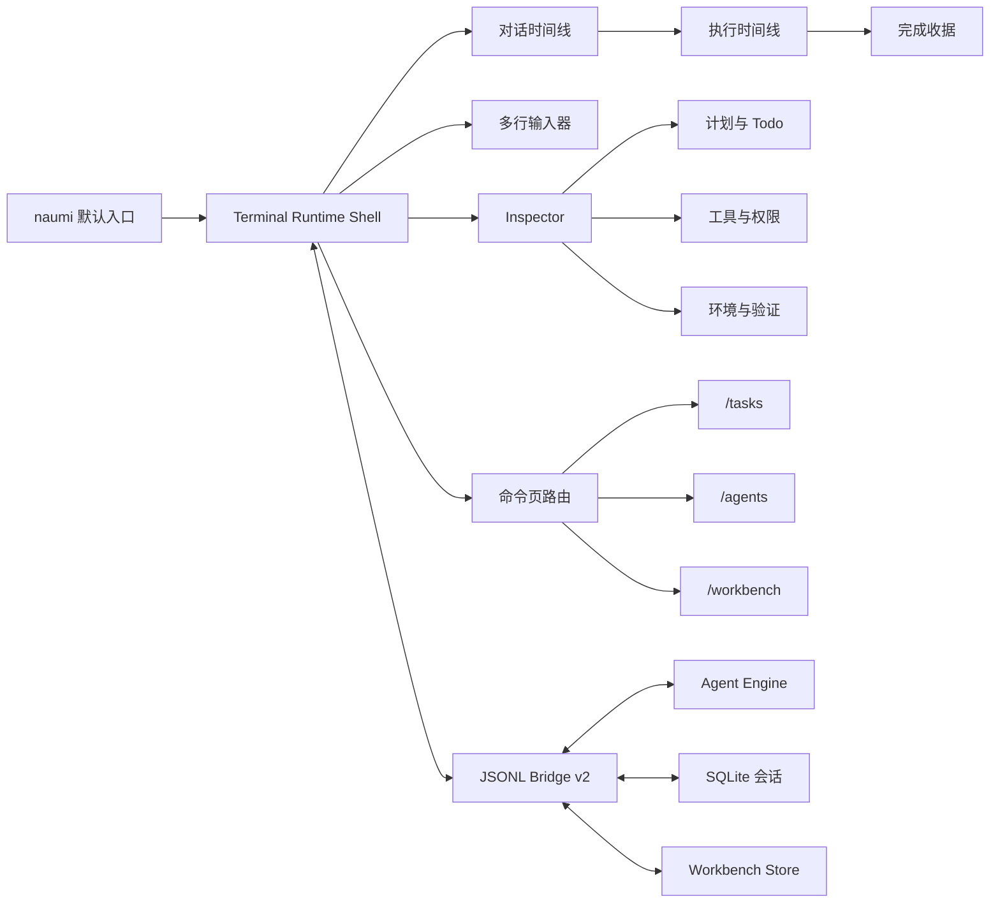

# NaumiAgent Terminal UI 产品化总设计

**状态**：已确定产品方向，待实施计划评审
**日期**：2026-07-13
**适用范围**：`naumi` 默认终端体验、JSONL Bridge、会话与任务执行展示

## 1. 决策摘要

NaumiAgent 的默认终端入口采用聚焦对话的全屏 Terminal UI。主界面保持单一时间线，不在首屏堆叠任务驾驶舱；计划、工具、权限、环境和验证信息通过可随时展开的 Inspector 提供。密集运营能力进入 `/tasks`、`/agents`、`/workbench` 独立页面。

本设计不是重写引擎或另建通信层，而是在现有 `frontend/terminal-ui`、`naumi_agent.ui.bridge`、SQLite 会话和 Workbench 事件之上完成产品化收口。

## 2. 已确认的产品原则

1. 运行 `naumi` 默认进入新 Terminal UI。
2. 旧 Prompt Toolkit 对话入口保留为 `naumi chat --classic`，用于兼容和故障回退。
3. Textual TUI 降级为维护模式，不再承接新能力。
4. 主界面默认只呈现对话、执行过程和输入器。
5. Inspector 在宽终端中从右侧展开；终端宽度小于 100 列时切换为独立全屏页。
6. `/tasks`、`/agents`、`/workbench` 是独立页面，不与主时间线争夺首屏空间。
7. 创建任务与日常对话共用同一会话和执行时间线，任务是对话中可追踪的执行对象，不是平行产品。
8. 小模块运行定向测试；完成大模块或发布候选时运行全量测试。

## 3. 当前基础与缺口

### 3.1 可复用基础

- JSONL Bridge 已支持握手、提交、模式切换、权限响应、恢复、任务面板、健康检查和关闭。
- Terminal UI 已支持助手流式输出、折叠思考摘要、工具准备/执行/结果卡、运行状态、Todo、子 Agent、恢复提示和 Workbench 事件。
- 输入器已有单行光标移动、删除、历史导航和模式切换。
- UI 快照可按会话写入 `.naumi/terminal-ui-state.json`。
- Bridge 已能从后端会话回放消息，并维护单调递增的事件序号。

### 3.2 产品化缺口

- `naumi` 默认入口仍未统一到新 UI。
- UI 快照是进程本地附属状态，缺少版本迁移、跨工作目录身份和崩溃恢复语义。
- 缺少多行输入、历史搜索、命令补全和草稿恢复。
- 执行结束缺少统一的“完成收据”，用户无法一次确认改动、测试、风险和下一步。
- 任务面板仍是内容卡片，不是正式 Inspector 信息架构。
- `/agents` 已具备权威状态、精确停止和双 TUI 页面；`/workbench` 仍缺少独立页面状态与导航协议。
- 旧 CLI、Textual TUI 和新 Terminal UI 的能力边界仍重叠。

## 4. 目标信息架构

## 5. 核心状态边界

### 5.1 后端权威状态

- 会话、消息、执行轮次和最终结果。
- 工具调用、权限请求及其解决结果。
- Todo、任务、Agent、Workbench 事件和验证结果。
- 可恢复执行所需的游标、运行状态和幂等标识。

### 5.2 前端表现状态

- 当前页面、Inspector 展开状态及选中标签。
- 时间线滚动位置、折叠卡片、选中任务。
- 输入草稿、历史游标和命令面板状态。
- 终端尺寸推导出的布局模式。

前端状态不得伪造后端执行结果；后端状态不得保存纯视觉尺寸和临时 hover/selection 信息。

## 6. 导航与键盘模型

| 操作 | 默认按键 | 行为 |
|---|---|---|
| 提交输入 | `Enter` | 单行提交；多行模式下由输入器规则判定 |
| 插入换行 | `Shift+Enter` | 在输入器中换行 |
| 打开 Inspector | `Ctrl+I` | 宽屏右侧抽屉，窄屏独立页 |
| 命令面板 | `/` | 空输入时进入斜杠命令建议 |
| 返回主时间线 | `Esc` | 关闭浮层或返回上一级页面 |
| 模式切换 | `Shift+Tab` | 沿用现有模式循环 |
| 权限允许/拒绝/绕过 | `Y` / `N` / `B` | 只在权限请求聚焦时生效 |
| 跳到最新输出 | `End` 或 `Ctrl+L` | 恢复自动跟随并定位到末尾 |

快捷键冲突以输入器优先、权限请求次之、页面路由再次、全局命令最后的顺序解析。

## 7. 实施里程碑

1. **M1 运行壳与默认入口**：统一入口、前置检查、回退和退出恢复。
2. **M2 对话时间线与输入器**：多行、草稿、自动跟随、命令补全。
3. **M3 执行时间线与权限**：统一事件卡状态机和安全交互。
4. **M4 完成收据（0.1.212 已完成）**：建立任务完成的用户闭环；后续仅扩展 Inspector 详情与 next action 交互。
5. **M5 Inspector（0.1.213 已完成）**：后端权威五标签快照、Bridge revision 同步、三档响应式新 UI 与 Textual 同源页已通过真实 Git/TaskStore/pytest/SQLite 端到端验收。
6. **M6 独立命令页**：`/tasks` 与 `/agents` 已完成；继续独立实现 `/workbench`。`/agents` 后续能力扩展不与 `/workbench` 混交。
7. **M7 会话持久化与恢复**：覆盖切页、退出、崩溃和协议重连。
8. **M8 兼容迁移与发布门禁**：收敛旧界面、补齐端到端证据并发布。

M1-M5 与 M6 `/agents` 已形成可正式使用的对话、执行、完成、运行时检查和 Agent 控制闭环。其余 M6-M8 能力在不改变 Bridge 主干的前提下逐步增强。

## 8. 非目标

- 不在本阶段重写 ReAct 引擎、模型路由、权限判定或 Workbench 数据层。
- 不把思考链原文直接暴露给用户；只展示可解释的阶段、工具和结果摘要。
- 不在 Terminal UI 内复制 Mac Workbench 的三栏画板布局。
- 不在旧 Textual TUI 复制密集运营命令页；当前会话的 Inspector 等关键后端能力仍保持同源语义与可达性。
- 不用 Prompt 模拟任务、Agent 或验证状态。

## 9. 总体验收标准

1. 用户从 `naumi` 启动、发送普通对话、创建编码任务、处理权限、观察执行、获得完成收据，整条链路无需切换应用。
2. 切换 `/tasks`、`/agents`、`/workbench` 后返回，当前会话、草稿、滚动和运行状态不丢失。
3. Bridge 断开、终端缩放、进程重启和损坏前端快照均有明确恢复路径。
4. 所有状态均来自真实后端事件，关键操作可追溯，危险操作不可被快捷键误触。
5. 中文为默认文案，英文通过同一消息键和格式参数完整覆盖。

## 10. 模块文档索引

细粒度规格位于 `docs/product/terminal-ui/`。该目录的 `README.md` 定义依赖顺序、文档责任和验收矩阵。
