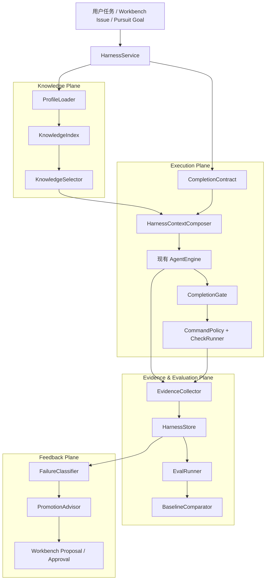

# NaumiAgent Harness Engineering Design

## 文档状态

- 日期：2026-07-14
- 状态：已批准；H1-H3、H4.1-H4.4 已实现，H4.5-H7 待实施
- 范围：设计 NaumiAgent 的 Harness Engineering 子系统，并记录各阶段真实落地状态
- 目标读者：NaumiAgent 维护者、实现 Agent、测试与安全审查者
- 推荐结论：建立独立的 `harness` 工程域，复用现有引擎、权限、任务、Worktree、Workbench 和 DebugTrace；不把 Harness 简化成更大的 Prompt，也不复制一套新的调度系统

---

## 1. 执行摘要

NaumiAgent 已经具备 Harness Engineering 的若干零散部件：

- `HarnessContextAssembler` 会在每个 ReAct turn 注入临时运行状态；
- `AGENTS.md` 定义了项目级质量规则；
- `PermissionChecker`、session grant 和 Plan 模式提供执行边界；
- `TaskStore`、Todo reconciliation、Pursuit、Workbench lease 和 Worktree 提供任务与隔离能力；
- `DebugTrace`、ChatRun、ValidationRun 和 AuditEvent 提供部分证据；
- Ruff、pytest、Node 测试、Swift 测试和 Workbench 本地闭环构成真实反馈渠道。

但这些能力当前没有形成一个统一的 Harness 闭环。系统能“执行很多事情”，却还不能稳定回答以下问题：

1. 当前仓库对 Agent 来说是否足够可读、可导航、可验证？
2. 本次任务的完成标准是什么，哪些证据才能证明完成？
3. Agent 在结束前是否执行了正确的检查，而不只是口头声称完成？
4. 一次失败究竟来自模型、上下文、工具、权限、环境、测试还是任务定义？
5. 同一种失败重复出现时，应该提升为文档、规则、结构测试还是工具能力？
6. 模型、Prompt、工具或引擎升级后，Agent 的真实任务成功率是否变好？

本设计把 Harness 定义为：

> 围绕 Agent 执行建立的、可版本化且可机械验证的工程环境。它负责把仓库知识、任务契约、工具与权限、运行证据、评测反馈和长期改进连接成闭环，使 Agent 能在清晰边界内持续完成真实任务。

推荐建立四个平面：

1. **Knowledge Plane**：让仓库事实、架构、命令和约束对 Agent 可发现。
2. **Execution Plane**：把任务契约、工具、权限、Worktree 和完成门禁接入现有引擎。
3. **Evidence & Evaluation Plane**：记录标准化轨迹、验证证据、评测结果和基线差异。
4. **Feedback Plane**：把重复失败转化为待审批的 Harness 改进建议。

实现必须分阶段完成。每个阶段只交付一个可独立使用、独立测试、独立提交的纵向切片。

---

## 2. 调研结论

### 2.1 OpenAI：Harness 的核心是环境、意图与反馈回路

OpenAI 在 *Harness engineering: leveraging Codex in an agent-first world* 中强调，Agent-first 工程的核心工作不再只是直接写代码，而是设计环境、明确意图并建设可靠反馈回路。几个关键经验与 NaumiAgent 直接相关：

- 仓库内、可版本化的代码、Markdown、Schema 和执行计划才是 Agent 真正可见的系统事实；
- 文档需要渐进式披露，不能把全部知识一次塞入上下文；
- 只写文档不足以维持架构，需要用自定义 lint 和结构测试机械执行不变量；
- UI、日志、指标和 trace 都要变成 Agent 可以直接检查的对象；
- 人类反馈应持续提升为文档、工具或规则；
- 自治会复制仓库中的坏模式，因此必须有持续的“熵清理”和 golden principles。

来源：[OpenAI Harness Engineering](https://openai.com/index/harness-engineering/)

### 2.2 OpenAI Codex：持久指导应分层，机械约束应独立

Codex 官方手册把持久上下文分成不同层次：

- `AGENTS.md` 保存仓库约定、验证命令和协作规范；
- Skills 保存可复用工作流；
- Hooks 在生命周期边界机械执行检查；
- MCP 暴露外部数据和动作；
- Worktree 隔离并行修改；
- Record & Replay 为问题重现和审计提供轨迹。

本设计采用相同原则：不把所有内容塞进一个 system prompt，也不让一个 Harness 配置文件同时承担知识、权限、命令执行和 UI 状态。

来源：[Codex Customization](https://developers.openai.com/codex/concepts/customization)

### 2.3 OpenAI Symphony：任务是控制面，Session 只是执行载体

Symphony 的关键不是“启动更多 Agent”，而是：

- 任务状态而不是聊天 session 成为控制面；
- 每个任务使用独立 workspace；
- 工作流策略保存在仓库内的版本化契约中；
- 每轮先 reconciliation，再 dispatch；
- stall、重试、恢复和清理具有明确状态机；
- workspace 路径、cwd 和生命周期具有机械安全不变量。

NaumiAgent 已有 TaskStore、Pursuit、Workbench lease 和 WorktreeManager，因此不应复制 Symphony。正确做法是让 Harness 为这些现有系统补齐契约、证据和评测层。

来源：[OpenAI Symphony](https://openai.com/index/open-source-codex-orchestration-symphony/)

### 2.4 Anthropic：长任务必须增量推进并留下结构化交接物

Anthropic 对长时间 Agent 的实验表明，只有 compaction 不足以跨上下文可靠工作。稳定模式包括：

- 初始化阶段建立可运行环境、任务清单和进度记录；
- 每轮只选择一个明确功能；
- 开始时读取进度、Git 历史并运行基本检查；
- 结束时留下干净代码、提交和结构化进度；
- 只有真实验证后才能把功能标记为完成。

这与 NaumiAgent 的“一次一个功能、真实验证、及时提交”原则一致，应该被提升为 Completion Contract，而不只存在于人工说明中。

来源：[Anthropic Effective Harnesses for Long-running Agents](https://www.anthropic.com/engineering/effective-harnesses-for-long-running-agents)

### 2.5 Anthropic：Harness 必须可消融、可简化

Anthropic 后续的 Harness 研究指出，每个 Harness 组件都隐含了“模型自身做不到什么”的假设。随着模型增强，这些组件可能过时；因此 Harness 本身必须可观测、可消融、可比较，不能无限增加 Planner、Reviewer 和 Prompt 层。

本设计要求每个 Harness 组件具有独立开关和指标，并能通过 baseline 对比确认它是否真正提高任务成功率。

来源：[Anthropic Harness Design for Long-running Application Development](https://www.anthropic.com/engineering/harness-design-long-running-apps)

---

## 3. 当前基线与差距

### 3.1 已有能力

| Harness 能力 | 当前实现 | 可复用结论 |
|---|---|---|
| 每轮运行状态 | `orchestrator/context_assembly.py` | 保留为 Runtime Snapshot，不改成知识库 |
| ReAct 生命周期 | `orchestrator/engine.py` | Harness 在现有 run/streaming/tool 路径接入 |
| 工具契约 | `tools/base.py` | 复用 `ToolMetadata` 与统一 execute() |
| 权限与确认 | `safety/permissions.py`、permission grants | Harness 命令不能绕过该路径 |
| 任务状态 | `tasks/store.py` | 继续作为任务状态唯一事实源 |
| 终态对账 | `tasks/reconciliation.py` | Completion Gate 复用其“一次纠正后阻塞”模式 |
| 长目标 | Pursuit | Harness 提供证据，不另建目标循环 |
| 隔离执行 | WorktreeManager | 变更型 live eval 默认使用 Worktree |
| 验证命令 | Workbench `ValidationRunner` | 提取通用命令策略，不复制 subprocess 逻辑 |
| 原始轨迹 | `debug_trace.py`、ChatRunStore | Harness 保存规范化索引与派生结果，不复制原始事件 |
| 治理与审批 | Workbench proposal/approval/audit | Harness 改进建议通过 Proposal 流程进入人工审批 |
| 前端事件 | EventEmitter、JSONL protocol | 新增事件类型，不建立第二套事件总线 |

### 3.2 关键缺口

1. **缺少仓库知识发现器**：当前源码没有系统读取 `AGENTS.md`、架构索引或目录级约束。
2. **Harness 只等于状态快照**：现有 `HarnessContextAssembler` 不负责任务契约、知识选择或完成证据。
3. **没有统一 Completion Contract**：不同入口对“完成”的定义不一致。
4. **验证逻辑分散**：自我修改、Workbench、CLI 和 CI 各自运行检查。
5. **轨迹不可直接评测**：DebugTrace 可回放，但缺少标准化 outcome、check、artifact 和 failure taxonomy。
6. **缺少可重复 Eval Suite**：无法稳定比较模型、Prompt、工具或 Harness 变更。
7. **缺少反馈提升机制**：用户纠正、失败和 review 意见不会自动成为候选规则。
8. **缺少配置信任模型**：如果直接允许仓库配置执行命令，Agent 可以通过修改配置扩大权限。

---

## 4. 方案比较

### 方案 A：继续扩展 `HarnessContextAssembler`

做法：把仓库文档、任务标准、验证状态和失败历史全部加入当前快照。

优点：

- 改动文件少；
- 所有界面立即生效；
- 初期开发速度快。

缺点：

- 把知识、执行、证据和评测混在一个 Prompt 组装器中；
- 上下文会快速膨胀；
- 无法独立测试、关闭或消融 Harness 组件；
- 不能解决命令安全、评测基线和反馈提升。

结论：不采用。它只能解决“模型看到什么”，不能构成 Harness Engineering。

### 方案 B：独立 Harness Kernel，接入现有引擎（推荐）

做法：建立 `src/naumi_agent/harness/` 工程域，统一 Profile、Knowledge、Contract、Check、Evidence、Evaluation 和 Feedback；通过现有 Engine、TaskStore、PermissionChecker、Worktree 和 Workbench 完成执行。

优点：

- 边界清晰，可逐模块独立测试；
- 不复制任务、权限和事件系统；
- 支持 CLI、TUI、API 和 Agent Tool 双通道；
- 可以建立真正的离线/在线 Eval 与 baseline；
- 适合未来自进化闭环。

缺点：

- 需要新增数据模型和持久化表；
- Completion Gate 会触及核心 Engine；
- 必须先解决仓库配置的信任边界。

结论：采用。

### 方案 C：Workbench/Symphony 优先，先做常驻调度器

做法：以 Mission/Issue/Lease 为中心建立 always-on Harness daemon。

优点：

- 长任务和多 Agent 体验直观；
- 与 Mac Workbench 产品方向一致；
- 易于展示可视化控制面。

缺点：

- 会在基础契约和评测未稳定前放大自治规模；
- 容易重复 Pursuit、Scheduler、BackgroundRunner 和 Workbench；
- 不能先回答“单个 Agent 是否可靠完成一个任务”。

结论：作为后期控制面集成，不作为 Harness 第一阶段。

---

## 5. 目标与非目标

### 5.1 目标

1. 让 Agent 在任务开始时获得最小但充分的仓库知识。
2. 为每次任务建立可机械检查的 Completion Contract。
3. 让所有验证命令经过同一安全与证据路径。
4. 为每次运行生成可回放、可比较、可追责的 Completion Receipt。
5. 建立离线可重复、在线受预算控制的 Eval Suite。
6. 把重复失败转化为待审批的 Harness 改进建议。
7. 支持用户手动命令与 Agent 自主 Tool 使用同一底层 service。
8. 使每个组件可关闭、可消融、可测量，防止 Harness 自身无限膨胀。

### 5.2 非目标

- 第一阶段不创建新的通用 Agent 循环。
- 不替换 `AgentEngine`、TaskStore、Pursuit 或 Workbench。
- 不允许 Harness 配置绕过 PermissionChecker。
- 不自动把 LLM judge 当作最终质量事实。
- 不自动修改 `AGENTS.md`、架构规则或 CI。
- 不在第一阶段实现云端多租户 Harness 服务。
- 不为了 Harness 一次性重构 `engine.py` 或 `main.py`。
- 不把全部仓库文档无选择地注入每轮上下文。

---

## 6. 总体架构



### 6.1 所有权原则

| 数据 | 唯一事实源 | Harness 行为 |
|---|---|---|
| 会话消息 | SessionStore | 只引用 session id，不复制消息数据库 |
| Todo/任务状态 | TaskStore | 读取并参与 Completion Gate |
| Mission/Issue/Lease/Approval | WorkbenchStore | 读取验收标准，写 Proposal，不双写状态 |
| Worktree 生命周期 | WorktreeManager | 请求隔离环境，不自行执行 Git plumbing |
| 工具权限 | PermissionChecker | 所有 Harness 执行必须经过该检查 |
| 原始 UI/Engine 事件 | DebugTrace/ChatRun | 保存引用与规范化索引，不复制完整原始流 |
| Harness Contract/Check/Eval | HarnessStore | 新增表，仅保存 Harness 派生事实 |

---

## 7. 仓库布局

计划新增：

```text
src/naumi_agent/harness/
├── __init__.py
├── models.py              # Profile、Contract、Run、Check、Evidence、Eval 数据类型
├── profile.py             # .naumi/harness.yaml 解析、校验、摘要
├── trust.py               # workspace + profile digest 信任记录
├── knowledge.py           # 知识发现、索引、相关性选择、预算裁剪
├── context.py             # 组合 Runtime Snapshot、知识和 Completion Contract
├── command_policy.py      # argv、cwd、allowlist、profile trust 检查
├── checks.py              # 通用验证执行器与取消/超时处理
├── evidence.py            # 从 Engine/DebugTrace/Check 提取规范化证据
├── store.py               # SQLite Harness 派生记录
├── completion.py          # Completion Gate 与 Receipt
├── evals.py               # Eval Suite 加载与运行
├── feedback.py            # 失败分类和规则提升建议
├── service.py             # CLI/Tool/API 共享 facade
└── tools.py               # Agent 可调用工具

docs/harness/
├── index.md               # Agent 入口索引，保持短小
├── architecture.md        # 当前架构边界与事实来源
├── golden-principles.md   # 可机械提升的工程原则
├── debt.md                # 已知技术债及状态
├── decisions/             # 版本化架构决策
└── evals/                 # 仓库内 Eval Case 定义

.naumi/harness.yaml        # 机器可读 Harness Profile
```

现有 `orchestrator/context_assembly.py` 保留。它继续负责易变的 Runtime Snapshot；新 `harness/context.py` 负责选择和组合，不把旧文件一次性搬迁。

---

## 8. Harness Profile

### 8.1 配置职责

`.naumi/harness.yaml` 只描述机械契约：知识入口、检查定义、上下文预算、完成规则和 Eval Suite 路径。人类可读的原则仍写在 `AGENTS.md` 和 `docs/harness/`。

配置必须：

- 使用 `yaml.safe_load`；
- 通过 Pydantic 严格模型解析，`extra="forbid"`；
- 有显式 `schema_version`；
- 文件最大 256 KiB；
- 禁止 YAML object tag；
- 所有相对路径锚定 workspace root；
- 拒绝路径越界和越界 symlink；
- 命令使用 argv 数组，不接受 shell 字符串；
- 不保存密钥，不做任意环境变量展开。

### 8.2 示例

```yaml
schema_version: 1

knowledge:
  entrypoints:
    - AGENTS.md
    - README.md
    - docs/harness/index.md
  include:
    - src/**/*.py
    - tests/**/*.py
    - docs/harness/**/*.md
  exclude:
    - data/**
    - .venv/**
    - apps/**/.build/**
  max_turn_tokens: 8000
  max_file_bytes: 131072

completion:
  require_todo_reconciliation: true
  require_change_evidence: true
  correction_attempts: 1
  unverified_status: completed_unverified

checks:
  - id: python_lint
    label: Python 静态检查
    argv: [uv, run, ruff, check, src/, tests/]
    timeout_seconds: 180
    when_changed: ["**/*.py"]
    required_for: [change]

  - id: python_tests
    label: Python 测试
    argv: [uv, run, pytest, tests/, -x, -q]
    timeout_seconds: 900
    when_changed: ["**/*.py"]
    required_for: [change]

evals:
  suites:
    - docs/harness/evals/core.yaml
  live_default: false
  max_cost_usd: 1.0
  max_duration_seconds: 1800
```

### 8.3 信任模型

仓库内配置可以被 Agent 修改，因此不能因为文件存在就自动执行命令。

使用 `HarnessTrustStore` 保存：

- 规范化 workspace root；
- Profile 内容 SHA-256；
- 批准时间；
- 批准来源；
- 可选失效原因。

规则：

1. 未信任 Profile 可以执行只读 `doctor` 和结构解析。
2. 未信任 Profile 不注入指令正文，不自动执行 checks。
3. 用户通过 `/harness trust` 查看摘要和命令列表后确认。
4. Profile 内容变化后 digest 改变，信任自动失效。
5. `harness_trust` 不注册为 Agent Tool，Agent 不能给自己的配置授权。
6. CLI/TUI/API 的人工确认必须使用现有 permission challenge 语义。

这是“双通道设计”的明确安全例外：诊断、状态和评测都有用户/Agent 双通道；建立信任只能由用户触发。

---

## 9. Knowledge Plane

### 9.1 分层知识

采用三级渐进式披露：

- **L0 Manifest**：每轮最多约 1,000 tokens，包含项目身份、主要入口、适用约束、可用检查和知识目录。
- **L1 Relevant Bundle**：根据任务、变更路径和当前错误选择相关文档与代码摘要，默认不超过 8,000 tokens。
- **L2 On-demand Evidence**：Agent 通过只读 `harness_read_knowledge` 工具读取完整文件或索引项。

任何层级都不得把 raw screenshot、base64、超长日志或完整大型 diff 塞入模型上下文；这些内容保存为 artifact 并只注入路径、摘要和 digest。

### 9.2 发现顺序

1. workspace root 的 `.naumi/harness.yaml`；
2. root `AGENTS.md`；
3. 任务涉及路径祖先链上的嵌套 `AGENTS.md`；
4. Profile 显式 entrypoints；
5. `pyproject.toml`、`package.json`、`Package.swift` 中可确定的构建信息；
6. 相关源码、测试和最近变更摘要。

更接近目标文件的 `AGENTS.md` 规则覆盖上层规则，但绝对红线不得被下层放宽。

### 9.3 确定性优先

首版 KnowledgeIndex 不引入向量数据库。选择流程使用：

- 路径邻近；
- 文件名/符号匹配；
- `rg` 文本命中；
- import 关系；
- Git changed files；
- Task/Issue 显式引用。

只有确定性选择无法满足召回率，并经过 Eval 证明后，才考虑 embedding reranker。

### 9.4 文档新鲜度

`docs/harness/index.md` 中的关键文档可以声明：

```yaml
source_paths:
  - src/naumi_agent/orchestrator/**
  - src/naumi_agent/safety/**
verified_at_commit: 2ec1b644
```

`harness doctor` 比较相关 source paths 在该 commit 后是否变化，只标记 `possibly_stale`，不自动断言文档错误。后期可由 doc-gardening Eval 生成修订 Proposal。

---

## 10. Completion Contract

### 10.1 Contract 来源优先级

1. Workbench Issue 的 acceptance criteria；
2. 用户本轮显式要求；
3. TaskStore 中的 subject/description；
4. Harness Profile 的 task-kind 默认规则；
5. Agent 生成的建议只能作为待确认补充，不能悄悄扩大 scope。

### 10.2 Task Kind

```text
answer    只回答或解释，不修改外部状态
analysis  读取并形成证据结论
change    修改代码、配置、文档或其他持久状态
monitor   等待外部状态达到条件
```

如果运行中出现任何非只读 Tool，最终 kind 自动升级为 `change`，不能继续用 `answer` 绕过验证。

### 10.3 Contract 数据

```text
HarnessContract
├── run_id
├── session_id
├── task_id / issue_id
├── task_kind
├── objective
├── acceptance_criteria[]
├── allowed_scope[]
├── prohibited_scope[]
├── required_checks[]
├── required_evidence[]
├── budget
└── source_refs[]
```

### 10.4 Completion Gate

Agent 准备输出最终答复时：

1. 检查 TaskStore 是否仍有未对账 Todo；
2. 检查实际变更路径是否越过 allowed scope；
3. 检查 required checks 是否存在且对应当前 Git tree fingerprint；
4. 检查 required evidence 是否存在；
5. 检查验证发生后文件是否又被修改；
6. 检查失败、取消和权限拒绝是否被诚实披露；
7. 生成 Completion Receipt。

如果第一次缺少证据，沿用 Todo reconciliation 模式，向 ReAct loop 注入一次明确纠正指令。第二次仍不满足时，不允许声称 `completed_verified`，返回 `completed_unverified` 或 `blocked`，并用中文说明缺失项。

### 10.5 Completion Receipt

```json
{
  "run_id": "hr_01...",
  "status": "completed_verified",
  "task_kind": "change",
  "changed_files": ["src/...", "tests/..."],
  "checks": [
    {"id": "python_lint", "status": "passed", "evidence_id": "he_..."},
    {"id": "python_tests", "status": "passed", "evidence_id": "he_..."}
  ],
  "criteria": [
    {"id": "ac_1", "status": "satisfied", "evidence_ids": ["he_..."]}
  ],
  "warnings": [],
  "tree_fingerprint": "sha256:..."
}
```

Receipt 只证明记录中的检查和证据，不声称形式化证明业务正确性。

---

## 11. Check Runner 与命令安全

### 11.1 不复制 Workbench 验证逻辑

从 `workbench/validation.py` 中提取通用能力：

- `ValidationCommandPolicy`：argv prefix、cwd、timeout、平台兼容；
- `ValidationExecutor`：subprocess、取消、超时、stdout/stderr artifact；
- Workbench `ValidationRunner`：继续负责创建 ValidationRun/FailureCard；
- Harness `CheckRunner`：负责 HarnessCheck/Evidence。

两者共享 executor 和 policy，不共享业务 store。

### 11.2 执行规则

- 禁止 `shell=True`；
- 禁止字符串命令；
- `cwd` 必须位于 workspace 或受管 Worktree；
- 命令先通过 Profile trust，再通过 Harness allowlist，再通过 PermissionChecker；
- Bypass 模式也不能绕过路径 containment 和 argv 结构校验；
- stdout/stderr 全量写 artifact，模型只得到有界摘要；
- timeout 后先 terminate，宽限期后 kill，并等待子进程回收；
- 取消必须终止整个 process group，不能遗留测试进程；
- 同一 `run_id + check_id + tree_fingerprint` 可复用成功结果；文件变化后缓存失效。

### 11.3 Check 状态

```text
pending -> running -> passed
                  -> failed
                  -> timed_out
                  -> cancelled
                  -> blocked_by_policy
                  -> infrastructure_error
```

测试失败和 Harness 基础设施失败必须分开，否则 Agent 会把“测试没启动”误报为“测试失败”。

---

## 12. Evidence 与 Trace

### 12.1 Evidence 类型

```text
file_snapshot
git_diff
command_result
test_report
lint_report
runtime_trace
ui_screenshot
ui_video
api_response
permission_decision
human_review
agent_review
completion_receipt
```

### 12.2 原始数据与派生数据

- DebugTrace、ChatRun 和 Workbench Audit 保存原始事件；
- Harness Evidence 保存原始数据 URI/path、digest、摘要、产生者和关联 criterion；
- 大文件不复制进 SQLite；
- SQLite 中不保存 secret、完整环境变量、认证 header 或模型 reasoning 原文。

### 12.3 标准化失败分类

```text
specification_gap       完成标准缺失或冲突
knowledge_gap           Agent 找不到已有事实
context_overflow        上下文不足或压缩丢失关键状态
tool_contract_error     schema/参数/结果契约错误
permission_block        权限或信任阻止执行
environment_error       依赖、进程、端口、平台问题
implementation_error    代码实现错误
verification_failure    检查真实失败
evaluation_error        Eval 自身错误
agent_premature_finish  缺少证据却提前完成
agent_repetition        重复无进展调用
human_judgment_required 需要产品或风险判断
```

分类器第一版使用确定性规则。LLM 可以提供补充解释，但不能覆盖原始状态。

---

## 13. HarnessStore 数据模型

新增 SQLite 表：

### `harness_profiles`

- `workspace_root`
- `profile_digest`
- `schema_version`
- `loaded_at`
- `trusted_at`
- `trust_source`
- `status`
- Primary key: `(workspace_root, profile_digest)`

### `harness_runs`

- `id`
- `workspace_root`
- `session_id`
- `task_id`
- `issue_id`
- `task_kind`
- `objective`
- `status`
- `profile_digest`
- `tree_fingerprint_before`
- `tree_fingerprint_after`
- `started_at`
- `completed_at`
- `contract_json`（写入前脱敏的规范化完成契约）
- `receipt_json`（规范化完成回执，用于幂等恢复）

### `harness_contract_criteria`

- `run_id`
- `criterion_id`
- `description`
- `source_kind`
- `source_ref`
- `status`
- `evidence_ids_json`

### `harness_checks`

- `id`
- `run_id`
- `check_key`
- `argv_json`
- `cwd`
- `status`
- `exit_code`
- `duration_ms`
- `started_at`
- `completed_at`
- `tree_fingerprint`
- `profile_digest`
- `artifact_path`

### `harness_evidence`

- `id`
- `run_id`
- `kind`
- `uri`
- `sha256`
- `summary_json`
- `producer`
- `created_at`
- `criterion_ids_json`

### `harness_eval_results`

- `id`
- `suite_id`
- `case_id`
- `run_id`
- `baseline_id`
- `status`
- `metrics_json`
- `failure_class`
- `created_at`

### `harness_feedback_candidates`

- `id`
- `fingerprint`
- `failure_class`
- `occurrence_count`
- `proposal_kind`
- `proposal_payload_json`
- `status`
- `workbench_proposal_id`

H4 使用独立的用户状态库 `harness.db`；原始大文件仍由 DebugTrace、ChatRun 或 artifact
目录保存，数据库只持有引用、摘要和 digest。迁移必须幂等；删除 Session 时使用现有
session deletion reconciliation 清理或归档关联 Harness 派生记录。H5/H6 表在对应阶段
启用时再创建，H4 迁移不预建空表。

---

## 14. Eval 系统

### 14.1 Eval 类型

1. **Static Eval**：Profile、知识图、结构规则、命令策略，无模型调用。
2. **Replay Eval**：从现有 trace 重新执行分类器和 evaluator，不重放破坏性工具。
3. **Sandbox Eval**：在临时目录或 Worktree 中运行真实工具和检查，默认无公网。
4. **Live Model Eval**：调用真实模型执行完整任务，显式 `--live`、预算和超时。
5. **Human Review Eval**：记录人类对正确性、体验或 taste 的结构化评分。

### 14.2 Eval Case

```yaml
id: modify_runtime_context
title: 修改每轮运行上下文并保持非持久化语义
kind: sandbox
fixture: tests/fixtures/harness/runtime-context-repo
task: |
  在每轮上下文中加入可信时区信息，并保持临时消息不进入持久历史。
acceptance:
  - id: fixed_clock
    check: pytest
    target: tests/test_context.py::test_fixed_clock
  - id: no_persistence
    check: pytest
    target: tests/test_context.py::test_snapshot_not_persisted
prohibited:
  - network_access
  - edit_outside_workspace
metrics:
  - completion_status
  - correction_cycles
  - tool_error_count
  - duration_ms
  - input_tokens
```

### 14.3 指标

- `task_success_rate`
- `verified_completion_rate`
- `first_pass_success_rate`
- `premature_finish_rate`
- `correction_cycles`
- `tool_error_rate`
- `permission_denial_rate`
- `context_tokens`
- `compaction_count`
- `wall_time_ms`
- `cost_usd`
- `human_intervention_count`
- `regression_count`

不使用一个模糊的“综合智能分”。每项指标保持原始含义，必要时按产品目标显式加权。

### 14.4 Baseline 比较

Baseline key 至少包含：

- Git commit；
- model/provider identity；
- system prompt digest；
- Harness Profile digest；
- tool registry digest；
- Eval Suite digest；
- OS/Python/Node/Swift 版本。

只有关键环境一致时才做严格回归比较；否则标记 `not_comparable`，不得伪造提升百分比。

### 14.5 LLM Judge 边界

LLM Judge 只用于难以机械判断的 UX、文案和设计质量，并且必须：

- 使用独立 evaluator 角色；
- 读取明确 rubric；
- 不知道候选是 baseline 还是新版本；
- 输出逐项理由与置信度；
- 与确定性检查分栏展示；
- 不能把确定性失败覆盖为通过。

---

## 15. Feedback Plane

### 15.1 提升阶梯

重复反馈按以下顺序提升：

```text
单次运行提示
  -> 文档候选
  -> AGENTS/Skill 候选
  -> Harness check 候选
  -> 结构 lint/测试候选
  -> 架构边界调整候选
```

默认阈值：同一 fingerprint 在 30 天内出现 3 次才生成 Proposal。安全类问题可立即生成，但仍不自动应用。

### 15.2 Proposal 内容

- 失败证据和 occurrence；
- 建议提升层级；
- 拟修改文件；
- 对旧行为的影响；
- 验证计划；
- 回滚方法；
- 是否需要人工产品判断。

Harness 只能创建 Workbench Proposal。用户批准后，才由普通 Agent 工作流实施修改。

---

## 16. 公共接口与双通道

### 16.1 Shared Service

```python
class HarnessService:
    async def status(self) -> HarnessStatus: ...
    async def doctor(self) -> HarnessDoctorReport: ...
    async def build_contract(self, request: HarnessTaskRequest) -> HarnessContract: ...
    async def build_turn_context(self, run_id: str) -> str: ...
    async def run_check(self, request: HarnessCheckRequest) -> HarnessCheckResult: ...
    async def complete(self, run_id: str) -> CompletionReceipt: ...
    async def run_eval(self, request: HarnessEvalRequest) -> HarnessEvalResult: ...
    async def explain(self, run_id: str) -> HarnessRunExplanation: ...
```

### 16.2 用户命令

```text
/harness status
/harness doctor
/harness explain <run_id>
/harness eval <suite> [--live]
/harness baseline <suite>
/harness trust
/harness untrust
```

### 16.3 Agent Tools

```text
harness_status           只读
harness_doctor           只读
harness_read_knowledge   只读
harness_explain          只读
harness_run_check        可能执行命令，需要权限
harness_eval             高成本/可能修改 Worktree，需要确认
```

所有命令和 Tool 调用同一个 `HarnessService`。`/harness trust` 和 `/harness untrust` 是用户专属，不提供同名 Agent Tool。

### 16.4 API

```text
GET  /api/v1/harness/status
GET  /api/v1/harness/doctor
GET  /api/v1/harness/runs/{run_id}
POST /api/v1/harness/checks
POST /api/v1/harness/evals
POST /api/v1/harness/trust/resolve   # 必须绑定人工 permission challenge
```

### 16.5 事件

```text
harness/profile_loaded
harness/profile_untrusted
harness/contract_created
harness/check_started
harness/check_completed
harness/completion_retry
harness/completion_receipt
harness/eval_started
harness/eval_completed
harness/feedback_candidate
```

事件写入现有 EventEmitter、DebugTrace 和 UI protocol。终端 UI 第一阶段只需结构化文本卡片；Mac Workbench 独立页面后置。

---

## 17. Engine 接入点

### 17.1 初始化

`AgentEngine.__init__` 创建 `HarnessService`，注入：

- workspace root；
- Session/Task/Workbench stores；
- WorktreeManager；
- PermissionChecker adapter；
- DebugTrace/EventEmitter adapter；
- ModelRouter 仅供 live eval 或可选 evaluator 使用。

Harness 模块不得反向 import `AgentEngine`。使用 Protocol 定义依赖，避免循环依赖。

### 17.2 Run 开始

在用户 Hook 处理后、记忆召回前：

1. 加载或刷新 Profile；
2. 创建 HarnessRun 和 Contract；
3. 记录 pre-run fingerprint；
4. 选择 L0/L1 knowledge；
5. 将 Harness 内容作为临时 system context 注入。

现有 Runtime Snapshot 继续每个 ReAct turn 刷新；静态 Knowledge Bundle 只有任务或 changed paths 变化时才重选。

### 17.3 Tool 执行

`_execute_tool` 成功或失败后只发送规范化事件给 EvidenceCollector。Harness 不包裹或绕过 Tool execute。

记录：

- tool name 与 metadata；
- 参数摘要和 digest；
- 权限 decision；
- status、duration；
- artifact 引用；
- 是否产生持久变更。

### 17.4 Final 前

在现有 Todo reconciliation 后调用 Completion Gate。Gate 最多要求一次纠正，防止无限循环。

### 17.5 Shutdown 与取消

- 取消当前 Harness checks；
- 回收 process groups；
- 标记 run 为 cancelled；
- 写入最后 receipt；
- 不删除 dirty Worktree；
- 不因 trace 写入失败阻止 Engine 正常退出。

---

## 18. 错误处理与用户体验

所有用户可见错误使用中文，并包含：发生了什么、为什么、下一步怎么做。

示例：

```text
Harness 配置未受信任

工作区中的 .naumi/harness.yaml 包含 4 条验证命令。配置摘要自上次批准后发生变化，系统已暂停自动执行。

下一步：运行 /harness trust 查看差异并确认；你仍可以使用 /harness doctor 进行只读诊断。
```

```text
任务已完成，但尚未验证

代码修改已经产生，但必需检查 python_tests 没有成功运行：测试进程在 900 秒后超时。

已保存：完整输出 data/harness/artifacts/...
建议：检查卡住的测试，或明确接受未验证结果。
```

不得把 `KeyError`、Pydantic traceback、SQLite SQL 或原始 provider 错误直接显示给普通用户。

---

## 19. 安全不变量

1. Profile 未信任时不执行任何仓库定义命令。
2. Harness 不能改变 PermissionChecker 的 mode。
3. Agent 不能调用 trust/untrust。
4. `cwd` 必须在 workspace 或受管 Worktree 内。
5. Profile 路径、knowledge 路径和 artifact 路径必须经过 containment 校验。
6. Symlink 解析后仍需 containment 校验。
7. Evidence 默认脱敏，不保存 secret 和认证信息。
8. Live eval 默认无公网；需要网络时单独确认。
9. 变更型 live eval 默认运行在隔离 Worktree。
10. Replay eval 不重新执行破坏性工具。
11. LLM Judge 不能覆盖确定性失败。
12. Feedback 只能创建 Proposal，不能自动改规则。
13. Harness 配置不能扩大 ToolRegistry 或动态连接 MCP。
14. Bypass 只影响交互确认，不影响路径和进程安全边界。

---

## 20. 性能预算

- L0 Manifest：默认不超过 1,000 tokens；
- L1 Knowledge Bundle：默认不超过 8,000 tokens；
- Harness 总上下文：不超过当前模型窗口的 15%，且硬上限 12,000 tokens；
- Profile/Index 缓存 key：workspace、profile digest、Git HEAD、changed paths digest；
- 每轮无变更时 Harness 组装 P95 小于 50 ms；
- `doctor` 在 NaumiAgent 当前仓库 P95 小于 2 s；
- 普通 answer/analysis 任务不得自动启动全量测试；
- Check 输出超过 64 KiB 时写 artifact，只注入末尾和错误摘要；
- HarnessStore 写入失败不得丢失主任务结果，但必须生成 `infrastructure_error` 警告。

---

## 21. 分阶段实施顺序

每个阶段独立设计、独立测试、独立提交、及时推送。不得合并多个阶段一次交付。

### H1：Profile Loader + Harness Doctor

**实施状态（2026-07-14）**：已完成。当前主线候选实现包含严格 Profile
schema、256 KiB 有界读取、路径与 symlink containment、用户级 Trust Store、
digest 变化失效、共享 HarnessService、`/harness status|doctor|trust|untrust`
以及只读 `harness_status`、`harness_doctor` Agent Tools。H1 只展示检查命令，
不会执行命令；H2 已启用受信任、临时且有预算的仓库知识上下文，H3 已启用
Completion Contract、Check Runner 与最终完成门禁。

**用户价值**：用户能确认仓库 Harness 配置是否有效、安全、可执行。

**范围**：

- `models.py`、`profile.py`、`trust.py`、`service.py`；
- `.naumi/harness.yaml` schema；
- `/harness status|doctor|trust`；
- `harness_status`、`harness_doctor` Tool；
- Profile digest 与信任失效。

**不包含**：上下文注入、命令执行、Eval。

**真实验证**：在真实 NaumiAgent workspace 运行 doctor；篡改副本 Profile 后确认 trust 失效。

### H2：Repository Knowledge Plane

**实施状态（2026-07-14）**：已完成。实现包含安全发现与嵌套 `AGENTS.md`
作用域、确定性相关性排序、L0/L1/L2 渐进披露、模型窗口与硬预算、临时
Engine 注入、只读 `harness_read_knowledge`、`/harness knowledge`、并发构建与
进程内选择缓存，以及写工具成功后的即时失效。用户命令、Agent Tool 和 Engine
共用 `HarnessService`；H2 不执行 Profile checks、不调用模型、不持久化知识正文。

**用户价值**：Agent 能按任务获得正确的仓库入口、规则和相关文档。

**范围**：

- `knowledge.py`、`context.py`；
- nested `AGENTS.md` 发现；
- L0/L1/L2 渐进式披露；
- `harness_read_knowledge`；
- 临时上下文语义和 token budget。

**不包含**：自动 checks 和 Eval。

**真实验证**：用真实 NaumiAgent 任务查询 engine、Terminal UI、Mac Workbench 三个不同路径，确认选择不同知识且不超预算。

**验收证据（2026-07-14）**：103 项 H1/H2 Python 定向测试通过，Terminal UI
Harness 命令元数据 Node 测试 1 项通过，Ruff 与 `git diff --check` 通过；真实
NaumiAgent 仓库的 Engine、Terminal UI、Mac Workbench 三类任务选择了互不相同
的适用 source 集合：分别命中 `orchestrator/engine.py`、Terminal UI `state.js`/
`state.test.js`、Workbench Issue DTO/command；三者均包含根 `AGENTS.md` 并满足
1K/8K/12K/15% 预算。100 次暖缓存组装的本机 P95 为 20.155 ms。按用户约束未
运行全量测试。

### H3：Completion Contract + Check Runner

**用户价值**：Agent 不能在缺少必要验证时假装完成。

**范围**：

- Contract、CompletionGate、Receipt；
- 从 Workbench ValidationRunner 提取公共 executor/policy；
- `harness_run_check`；
- tree fingerprint 与检查缓存；
- Engine final 前的一次纠正。

**真实验证（已完成）**：在 detached 临时 worktree 修改真实 Harness 源文件，先故意跳过
检查，Gate 要求纠正；补跑真实 pytest 小模块后得到 verified receipt；检查后再修改会使
证据 stale，Profile 变化会在命令启动前阻止执行。

### H4：Evidence Store + Replay

**实施状态（2026-07-15）**：H4.1-H4.4 已完成。独立用户状态库 `harness.db`
已提供 Profile、Run、Criterion、Check、Evidence 五类持久化记录、幂等迁移、
外键级联、工作区隔离、写盘前脱敏和 Unix 权限收敛；`HarnessService` 已按
begin → check → finish 生命周期自动持久化受信任运行，`AgentEngine` 默认注入
真实 Store。Store 故障不会丢失主任务结果或改变 Gate 完成状态，但会在回执中
生成去重的 `infrastructure_error` 警告。`EvidenceCollector` 已把 Engine 的
`tool_start`、`tool_end` 和 `permission_bubble` 关联为 digest-only Evidence；按
call id 隔离并发，覆盖重复 end、缺失或迟到 start、预检跳过、权限确认和无 UI
callback 的执行路径，只保存状态、耗时、UTF-8 字节数、脱敏事件 digest 与
ChatRun URI，不保存原始参数、stdout、权限原因或模型 reasoning。确定性
`HarnessExplainer` 已基于 Store 的规范化 Run、Check、Evidence 和 Receipt 生成
稳定失败分类、可复核事实与中文下一步；`harness_explain` Tool 与
`/harness explain [run-id|latest]` 共享 Service，并执行当前工作区隔离。Replay、
Session 删除联动和 UI completion receipt card 尚未实现。

**H4.2 验收证据（2026-07-15）**：41 项 Store、Completion、Run Gate、Engine Gate
定向测试通过；三条无 mock 真实链路分别覆盖跨 Store 实例恢复、状态目录从启动即
不可写、运行开始后状态库失效，均确认主任务结果保留且警告语义正确。Ruff、
compileall 与 `git diff --check` 通过；按用户约束未运行全量测试。

**H4.3 验收证据（2026-07-15）**：Evidence、Store、Completion、Run Gate 和
Engine Gate 定向测试覆盖 digest-only 落盘、20 路并发配对、重复与乱序事件、
中文结果字节计数、预检跳过、权限确认和 Store 故障降级；真实 Engine 工具通过
无 UI callback 路径执行后，可由新的 Store 实例恢复 Evidence。Ruff、compileall
与 `git diff --check` 通过；按用户约束未运行全量测试。

**H4.4 验收证据（2026-07-15）**：65 项 Explain、Store、Surfaces、Tools、补全和
新 UI 命令注册定向测试覆盖 verified、running、检查失败、权限阻止、重复调用、工具契约、
缺证据、基础设施故障、未分类 blocked、latest 查询、显式 run id、跨工作区隔离和
损坏 Store；真实 SQLite 完成运行由新 Store 恢复后，Agent Tool 与 slash 命令得到
相同分类，且不渲染原始 check output。按用户约束未运行全量测试。

**用户价值**：用户能解释一次运行为什么成功、失败或被阻止。

**范围**：

- HarnessStore migrations；
- EvidenceCollector；
- DebugTrace/ChatRun 引用；
- `/harness explain`；
- 失败分类；
- UI completion receipt card。

**真实验证**：回放成功、测试失败、权限拒绝、取消四种真实运行。

### H5：Eval Suite + Baseline

**用户价值**：模型、Prompt、工具和 Harness 改动可以量化比较。

**范围**：

- Static/Replay/Sandbox Eval；
- Eval YAML schema；
- baseline identity；
- `/harness eval|baseline`；
- 可选 `--live`，默认关闭。

**真实验证**：至少 5 个本地 fixture case 和 1 个真实 NaumiAgent slice；重复两次结果必须可比较。

### H6：Feedback Promotion

**用户价值**：重复错误可以变成可审查的长期改进，而不是每次重新提醒。

**范围**：

- failure fingerprint；
- occurrence 聚合；
- PromotionAdvisor；
- Workbench Proposal；
- 人工 approve/reject。

**真实验证**：制造三次同类失败，确认只生成一个去重 Proposal，且不会自动修改仓库。

### H7：Long-running Control Plane Integration

**用户价值**：Pursuit 和 Workbench 长任务在跨 session、重启和 stall 后仍能继续。

**范围**：

- Contract 绑定 Issue/Pursuit run；
- Worktree reuse；
- reconciliation-before-dispatch；
- stall detection、backoff、restart recovery；
- Harness 状态进入 Mac Workbench。

**前置条件**：H1-H6 全部稳定并有 baseline。不得提前实施。

---

## 22. 测试矩阵

### 22.1 单元测试

- Profile：空文件、未知字段、版本不兼容、超大文件、恶意 YAML；
- Path：`..`、绝对路径、symlink escape、Unicode、空路径；
- Trust：digest 稳定、内容变化失效、workspace 隔离、并发批准；
- Knowledge：nested 规则覆盖、预算裁剪、文件不可读、Git 不存在；
- Contract：source priority、task kind 升级、scope 冲突；
- Command：argv prefix、cwd containment、timeout、取消、process group；
- Gate：一次纠正、二次未验证、文件在验证后变化；
- Evidence：脱敏、digest、artifact 丢失、损坏 trace；
- Eval：baseline comparable/not comparable、部分 case 失败、取消；
- Feedback：fingerprint、去重、阈值、Proposal 幂等。

### 22.2 集成测试

- Engine + Harness 临时上下文；
- Engine + Completion Gate；
- PermissionChecker + CheckRunner；
- TaskStore + Workbench acceptance criteria；
- Worktree + Sandbox Eval；
- Session 删除/切换 + HarnessRun reconciliation；
- API + permission broker；
- JSONL Bridge + Terminal UI receipt card。

### 22.3 端到端真实场景

```text
创建临时真实 Git repo
  -> 写入 AGENTS.md + harness.yaml
  -> 用户批准 Profile digest
  -> 创建变更型任务和 acceptance criteria
  -> Agent 读取 L0/L1 knowledge
  -> 在 Worktree 修改代码
  -> Completion Gate 发现缺少测试并要求一次纠正
  -> Agent 执行 allowlisted pytest
  -> 保存完整输出 artifact
  -> 生成 verified Completion Receipt
  -> Replay Eval 重算结果
  -> 修改 Profile 后确认 trust 失效
```

该 E2E 不使用 mock model。首版可以使用确定性 fake provider 产生预设 Tool calls，但文件系统、Git、SQLite、权限、进程和测试必须是真实实现。Live model E2E 另设显式开关。

### 22.4 并发与故障测试

- 两个 run 同时请求同一 check；
- Session 切换时旧 run 尝试完成；
- Profile 在 check 执行中变化；
- SQLite busy/locked；
- 子进程无输出卡死；
- UI 断线但 Engine 继续；
- Worktree dirty 且任务取消；
- trace 写入失败；
- evaluator 崩溃；
- 应用重启后恢复 running/abandoned runs。

---

## 23. 验收标准

### H1-H3 核心准入

- Profile 非法时 100% 返回可行动中文错误；
- 未信任 Profile 的命令执行率为 0；
- 路径越界和 symlink escape 全部被拒绝；
- change 任务没有当前 tree fingerprint 的 required checks 时，verified completion 率为 0；
- 用户命令和 Agent Tool 共用同一个 service；
- Runtime Snapshot 保持临时语义，不进入持久历史；
- Harness 关闭时现有行为完全兼容。

### Eval 准入

- Static/Replay Eval 无网络、无模型即可运行；
- 同一 baseline identity 重跑产生相同确定性结果；
- 环境不同的结果明确标记 `not_comparable`；
- Live eval 必须显式确认预算和 Worktree；
- 任何确定性失败都不能被 LLM Judge 改为通过。

### 工程准入

每个阶段至少执行：

```bash
uv run ruff check src/ tests/
uv run pytest <阶段定向测试> -q
uv run pytest tests/ -x -q
npm --prefix frontend/terminal-ui test   # 涉及 UI protocol 时
apps/macos/NaumiAgentWorkbench/scripts/test.sh  # 涉及 Mac UI 时
git diff --check
```

涉及真实命令、Worktree 或 API 时，必须额外执行对应本地 E2E。

---

## 24. CI 与发布门禁建议

Harness H5 落地前先修复现有 CI 覆盖缺口：

1. Python lint/test 保持阻塞；
2. mypy 从 `continue-on-error` 迁移为分阶段阻塞，先限定 harness 新目录 strict；
3. Node Terminal UI 测试进入 CI；
4. Swift 测试进入 macOS CI；
5. Harness static/replay eval 进入 PR gate；
6. Live eval 不阻塞普通 PR，按计划或 release candidate 运行；
7. baseline 退化时展示具体 case 和指标，不只显示总分。

---

## 25. 迁移与兼容

- 默认 `harness.enabled=false` 直到 H3 验证完成；
- 没有 `.naumi/harness.yaml` 时使用只读 auto-discovery，不自动运行命令；
- 现有 `HarnessContextAssembler` 公共接口保持兼容；
- 现有 slash commands 不改名；
- Workbench ValidationRun 数据继续有效；
- DebugTrace 旧记录仍可用，Replay 对缺失字段做降级；
- 新数据库表通过幂等 migration 创建；
- Feature flag 可按 workspace/session 关闭；
- 回滚 Harness 不应影响 Session、Task、Workbench 或 Git 数据。

---

## 26. 风险与缓解

| 风险 | 后果 | 缓解 |
|---|---|---|
| Harness 上下文过大 | 成本、延迟、注意力稀释 | L0/L1/L2、硬 token budget、artifact |
| 配置 Prompt injection | Agent 被仓库恶意指令控制 | workspace/profile trust、层级规则、system 边界 |
| 配置命令越权 | Agent 修改配置后执行任意命令 | digest trust、argv、allowlist、PermissionChecker |
| 验证逻辑复制 | Workbench/Harness 行为漂移 | 提取共享 executor/policy |
| Completion Gate 无限循环 | 延迟和成本失控 | 最多一次自动纠正 |
| Eval 追求虚假总分 | 局部指标掩盖真实回归 | 原始指标、case 明细、not_comparable |
| LLM Judge 偏差 | 错误通过 | 只评主观维度，不覆盖确定性失败 |
| Harness 本身腐化 | 新模型仍背负旧脚手架 | 组件开关、消融测试、baseline |
| Engine 继续膨胀 | 可维护性下降 | Protocol 注入、HarnessService facade、禁止反向 import |
| 多控制面冲突 | Task/Pursuit/Workbench 状态不一致 | 明确唯一事实源，只保存引用和派生数据 |

---

## 27. 明确决策

以下问题在本设计中已经定案，不留实现阶段自由猜测：

1. Harness 是独立工程域，不是更大的 system prompt。
2. 现有 Runtime Snapshot 保留，不直接搬迁。
3. 不复制 TaskStore、Pursuit、Workbench 或 Worktree。
4. Profile 使用 YAML，指导性内容继续使用 Markdown。
5. Profile 变更使信任失效。
6. Agent 不能自助 trust。
7. 命令只接受 argv，不接受 shell string。
8. Completion Gate 最多自动纠正一次。
9. Deterministic checks 优先于 LLM Judge。
10. 首版知识选择不使用 embedding。
11. Replay 不重放破坏性工具。
12. Feedback 只生成 Proposal，不自动修改仓库。
13. Long-running orchestration 是 H7，不提前实现。
14. 每个阶段独立提交，不进行大爆炸式交付。

---

## 28. 下一步

H1-H3、H4.1-H4.4 已完成。下一步只推进 **H4.5：安全 Replay**，复用现有 Store、
Evidence 和纯 Explainer 重算分类；不得重放破坏性工具，也不得提前创建 UI 卡片或
H5-H7 空壳模块。

---

## 29. 自审结果

- 完整性：无未决项；阶段边界已明确。
- 一致性：推荐方案、文件布局、信任模型和实施顺序一致。
- Scope：本文覆盖完整 Harness 目标，但实现被拆成 H1-H7；下一份计划只允许覆盖 H4.4。
- 安全：Profile trust、命令、路径、Replay 和反馈提升均有明确边界。
- 可验证性：每个阶段都有真实用户价值、非目标、测试和验收条件。
- 复用：没有创建第二套任务、权限、事件、Worktree 或 Workbench。
- 用户体验：所有主要失败场景要求中文原因和下一步行动。
